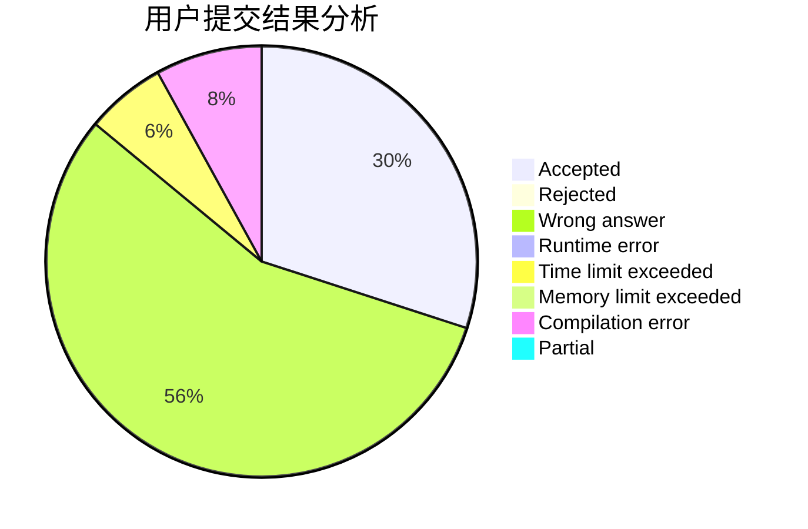
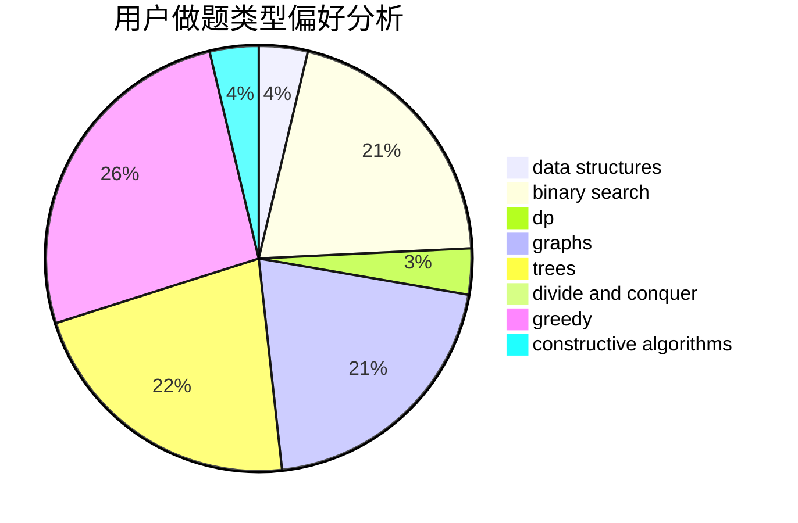

# Best_Raino

<!-- tabs:start -->

#### **用户提交结果分析**

#### **用户做题类型偏好分析**

#### **用户错题知识点分析**

<!-- tabs:end -->
# 推荐题目
[1055D](https://codeforces.com/contest/1055/problem/D)		greedy,
                        implementation,
                        strings		  
[273E](https://codeforces.com/contest/273/problem/E)		dp,
                        games		  
[10C](https://codeforces.com/contest/10/problem/C)		number theory		  
[1073D](https://codeforces.com/contest/1073/problem/D)		binary search,
                        brute force,
                        data structures,
                        greedy		  
[523A](https://codeforces.com/contest/523/problem/A)		*special problem,
                        implementation		  
[522D](https://codeforces.com/contest/522/problem/D)		*special problem,
                        data structures		  
[524F](https://codeforces.com/contest/524/problem/F)		data structures,
                        greedy,
                        hashing,
                        string suffix structures,
                        strings		  
[524E](https://codeforces.com/contest/524/problem/E)		data structures,
                        sortings		  
[471A](https://codeforces.com/contest/471/problem/A)		implementation		  
[201E](https://codeforces.com/contest/201/problem/E)		binary search,
                        combinatorics		  
