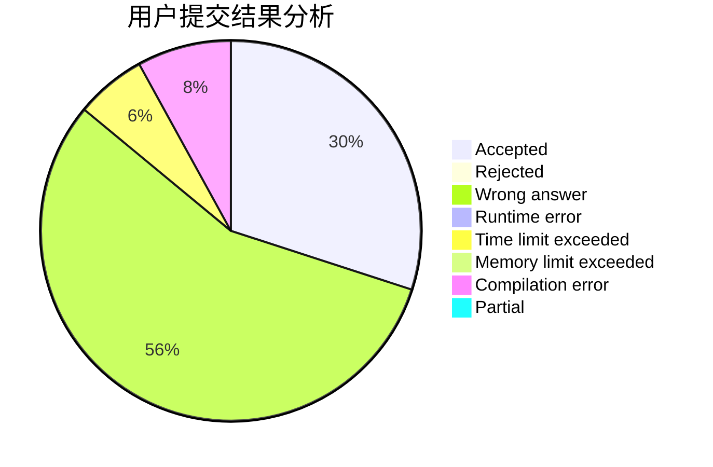
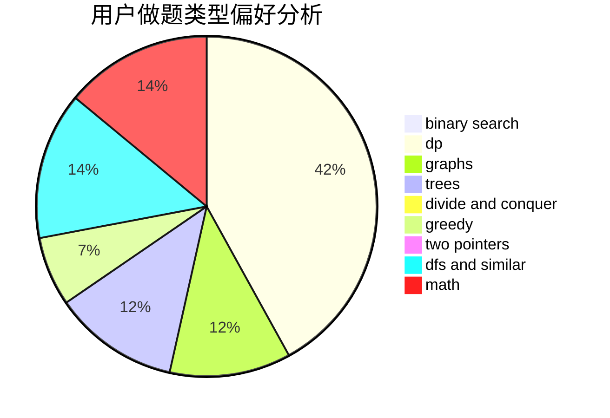

# Best_Raino

<!-- tabs:start -->

#### **用户提交结果分析**

#### **用户做题类型偏好分析**

<!-- tabs:end -->
# 推荐题目
[1056A](https://codeforces.com/contest/1056/problem/A)
[289D](https://codeforces.com/contest/289/problem/D)
[1100A](https://codeforces.com/contest/1100/problem/A)
[1073G](https://codeforces.com/contest/1073/problem/G)
[548B](https://codeforces.com/contest/548/problem/B)
[548A](https://codeforces.com/contest/548/problem/A)
[549C](https://codeforces.com/contest/549/problem/C)
[549B](https://codeforces.com/contest/549/problem/B)
[489F](https://codeforces.com/contest/489/problem/F)
[226E](https://codeforces.com/contest/226/problem/E)
