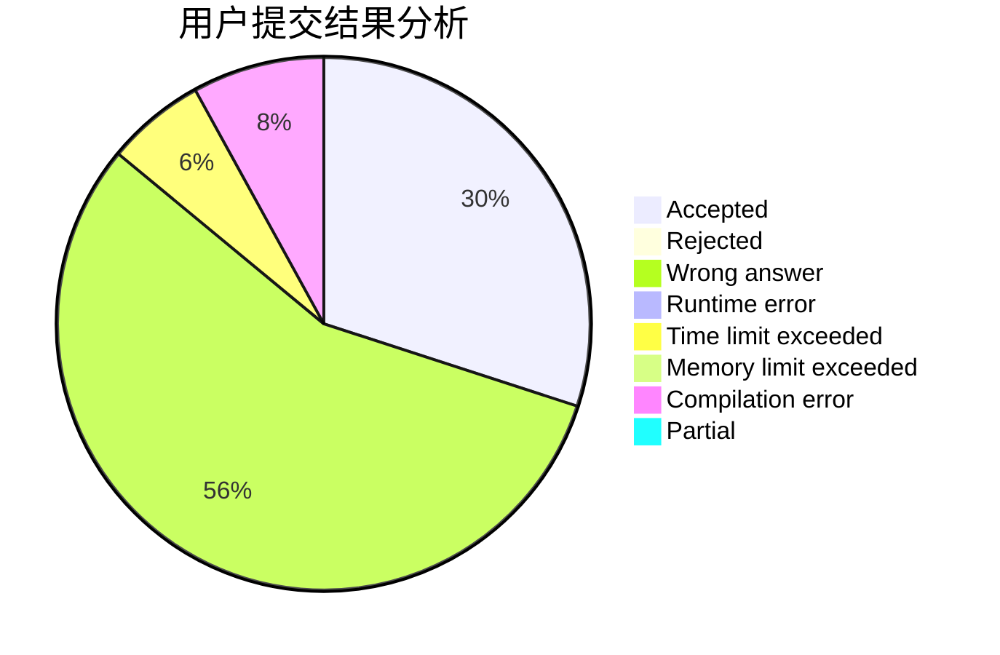
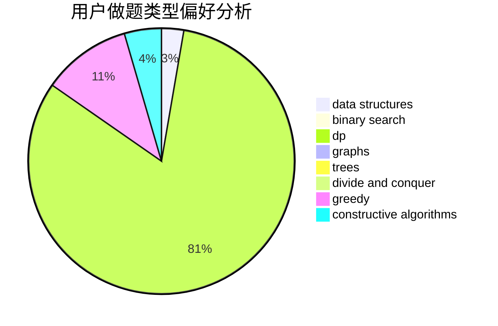

# Best_Raino

<!-- tabs:start -->

#### **用户提交结果分析**

#### **用户做题类型偏好分析**

#### **用户错题知识点分析**

<!-- tabs:end -->
# 推荐题目
[1056A](https://codeforces.com/contest/1056/problem/A)		implementation		  
[289D](https://codeforces.com/contest/289/problem/D)		dsu,graphs,sortings,trees		  
[1100A](https://codeforces.com/contest/1100/problem/A)		implementation		  
[1073G](https://codeforces.com/contest/1073/problem/G)		data structures,
                        string suffix structures		  
[548B](https://codeforces.com/contest/548/problem/B)		brute force,
                        dp,
                        greedy,
                        implementation		  
[548A](https://codeforces.com/contest/548/problem/A)		brute force,
                        implementation,
                        strings		  
[549C](https://codeforces.com/contest/549/problem/C)		games		  
[549B](https://codeforces.com/contest/549/problem/B)		constructive algorithms,
                        dfs and similar,
                        graphs,
                        greedy		  
[489F](https://codeforces.com/contest/489/problem/F)		combinatorics,
                        dp		  
[226E](https://codeforces.com/contest/226/problem/E)		data structures,
                        trees		  
