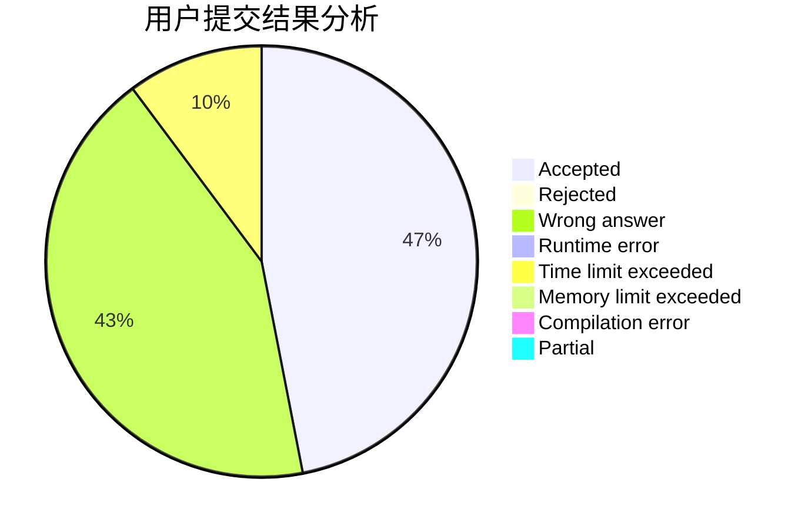
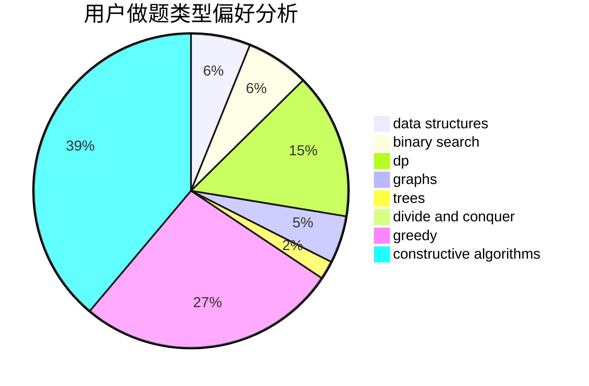
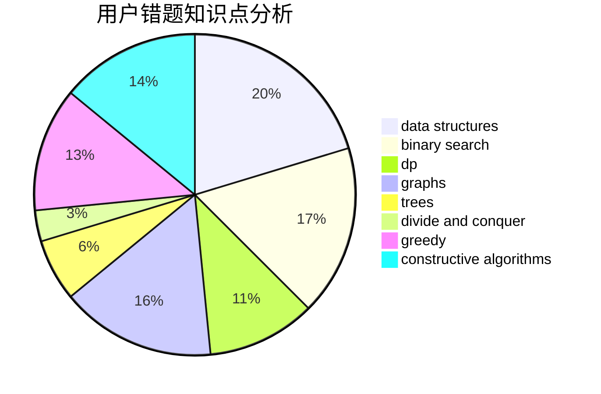

# kpgong

<!-- tabs:start -->

#### **用户提交结果分析**

#### **用户做题类型偏好分析**

#### **用户错题知识点分析**

<!-- tabs:end -->
# 推荐题目
[847E](https://codeforces.com/contest/847/problem/E)		binary search,
                        dp		  
[1205A](https://codeforces.com/contest/1205/problem/A)		constructive algorithms,
                        greedy,
                        math		  
[1331D](https://codeforces.com/contest/1331/problem/D)		implementation		  
[645E](https://codeforces.com/contest/645/problem/E)		dp,
                        greedy,
                        strings		  
[1262A](https://codeforces.com/contest/1262/problem/A)		dsu,graphs,sortings,trees		  
[75D](https://codeforces.com/contest/75/problem/D)		data structures,
                        dp,
                        greedy,
                        implementation,
                        math,
                        trees		  
[810C](https://codeforces.com/contest/810/problem/C)		dsu,graphs,sortings,trees		  
[915D](https://codeforces.com/contest/915/problem/D)		dfs and similar,
                        graphs		  
[475B](https://codeforces.com/contest/475/problem/B)		brute force,
                        dfs and similar,
                        graphs,
                        implementation		  
[1227F2](https://codeforces.com/contest/1227F/problem/2)		combinatorics,
                        math		  
