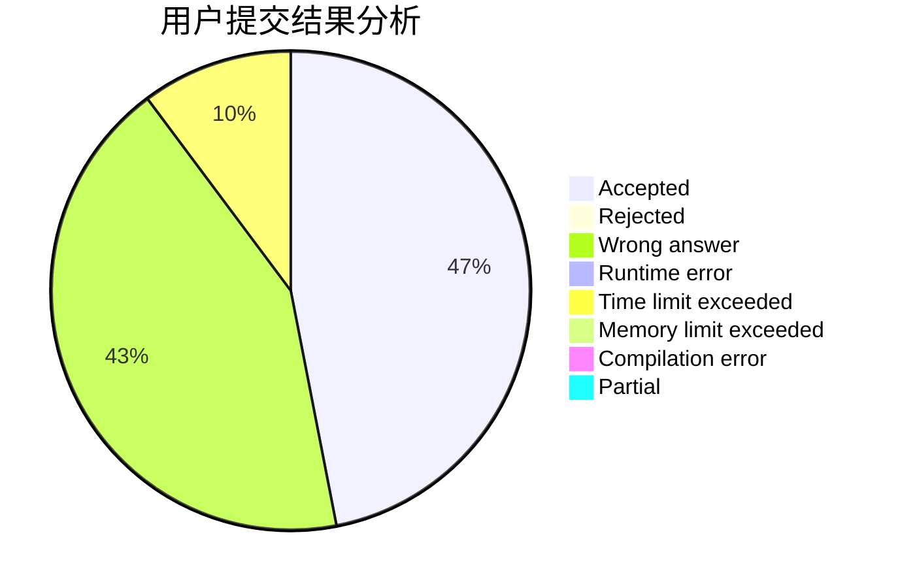
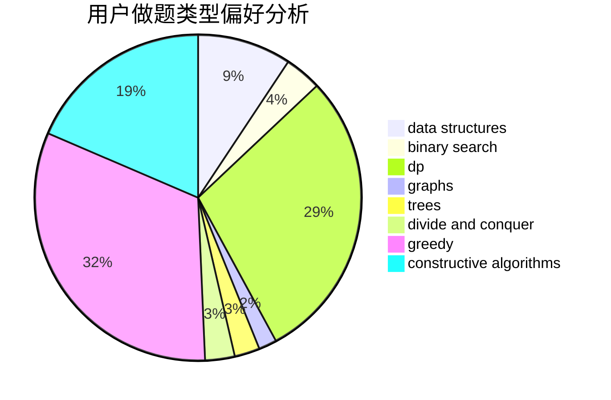
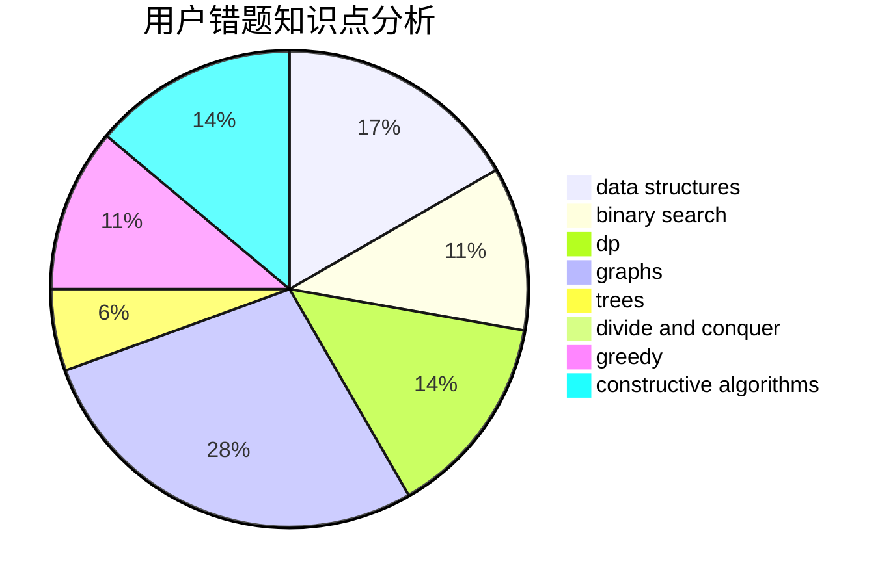

# kpgong

<!-- tabs:start -->

#### **用户提交结果分析**

#### **用户做题类型偏好分析**

#### **用户错题知识点分析**

<!-- tabs:end -->
# 推荐题目
[865D](https://codeforces.com/contest/865/problem/D)		constructive algorithms,
                        data structures,
                        greedy		  
[1209C](https://codeforces.com/contest/1209/problem/C)		constructive algorithms,
                        greedy,
                        implementation		  
[1337C](https://codeforces.com/contest/1337/problem/C)		dsu,graphs,sortings,trees		  
[672A](https://codeforces.com/contest/672/problem/A)		implementation		  
[1267I](https://codeforces.com/contest/1267/problem/I)		brute force,
                        constructive algorithms,
                        implementation,
                        interactive,
                        sortings		  
[77B](https://codeforces.com/contest/77/problem/B)		math,
                        probabilities		  
[828C](https://codeforces.com/contest/828/problem/C)		dsu,graphs,sortings,trees		  
[935C](https://codeforces.com/contest/935/problem/C)		geometry		  
[494B](https://codeforces.com/contest/494/problem/B)		dp,
                        strings		  
[1236D](https://codeforces.com/contest/1236/problem/D)		brute force,
                        data structures,
                        greedy,
                        implementation		  
