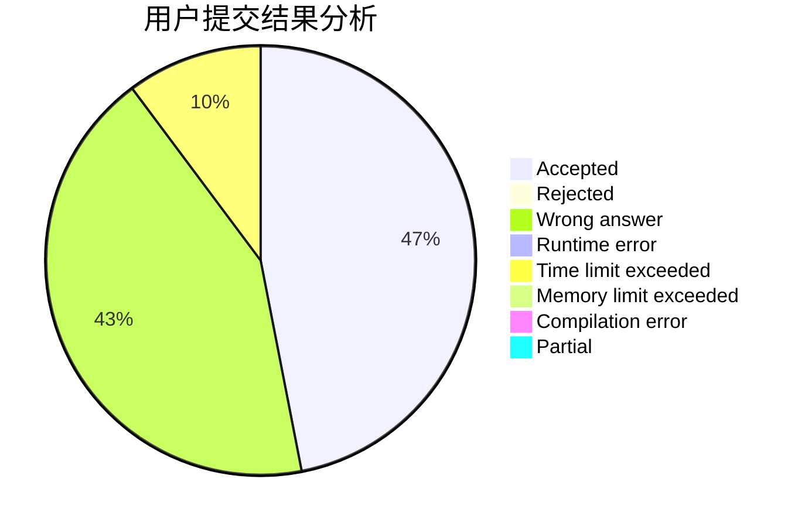
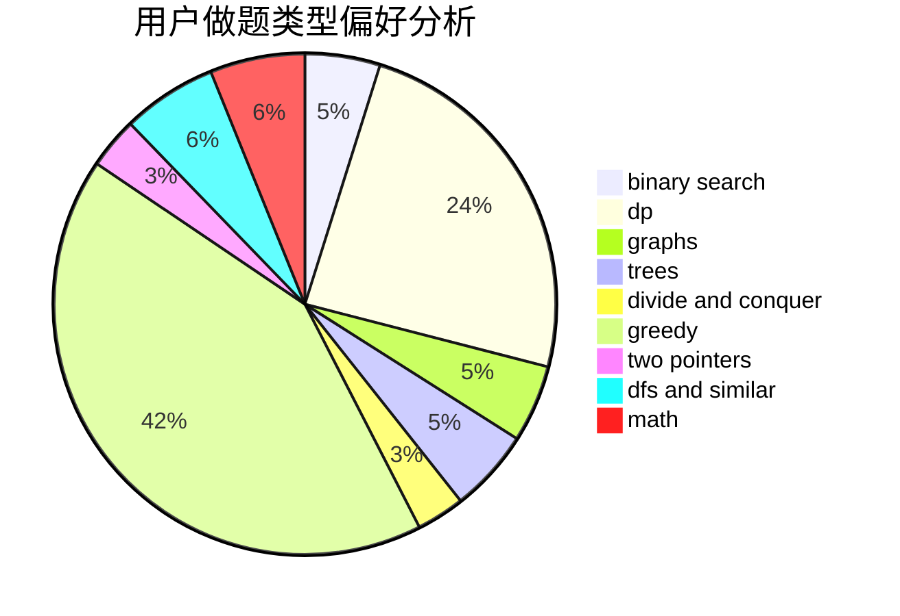

# kpgong

<!-- tabs:start -->

#### **用户提交结果分析**

#### **用户做题类型偏好分析**

<!-- tabs:end -->
# 推荐题目
[865D](https://codeforces.com/contest/865/problem/D)
[1209C](https://codeforces.com/contest/1209/problem/C)
[1337C](https://codeforces.com/contest/1337/problem/C)
[672A](https://codeforces.com/contest/672/problem/A)
[1267I](https://codeforces.com/contest/1267/problem/I)
[77B](https://codeforces.com/contest/77/problem/B)
[828C](https://codeforces.com/contest/828/problem/C)
[935C](https://codeforces.com/contest/935/problem/C)
[494B](https://codeforces.com/contest/494/problem/B)
[1236D](https://codeforces.com/contest/1236/problem/D)
