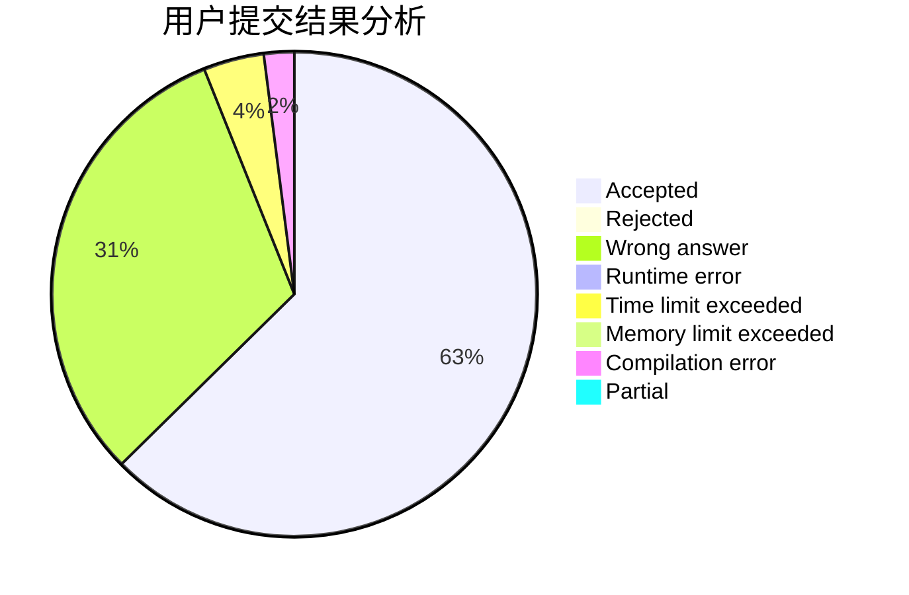
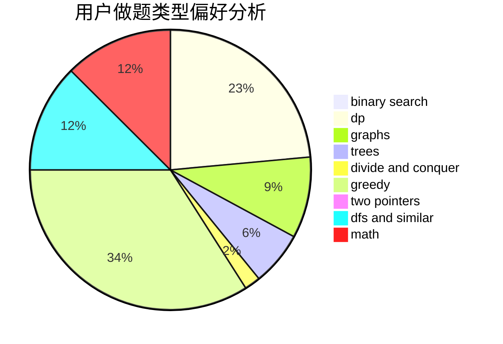

# kphmd

<!-- tabs:start -->

#### **用户提交结果分析**

#### **用户做题类型偏好分析**

<!-- tabs:end -->
# 推荐题目
[220C](https://codeforces.com/contest/220/problem/C)
[1382E](https://codeforces.com/contest/1382/problem/E)
[44E](https://codeforces.com/contest/44/problem/E)
[992A](https://codeforces.com/contest/992/problem/A)
[1327B](https://codeforces.com/contest/1327/problem/B)
[95B](https://codeforces.com/contest/95/problem/B)
[965C](https://codeforces.com/contest/965/problem/C)
[1268D](https://codeforces.com/contest/1268/problem/D)
[1051G](https://codeforces.com/contest/1051/problem/G)
[887E](https://codeforces.com/contest/887/problem/E)
