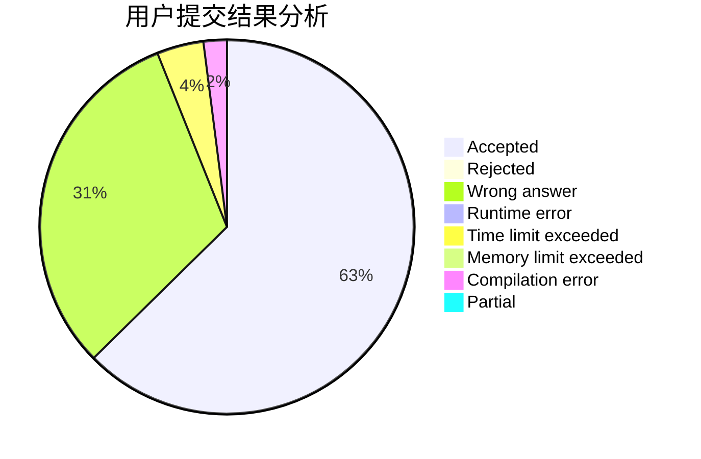
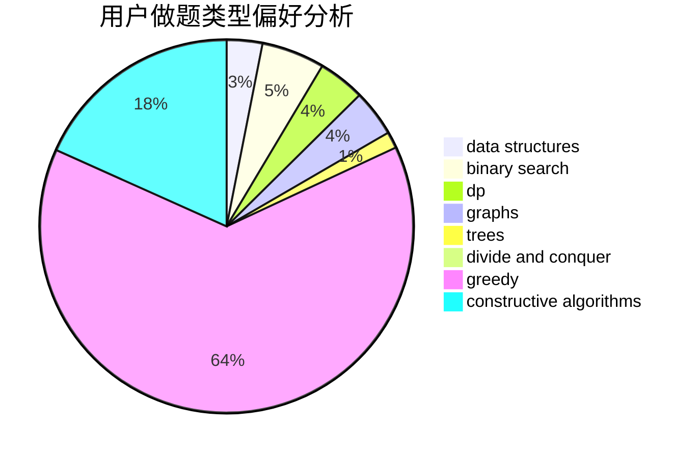
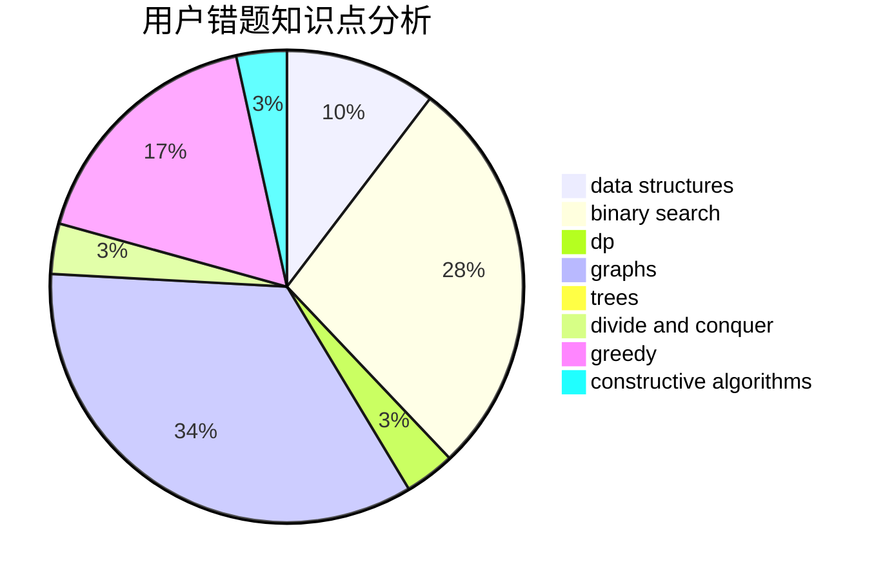

# kphmd

<!-- tabs:start -->

#### **用户提交结果分析**

#### **用户做题类型偏好分析**

#### **用户错题知识点分析**

<!-- tabs:end -->
# 推荐题目
[199D](https://codeforces.com/contest/199/problem/D)		dsu,graphs,sortings,trees		  
[1374A](https://codeforces.com/contest/1374/problem/A)		math		  
[429A](https://codeforces.com/contest/429/problem/A)		dfs and similar,
                        trees		  
[978C](https://codeforces.com/contest/978/problem/C)		binary search,
                        implementation,
                        two pointers		  
[1320B](https://codeforces.com/contest/1320/problem/B)		dfs and similar,
                        graphs,
                        shortest paths		  
[938C](https://codeforces.com/contest/938/problem/C)		binary search,
                        brute force,
                        constructive algorithms		  
[948B](https://codeforces.com/contest/948/problem/B)		dsu,graphs,sortings,trees		  
[1263A](https://codeforces.com/contest/1263/problem/A)		math		  
[1051D](https://codeforces.com/contest/1051/problem/D)		bitmasks,
                        dp		  
[868C](https://codeforces.com/contest/868/problem/C)		bitmasks,
                        brute force,
                        constructive algorithms,
                        dp		  
