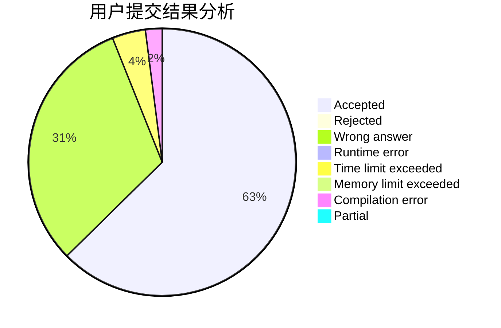
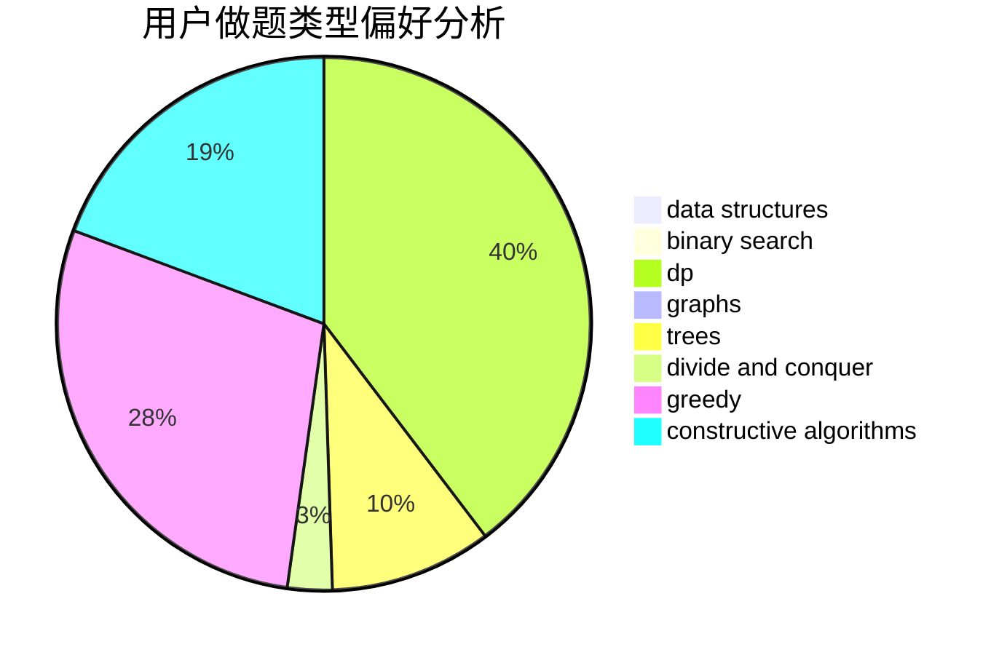

# kphmd

<!-- tabs:start -->

#### **用户提交结果分析**

#### **用户做题类型偏好分析**

#### **用户错题知识点分析**

<!-- tabs:end -->
# 推荐题目
[220C](https://codeforces.com/contest/220/problem/C)		data structures		  
[1382E](https://codeforces.com/contest/1382/problem/E)		dsu,graphs,sortings,trees		  
[44E](https://codeforces.com/contest/44/problem/E)		dp		  
[992A](https://codeforces.com/contest/992/problem/A)		implementation,
                        sortings		  
[1327B](https://codeforces.com/contest/1327/problem/B)		brute force,
                        graphs,
                        greedy		  
[95B](https://codeforces.com/contest/95/problem/B)		dp,
                        greedy		  
[965C](https://codeforces.com/contest/965/problem/C)		math		  
[1268D](https://codeforces.com/contest/1268/problem/D)		brute force,
                        divide and conquer,
                        graphs,
                        math		  
[1051G](https://codeforces.com/contest/1051/problem/G)		data structures,
                        dsu,
                        greedy		  
[887E](https://codeforces.com/contest/887/problem/E)		binary search,
                        geometry,
                        sortings		  
