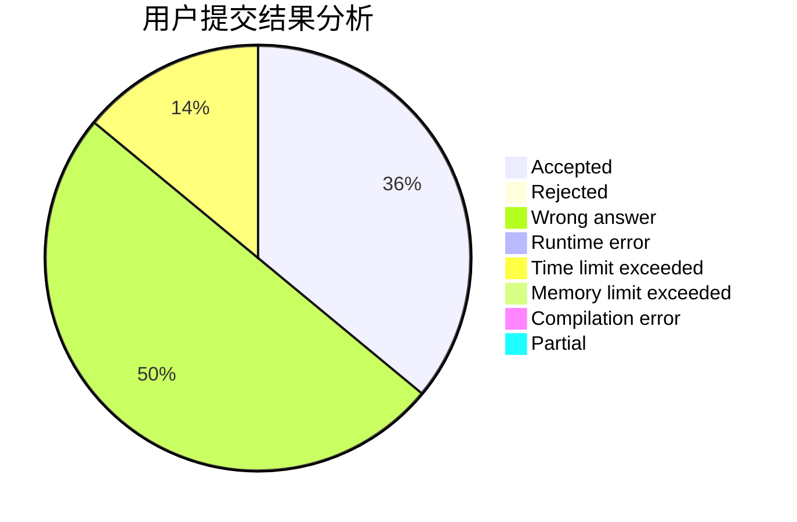
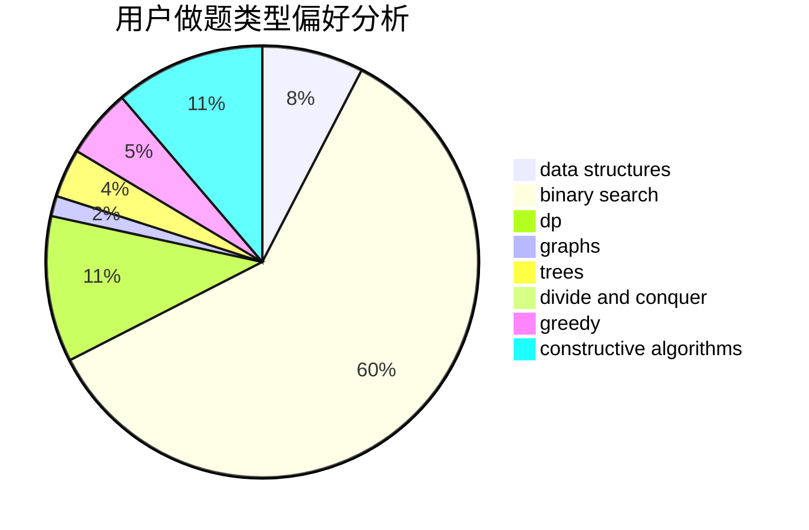
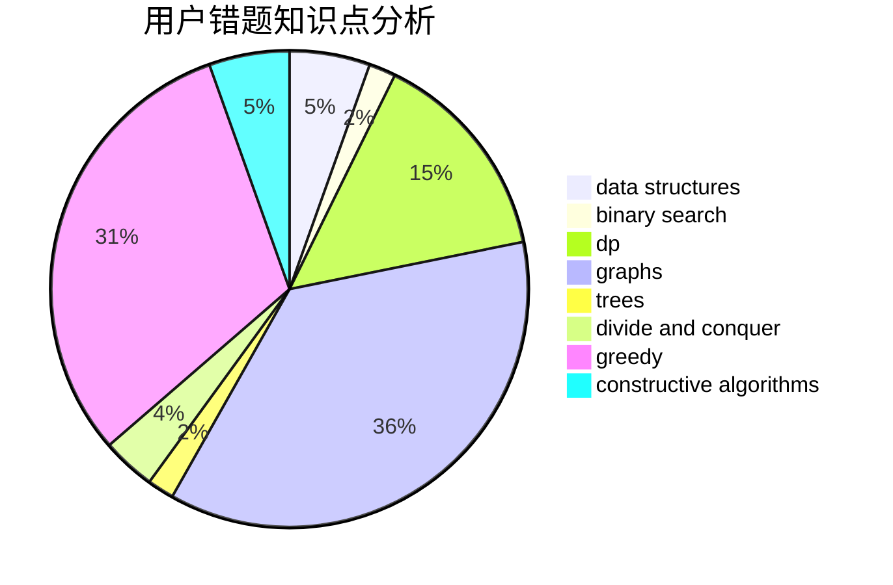

# kqp

<!-- tabs:start -->

#### **用户提交结果分析**

#### **用户做题类型偏好分析**

#### **用户错题知识点分析**

<!-- tabs:end -->
# 推荐题目
[526A](https://codeforces.com/contest/526/problem/A)		brute force,
                        implementation		  
[349B](https://codeforces.com/contest/349/problem/B)		data structures,
                        dp,
                        greedy,
                        implementation		  
[254B](https://codeforces.com/contest/254/problem/B)		brute force,
                        implementation		  
[295C](https://codeforces.com/contest/295/problem/C)		combinatorics,
                        dp,
                        graphs,
                        shortest paths		  
[119D](https://codeforces.com/contest/119/problem/D)		hashing,
                        strings		  
[411A](https://codeforces.com/contest/411/problem/A)		*special problem,
                        implementation		  
[13791](https://codeforces.com/contest/1379/problem/1)		dsu,graphs,sortings,trees		  
[193C](https://codeforces.com/contest/193/problem/C)		constructive algorithms,
                        greedy,
                        math,
                        matrices		  
[759B](https://codeforces.com/contest/759/problem/B)		dsu,graphs,sortings,trees		  
[164C](https://codeforces.com/contest/164/problem/C)		flows,
                        graphs		  
