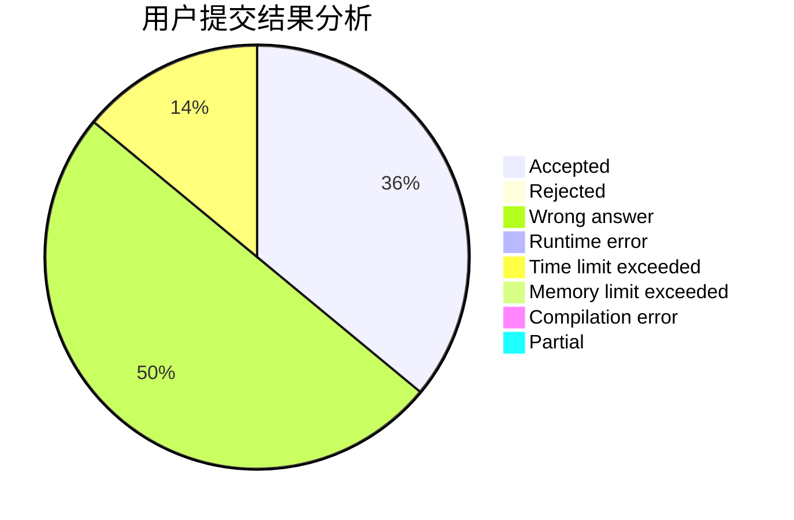
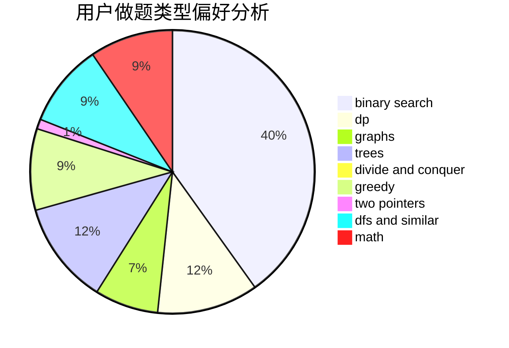

# kqp

<!-- tabs:start -->

#### **用户提交结果分析**

#### **用户做题类型偏好分析**

<!-- tabs:end -->
# 推荐题目
[526A](https://codeforces.com/contest/526/problem/A)
[349B](https://codeforces.com/contest/349/problem/B)
[254B](https://codeforces.com/contest/254/problem/B)
[295C](https://codeforces.com/contest/295/problem/C)
[119D](https://codeforces.com/contest/119/problem/D)
[411A](https://codeforces.com/contest/411/problem/A)
[13791](https://codeforces.com/contest/1379/problem/1)
[193C](https://codeforces.com/contest/193/problem/C)
[759B](https://codeforces.com/contest/759/problem/B)
[164C](https://codeforces.com/contest/164/problem/C)
