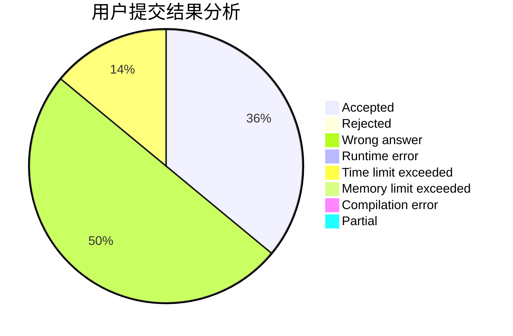
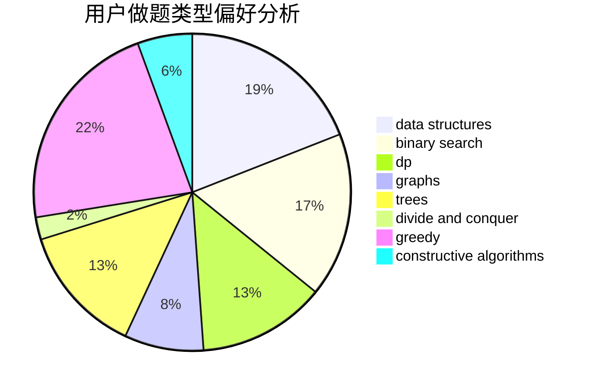
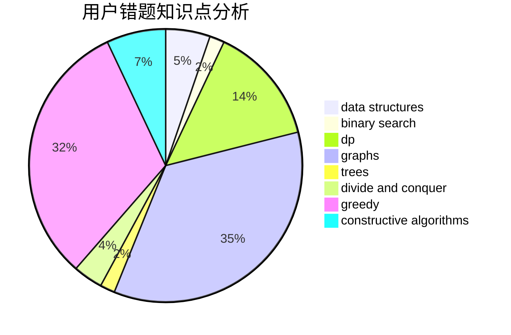

# kqp

<!-- tabs:start -->

#### **用户提交结果分析**

#### **用户做题类型偏好分析**

#### **用户错题知识点分析**

<!-- tabs:end -->
# 推荐题目
[505D](https://codeforces.com/contest/505/problem/D)		dfs and similar		  
[319A](https://codeforces.com/contest/319/problem/A)		combinatorics,
                        math		  
[232C](https://codeforces.com/contest/232/problem/C)		constructive algorithms,
                        divide and conquer,
                        dp,
                        graphs,
                        shortest paths		  
[27D](https://codeforces.com/contest/27/problem/D)		2-sat,
                        dfs and similar,
                        dsu,
                        graphs		  
[1195E](https://codeforces.com/contest/1195/problem/E)		data structures,
                        two pointers		  
[380C](https://codeforces.com/contest/380/problem/C)		data structures,
                        schedules		  
[1370B](https://codeforces.com/contest/1370/problem/B)		constructive algorithms,
                        math,
                        number theory		  
[167B](https://codeforces.com/contest/167/problem/B)		dp,
                        math,
                        probabilities		  
[737E](https://codeforces.com/contest/737/problem/E)		graph matchings,
                        graphs,
                        greedy,
                        schedules		  
[1510D](https://codeforces.com/contest/1510/problem/D)		dp,
                        math,
                        number theory		  
