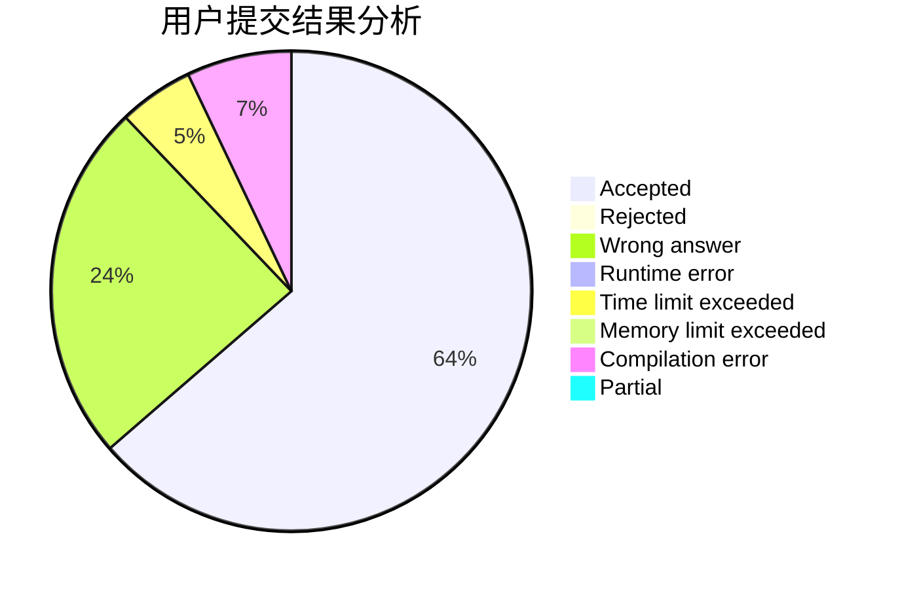
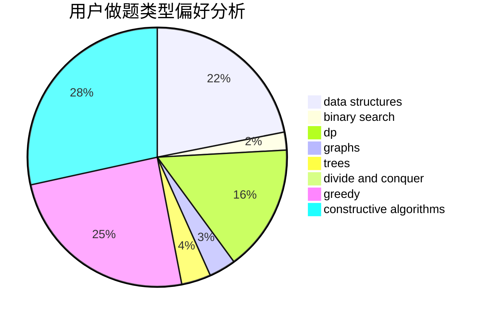
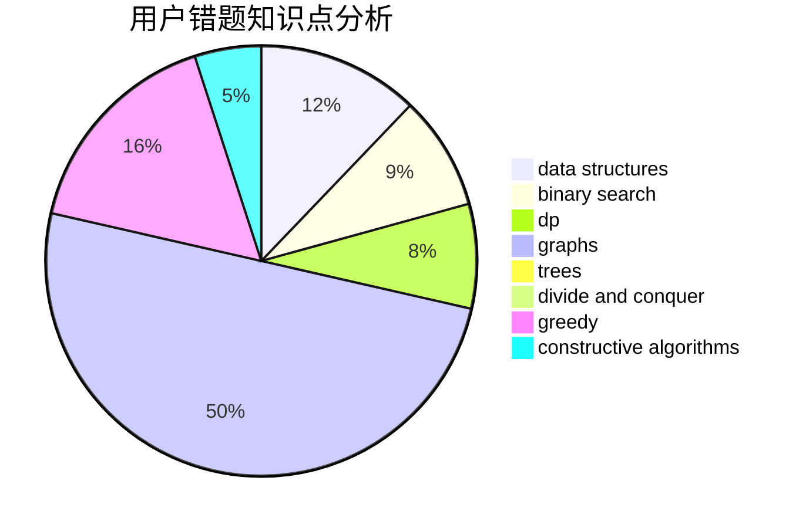

# kun368

<!-- tabs:start -->

#### **用户提交结果分析**

#### **用户做题类型偏好分析**

#### **用户错题知识点分析**

<!-- tabs:end -->
# 推荐题目
[1322C](https://codeforces.com/contest/1322/problem/C)		graphs,
                        hashing,
                        math,
                        number theory		  
[24E](https://codeforces.com/contest/24/problem/E)		binary search		  
[864E](https://codeforces.com/contest/864/problem/E)		dp,
                        sortings		  
[1084D](https://codeforces.com/contest/1084/problem/D)		dsu,graphs,sortings,trees		  
[977A](https://codeforces.com/contest/977/problem/A)		implementation		  
[1005C](https://codeforces.com/contest/1005/problem/C)		brute force,
                        greedy,
                        implementation		  
[462A](https://codeforces.com/contest/462/problem/A)		brute force,
                        implementation		  
[703A](https://codeforces.com/contest/703/problem/A)		implementation		  
[1264C](https://codeforces.com/contest/1264/problem/C)		data structures,
                        probabilities		  
[859F](https://codeforces.com/contest/859/problem/F)		greedy		  
