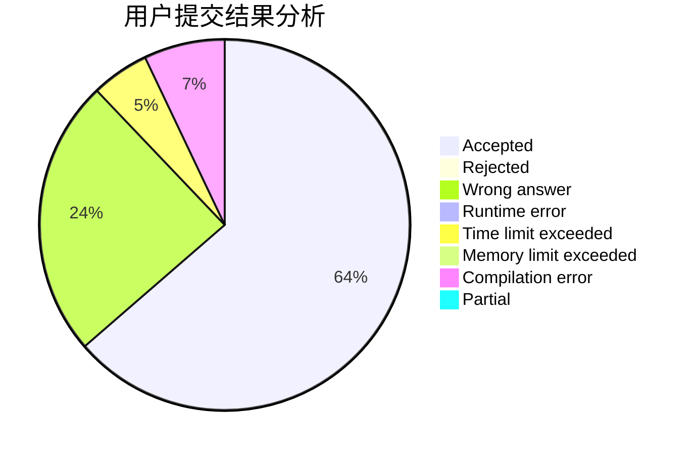
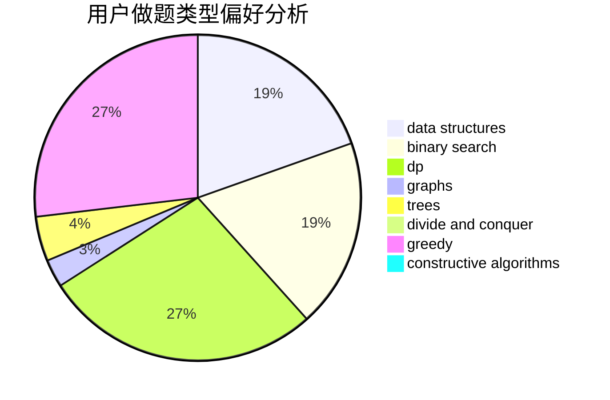
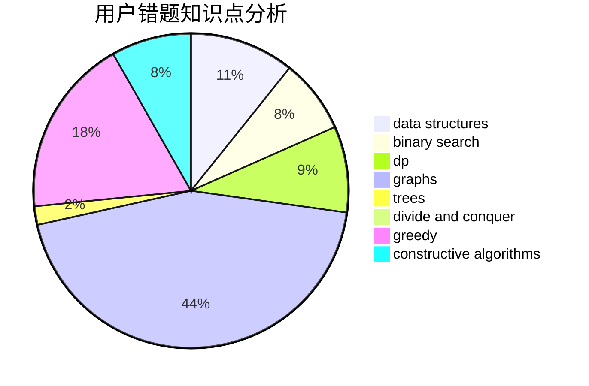

# kun368

<!-- tabs:start -->

#### **用户提交结果分析**

#### **用户做题类型偏好分析**

#### **用户错题知识点分析**

<!-- tabs:end -->
# 推荐题目
[1312G](https://codeforces.com/contest/1312/problem/G)		data structures,
                        dfs and similar,
                        dp		  
[22B](https://codeforces.com/contest/22/problem/B)		brute force,
                        dp		  
[846C](https://codeforces.com/contest/846/problem/C)		brute force,
                        data structures,
                        dp		  
[1083F](https://codeforces.com/contest/1083/problem/F)		data structures		  
[955A](https://codeforces.com/contest/955/problem/A)		greedy,
                        math		  
[1005B](https://codeforces.com/contest/1005/problem/B)		brute force,
                        implementation,
                        strings		  
[441C](https://codeforces.com/contest/441/problem/C)		constructive algorithms,
                        dfs and similar,
                        implementation		  
[679B](https://codeforces.com/contest/679/problem/B)		binary search,
                        dp,
                        greedy		  
[1257C](https://codeforces.com/contest/1257/problem/C)		greedy,
                        implementation,
                        sortings,
                        strings,
                        two pointers		  
[840B](https://codeforces.com/contest/840/problem/B)		constructive algorithms,
                        data structures,
                        dfs and similar,
                        dp,
                        graphs		  
