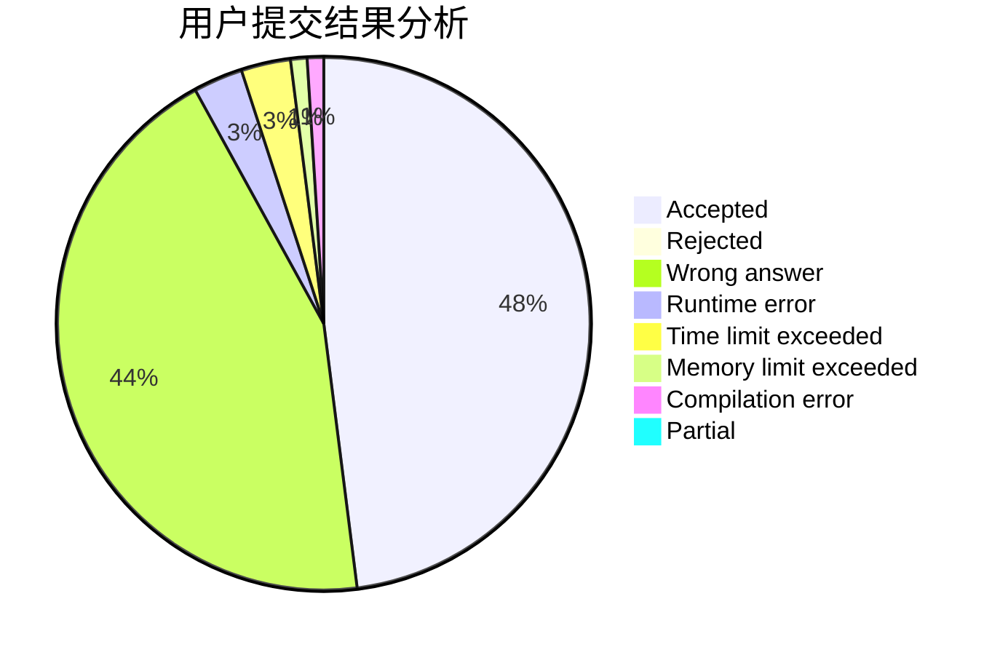
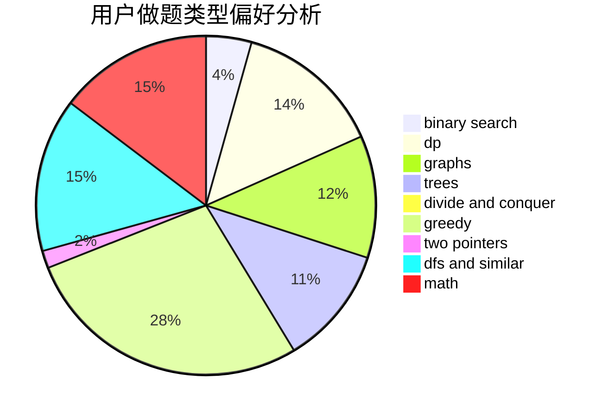

# kunpeng

<!-- tabs:start -->

#### **用户提交结果分析**

#### **用户做题类型偏好分析**

<!-- tabs:end -->
# 推荐题目
[952E](https://codeforces.com/contest/952/problem/E)
[1326C](https://codeforces.com/contest/1326/problem/C)
[869E](https://codeforces.com/contest/869/problem/E)
[813F](https://codeforces.com/contest/813/problem/F)
[1175D](https://codeforces.com/contest/1175/problem/D)
[1208B](https://codeforces.com/contest/1208/problem/B)
[397E](https://codeforces.com/contest/397/problem/E)
[13562](https://codeforces.com/contest/1356/problem/2)
[612F](https://codeforces.com/contest/612/problem/F)
[1140G](https://codeforces.com/contest/1140/problem/G)
