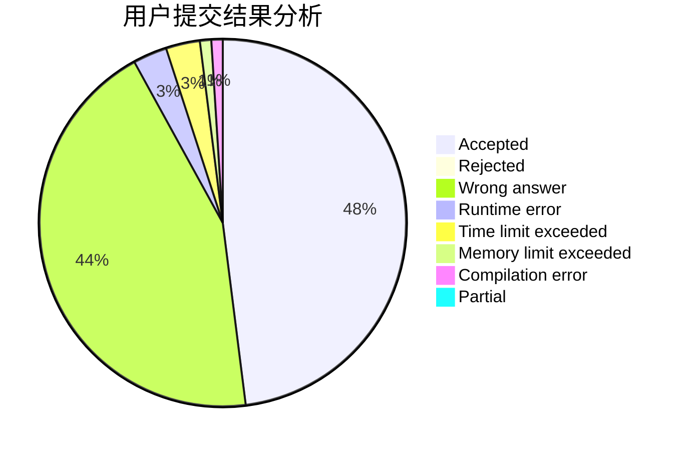
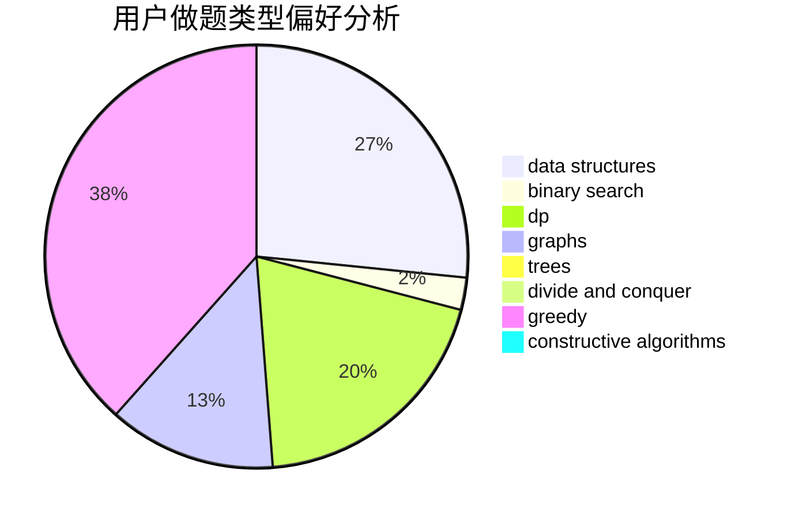
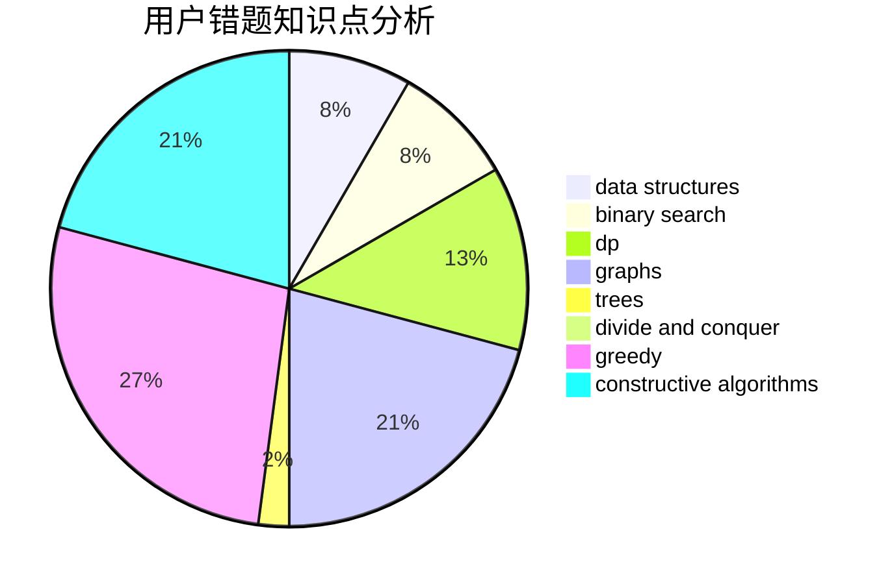

# kunpeng

<!-- tabs:start -->

#### **用户提交结果分析**

#### **用户做题类型偏好分析**

#### **用户错题知识点分析**

<!-- tabs:end -->
# 推荐题目
[931F](https://codeforces.com/contest/931/problem/F)		dsu,graphs,sortings,trees		  
[131A](https://codeforces.com/contest/131/problem/A)		implementation,
                        strings		  
[850F](https://codeforces.com/contest/850/problem/F)		math		  
[799F](https://codeforces.com/contest/799/problem/F)		data structures		  
[1173A](https://codeforces.com/contest/1173/problem/A)		greedy		  
[1203D2](https://codeforces.com/contest/1203D/problem/2)		binary search,
                        greedy,
                        implementation,
                        two pointers		  
[367A](https://codeforces.com/contest/367/problem/A)		data structures,
                        implementation		  
[1349D](https://codeforces.com/contest/1349/problem/D)		math,
                        probabilities		  
[594E](https://codeforces.com/contest/594/problem/E)		string suffix structures,
                        strings		  
[1139C](https://codeforces.com/contest/1139/problem/C)		dfs and similar,
                        dsu,
                        graphs,
                        math,
                        trees		  
