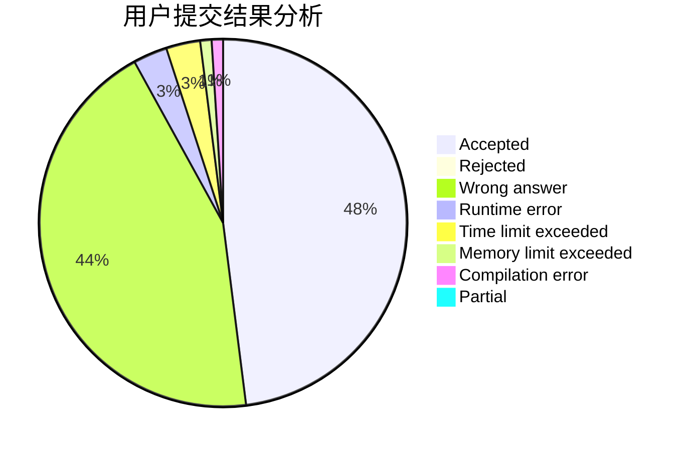
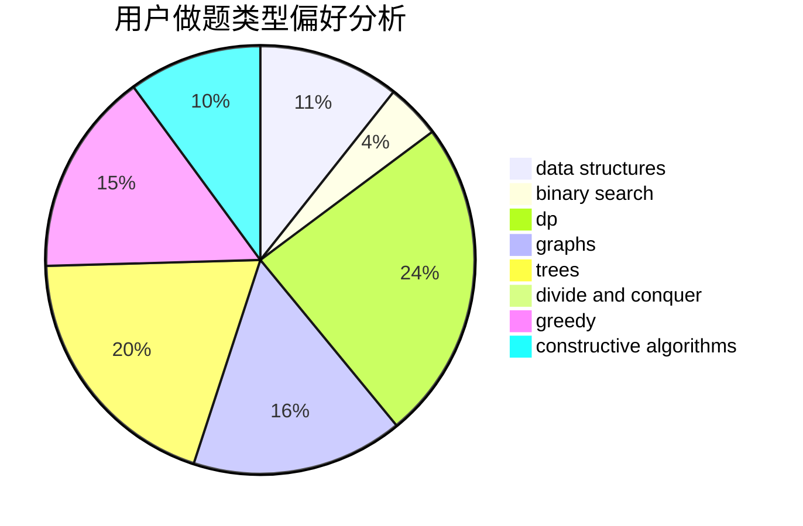
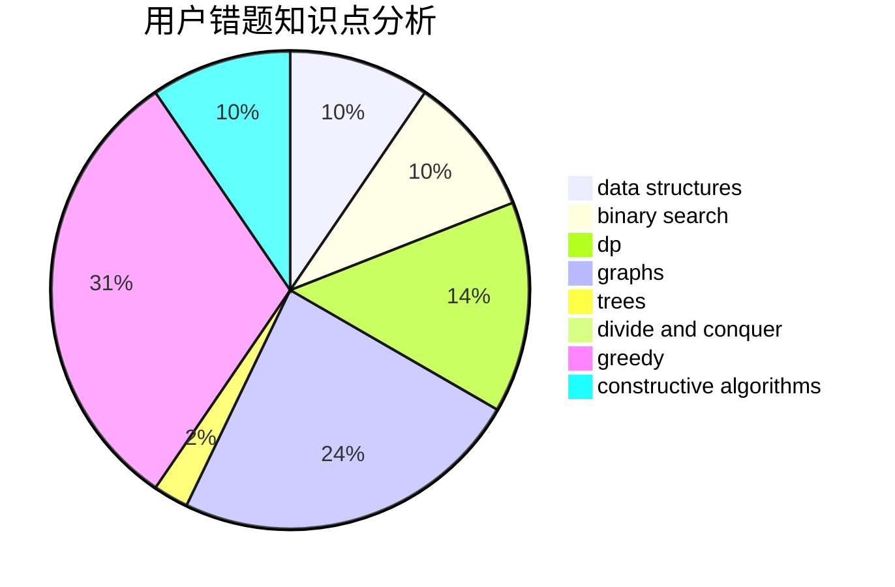

# kunpeng

<!-- tabs:start -->

#### **用户提交结果分析**

#### **用户做题类型偏好分析**

#### **用户错题知识点分析**

<!-- tabs:end -->
# 推荐题目
[952E](https://codeforces.com/contest/952/problem/E)		nan		  
[1326C](https://codeforces.com/contest/1326/problem/C)		combinatorics,
                        greedy,
                        math		  
[869E](https://codeforces.com/contest/869/problem/E)		data structures,
                        hashing		  
[813F](https://codeforces.com/contest/813/problem/F)		data structures,
                        dsu,
                        graphs		  
[1175D](https://codeforces.com/contest/1175/problem/D)		greedy,
                        sortings		  
[1208B](https://codeforces.com/contest/1208/problem/B)		binary search,
                        brute force,
                        implementation,
                        two pointers		  
[397E](https://codeforces.com/contest/397/problem/E)		dsu,graphs,sortings,trees		  
[13562](https://codeforces.com/contest/1356/problem/2)		dsu,graphs,sortings,trees		  
[612F](https://codeforces.com/contest/612/problem/F)		dp		  
[1140G](https://codeforces.com/contest/1140/problem/G)		data structures,
                        divide and conquer,
                        shortest paths,
                        trees		  
