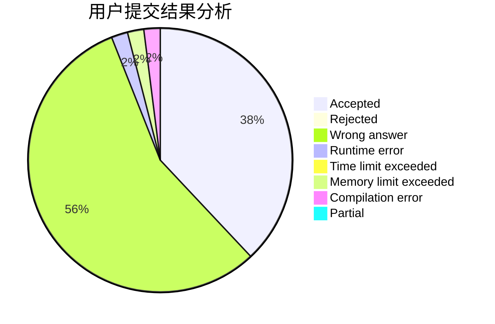
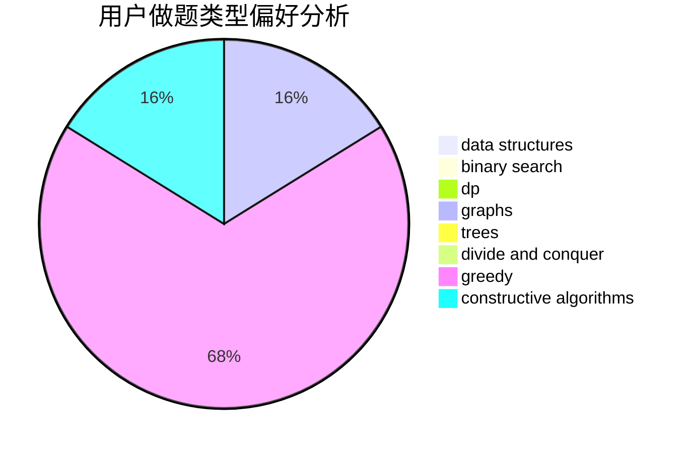

# kvrmnks

<!-- tabs:start -->

#### **用户提交结果分析**

#### **用户做题类型偏好分析**

#### **用户错题知识点分析**

<!-- tabs:end -->
# 推荐题目
[1254B1](https://codeforces.com/contest/1254B/problem/1)		constructive algorithms,
                        greedy,
                        math,
                        number theory,
                        ternary search,
                        two pointers		  
[1105C](https://codeforces.com/contest/1105/problem/C)		combinatorics,
                        dp,
                        math		  
[952D](https://codeforces.com/contest/952/problem/D)		probabilities		  
[714A](https://codeforces.com/contest/714/problem/A)		implementation,
                        math		  
[1456D](https://codeforces.com/contest/1456/problem/D)		dsu,graphs,sortings,trees		  
[1482E](https://codeforces.com/contest/1482/problem/E)		data structures,
                        divide and conquer,
                        dp		  
[1489D](https://codeforces.com/contest/1489/problem/D)		dsu,graphs,sortings,trees		  
[1483E](https://codeforces.com/contest/1483/problem/E)		dsu,graphs,sortings,trees		  
[1475F](https://codeforces.com/contest/1475/problem/F)		2-sat,
                        brute force,
                        constructive algorithms		  
[1472A](https://codeforces.com/contest/1472/problem/A)		greedy,
                        math		  
