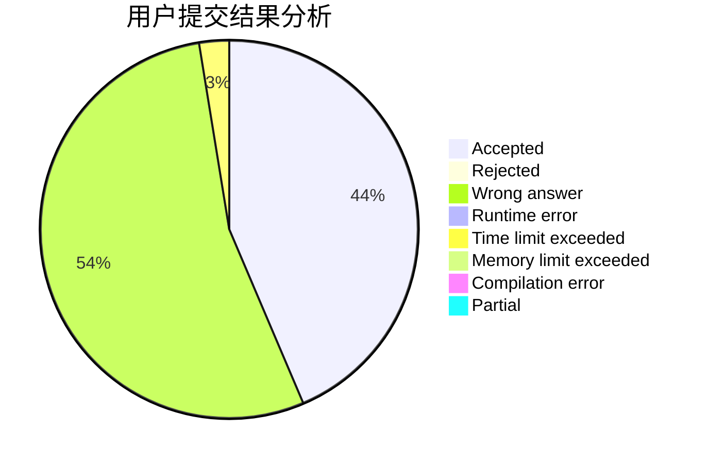
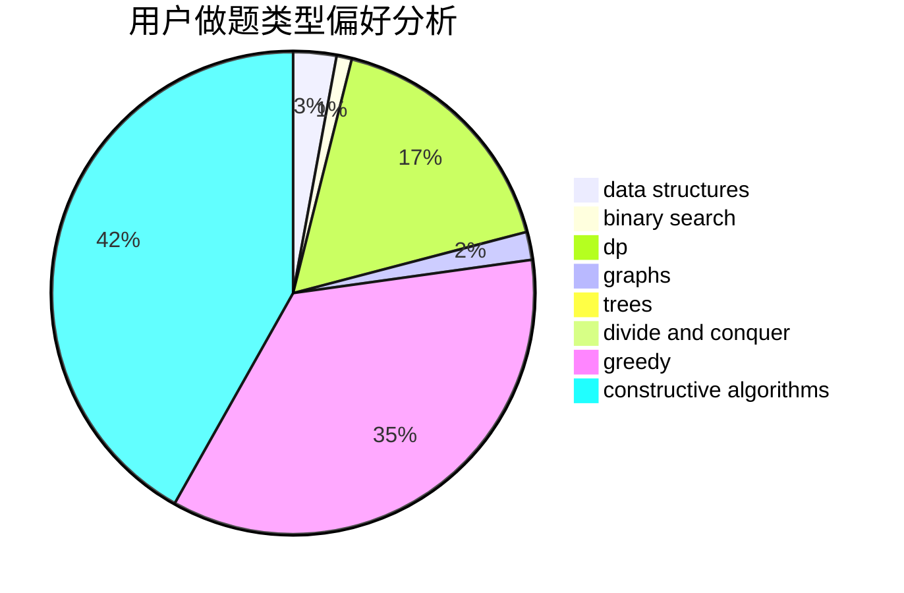
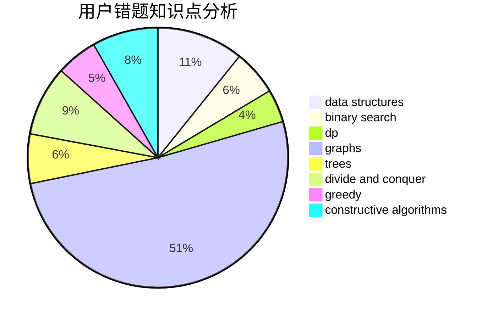

# kzsn

<!-- tabs:start -->

#### **用户提交结果分析**

#### **用户做题类型偏好分析**

#### **用户错题知识点分析**

<!-- tabs:end -->
# 推荐题目
[659F](https://codeforces.com/contest/659/problem/F)		dfs and similar,
                        dsu,
                        graphs,
                        greedy,
                        sortings		  
[229D](https://codeforces.com/contest/229/problem/D)		dp,
                        greedy,
                        two pointers		  
[958D1](https://codeforces.com/contest/958D/problem/1)		expression parsing,
                        math		  
[1033C](https://codeforces.com/contest/1033/problem/C)		brute force,
                        dp,
                        games		  
[1029B](https://codeforces.com/contest/1029/problem/B)		dp,
                        greedy,
                        math		  
[498E](https://codeforces.com/contest/498/problem/E)		dp,
                        matrices		  
[895D](https://codeforces.com/contest/895/problem/D)		combinatorics,
                        math,
                        strings		  
[1209G2](https://codeforces.com/contest/1209G/problem/2)		data structures		  
[900C](https://codeforces.com/contest/900/problem/C)		brute force,
                        data structures,
                        math		  
[919D](https://codeforces.com/contest/919/problem/D)		dfs and similar,
                        dp,
                        graphs		  
