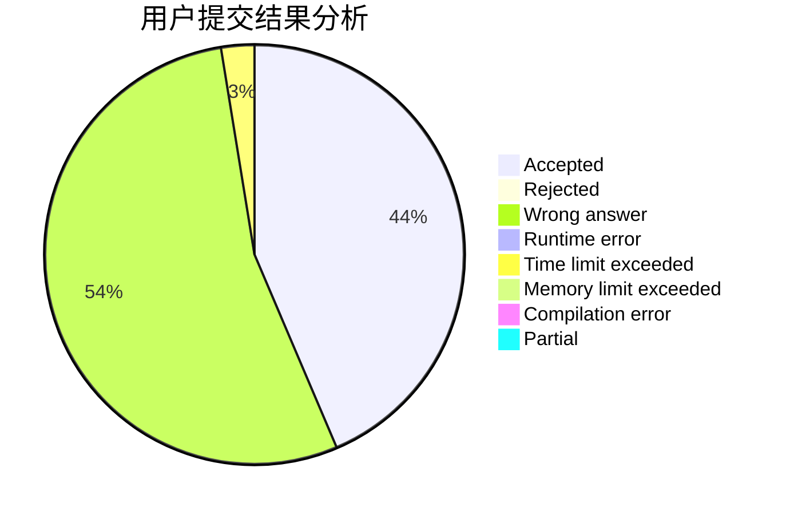
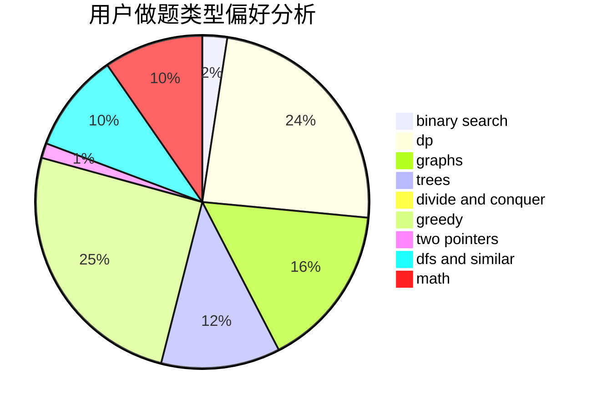

# kzsn

<!-- tabs:start -->

#### **用户提交结果分析**

#### **用户做题类型偏好分析**

<!-- tabs:end -->
# 推荐题目
[67A](https://codeforces.com/contest/67/problem/A)
[249E](https://codeforces.com/contest/249/problem/E)
[97D](https://codeforces.com/contest/97/problem/D)
[1033F](https://codeforces.com/contest/1033/problem/F)
[1029E](https://codeforces.com/contest/1029/problem/E)
[519E](https://codeforces.com/contest/519/problem/E)
[913B](https://codeforces.com/contest/913/problem/B)
[1215E](https://codeforces.com/contest/1215/problem/E)
[917A](https://codeforces.com/contest/917/problem/A)
[939E](https://codeforces.com/contest/939/problem/E)
