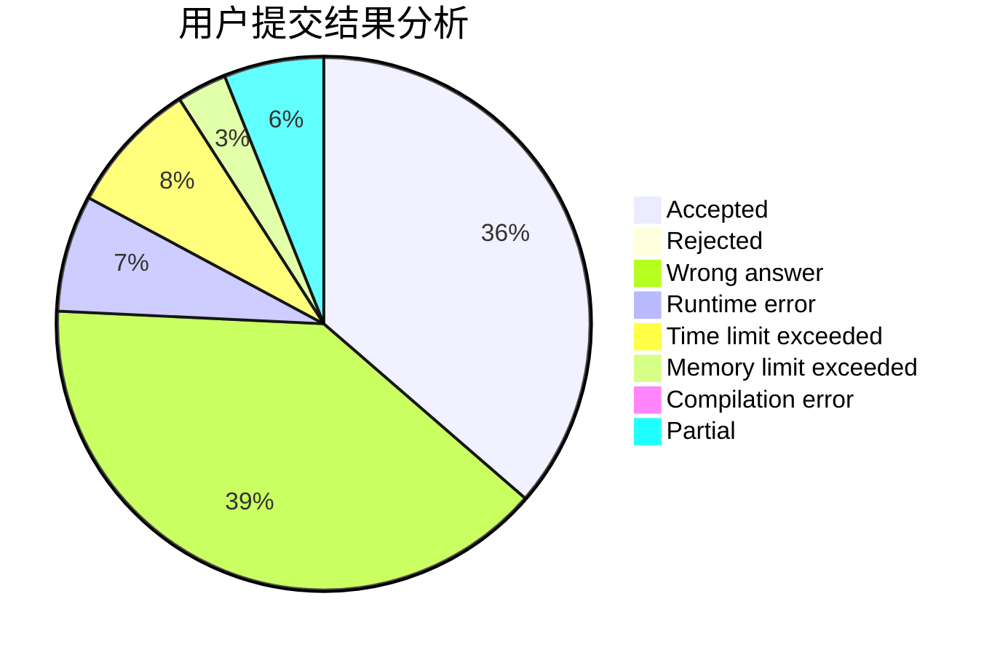
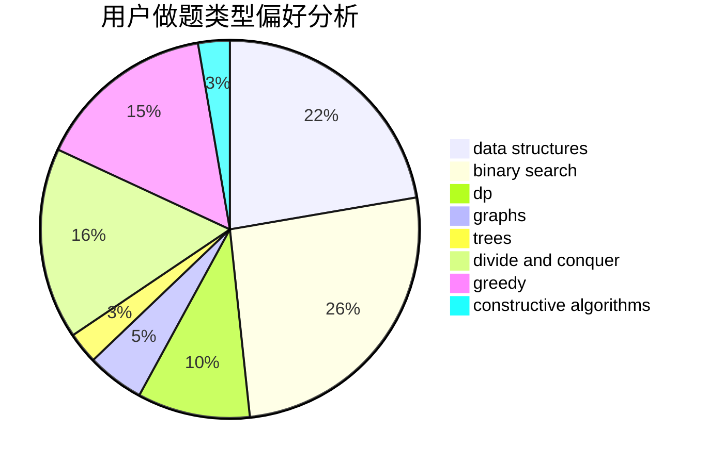
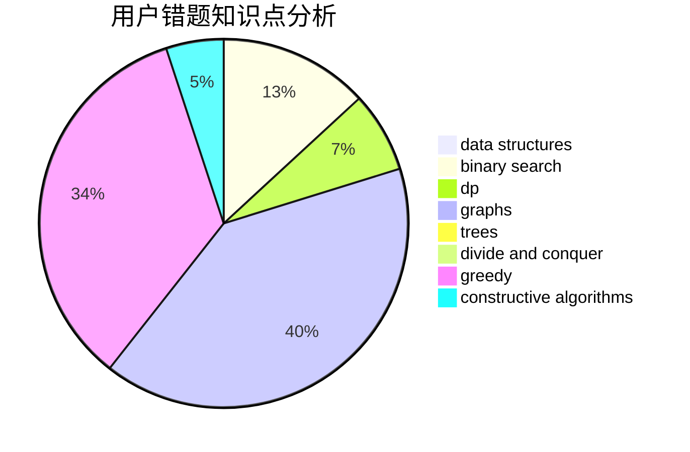

# l_h_j

<!-- tabs:start -->

#### **用户提交结果分析**

#### **用户做题类型偏好分析**

#### **用户错题知识点分析**

<!-- tabs:end -->
# 推荐题目
[1487D](https://codeforces.com/contest/1487/problem/D)		binary search,
                        brute force,
                        math,
                        number theory		  
[1375C](https://codeforces.com/contest/1375/problem/C)		constructive algorithms,
                        data structures,
                        greedy		  
[1227D1](https://codeforces.com/contest/1227D/problem/1)		data structures,
                        greedy		  
[808G](https://codeforces.com/contest/808/problem/G)		dp,
                        strings		  
[446C](https://codeforces.com/contest/446/problem/C)		data structures,
                        math,
                        number theory		  
[20A](https://codeforces.com/contest/20/problem/A)		implementation		  
[1105A](https://codeforces.com/contest/1105/problem/A)		brute force,
                        implementation		  
[584B](https://codeforces.com/contest/584/problem/B)		combinatorics		  
[981A](https://codeforces.com/contest/981/problem/A)		brute force,
                        implementation,
                        strings		  
[1385F](https://codeforces.com/contest/1385/problem/F)		data structures,
                        greedy,
                        implementation,
                        trees		  
