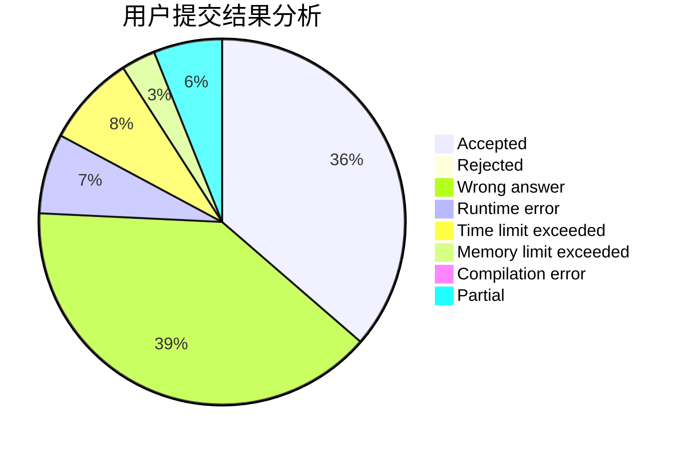
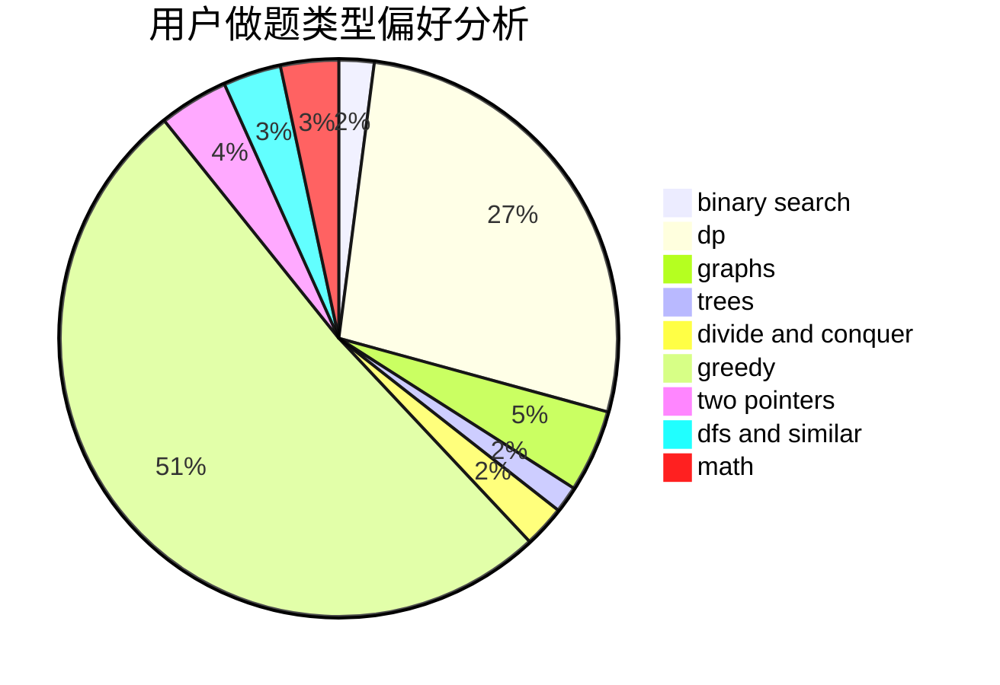

# l_h_j

<!-- tabs:start -->

#### **用户提交结果分析**

#### **用户做题类型偏好分析**

<!-- tabs:end -->
# 推荐题目
[1495A](https://codeforces.com/contest/1495/problem/A)
[1384A](https://codeforces.com/contest/1384/problem/A)
[1236A](https://codeforces.com/contest/1236/problem/A)
[825F](https://codeforces.com/contest/825/problem/F)
[466D](https://codeforces.com/contest/466/problem/D)
[231C](https://codeforces.com/contest/231/problem/C)
[1105D](https://codeforces.com/contest/1105/problem/D)
[604B](https://codeforces.com/contest/604/problem/B)
[996B](https://codeforces.com/contest/996/problem/B)
[1395F](https://codeforces.com/contest/1395/problem/F)
