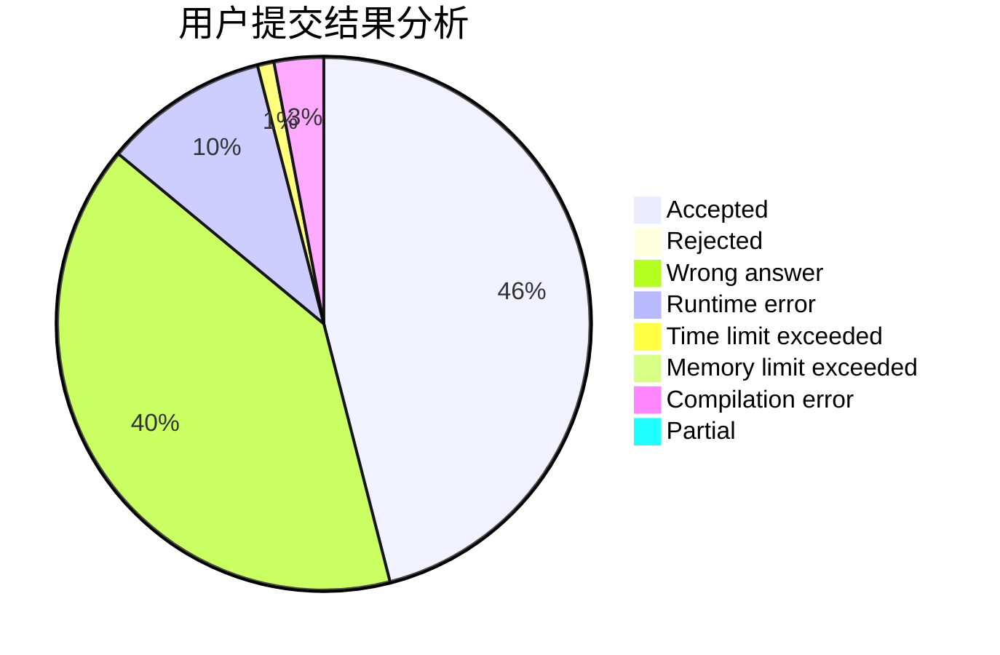
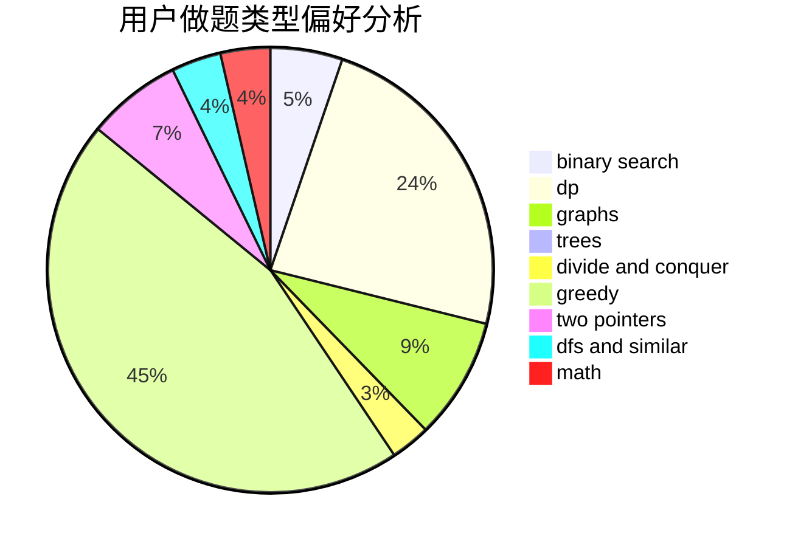

# lagerst

<!-- tabs:start -->

#### **用户提交结果分析**

#### **用户做题类型偏好分析**

<!-- tabs:end -->
# 推荐题目
[886A](https://codeforces.com/contest/886/problem/A)
[683B](https://codeforces.com/contest/683/problem/B)
[549C](https://codeforces.com/contest/549/problem/C)
[916C](https://codeforces.com/contest/916/problem/C)
[794C](https://codeforces.com/contest/794/problem/C)
[600C](https://codeforces.com/contest/600/problem/C)
[29B](https://codeforces.com/contest/29/problem/B)
[939E](https://codeforces.com/contest/939/problem/E)
[962D](https://codeforces.com/contest/962/problem/D)
[1387A](https://codeforces.com/contest/1387/problem/A)
