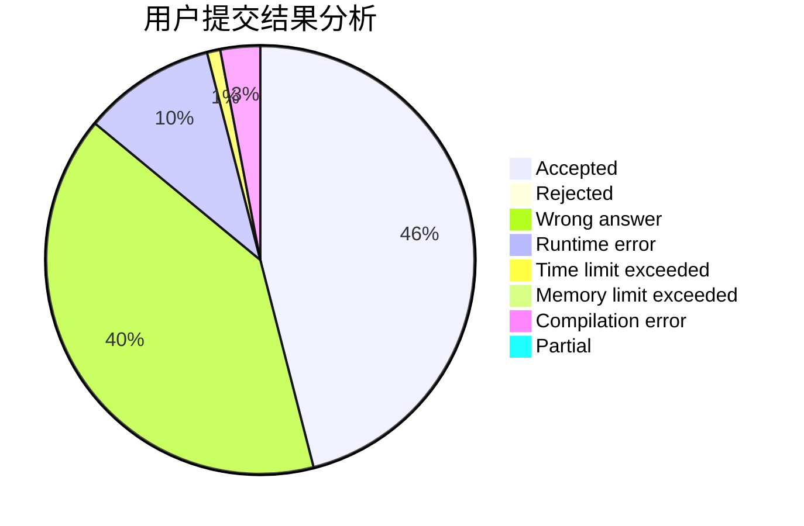
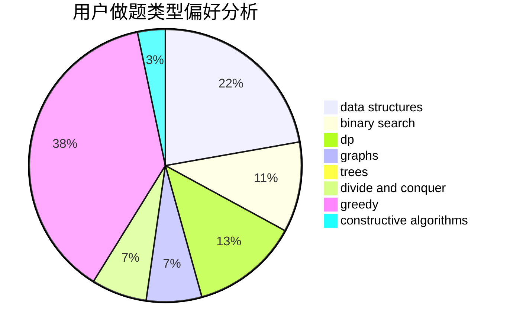
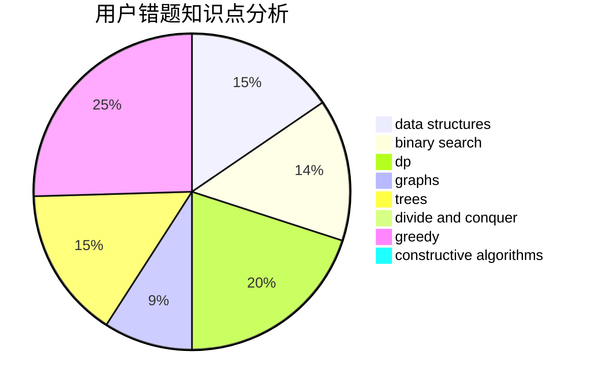

# lagerst

<!-- tabs:start -->

#### **用户提交结果分析**

#### **用户做题类型偏好分析**

#### **用户错题知识点分析**

<!-- tabs:end -->
# 推荐题目
[886A](https://codeforces.com/contest/886/problem/A)		brute force		  
[683B](https://codeforces.com/contest/683/problem/B)		*special problem		  
[549C](https://codeforces.com/contest/549/problem/C)		games		  
[916C](https://codeforces.com/contest/916/problem/C)		constructive algorithms,
                        graphs,
                        shortest paths		  
[794C](https://codeforces.com/contest/794/problem/C)		games,
                        greedy,
                        sortings		  
[600C](https://codeforces.com/contest/600/problem/C)		constructive algorithms,
                        greedy,
                        strings		  
[29B](https://codeforces.com/contest/29/problem/B)		implementation		  
[939E](https://codeforces.com/contest/939/problem/E)		binary search,
                        greedy,
                        ternary search,
                        two pointers		  
[962D](https://codeforces.com/contest/962/problem/D)		data structures,
                        implementation		  
[1387A](https://codeforces.com/contest/1387/problem/A)		*special problem,
                        binary search,
                        dfs and similar,
                        dp,
                        math,
                        ternary search		  
