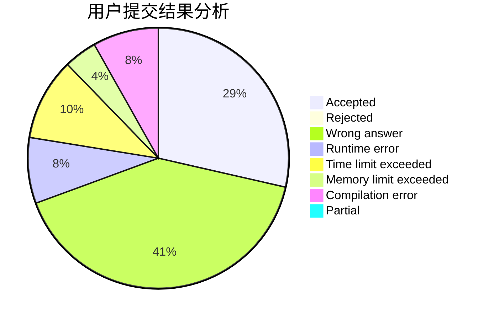
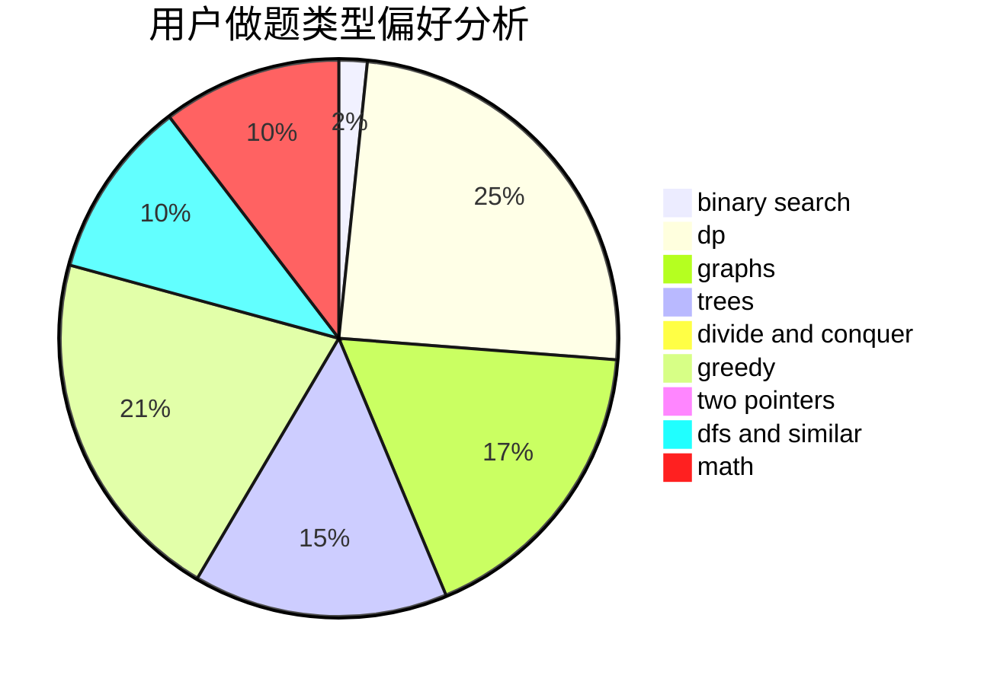

# lagin

<!-- tabs:start -->

#### **用户提交结果分析**

#### **用户做题类型偏好分析**

<!-- tabs:end -->
# 推荐题目
[1394E](https://codeforces.com/contest/1394/problem/E)
[847B](https://codeforces.com/contest/847/problem/B)
[849B](https://codeforces.com/contest/849/problem/B)
[1176E](https://codeforces.com/contest/1176/problem/E)
[981D](https://codeforces.com/contest/981/problem/D)
[98A](https://codeforces.com/contest/98/problem/A)
[165D](https://codeforces.com/contest/165/problem/D)
[13701](https://codeforces.com/contest/1370/problem/1)
[1301F](https://codeforces.com/contest/1301/problem/F)
[1091F](https://codeforces.com/contest/1091/problem/F)
