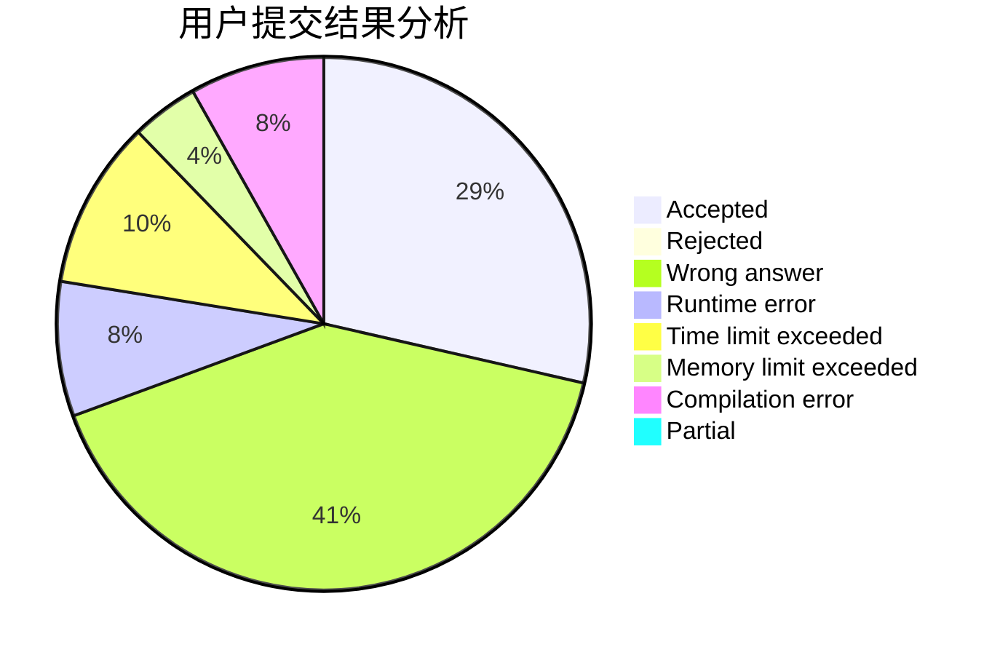
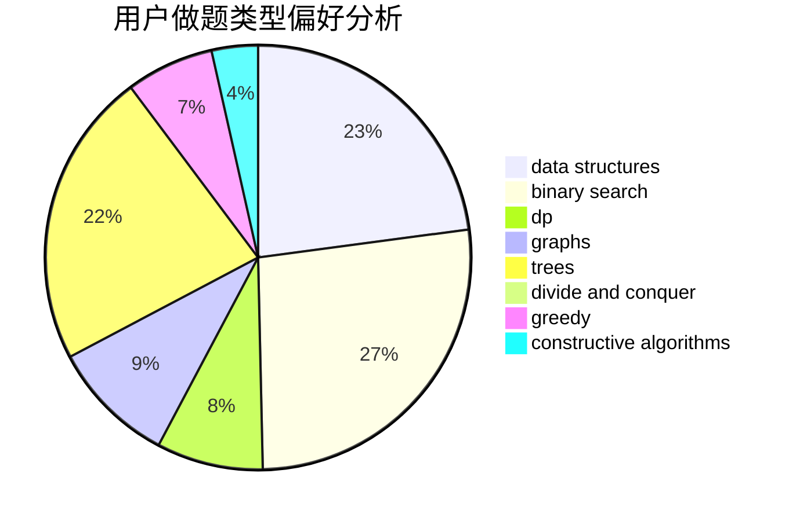
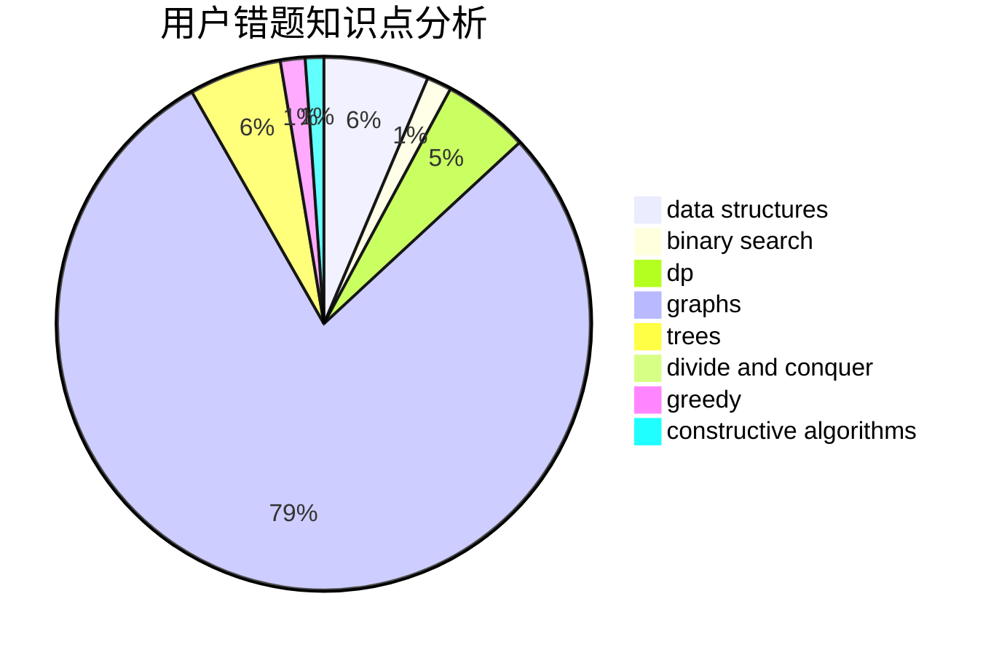

# lagin

<!-- tabs:start -->

#### **用户提交结果分析**

#### **用户做题类型偏好分析**

#### **用户错题知识点分析**

<!-- tabs:end -->
# 推荐题目
[1384E](https://codeforces.com/contest/1384/problem/E)		dsu,graphs,sortings,trees		  
[828D](https://codeforces.com/contest/828/problem/D)		dsu,graphs,sortings,trees		  
[831B](https://codeforces.com/contest/831/problem/B)		implementation,
                        strings		  
[1174C](https://codeforces.com/contest/1174/problem/C)		constructive algorithms,
                        number theory		  
[959F](https://codeforces.com/contest/959/problem/F)		bitmasks,
                        dp,
                        math,
                        matrices		  
[975B](https://codeforces.com/contest/975/problem/B)		brute force,
                        implementation		  
[1510G](https://codeforces.com/contest/1510/problem/G)		nan		  
[1362F](https://codeforces.com/contest/1362/problem/F)		dsu,graphs,sortings,trees		  
[1295C](https://codeforces.com/contest/1295/problem/C)		dp,
                        greedy,
                        strings		  
[1091C](https://codeforces.com/contest/1091/problem/C)		math,
                        number theory		  
