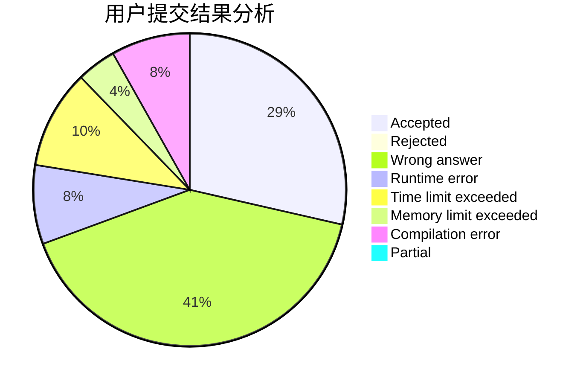
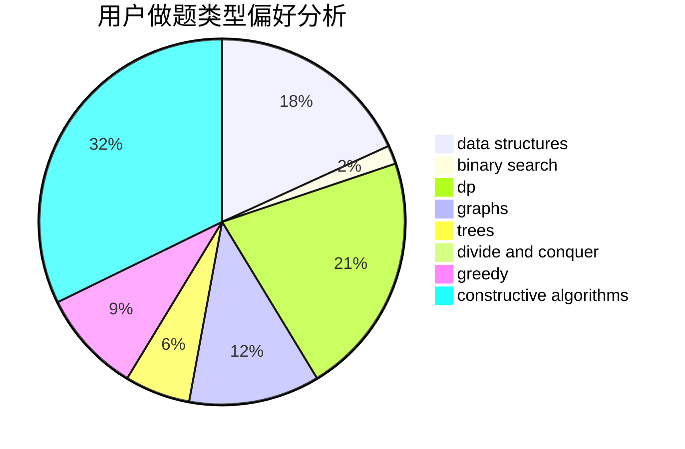
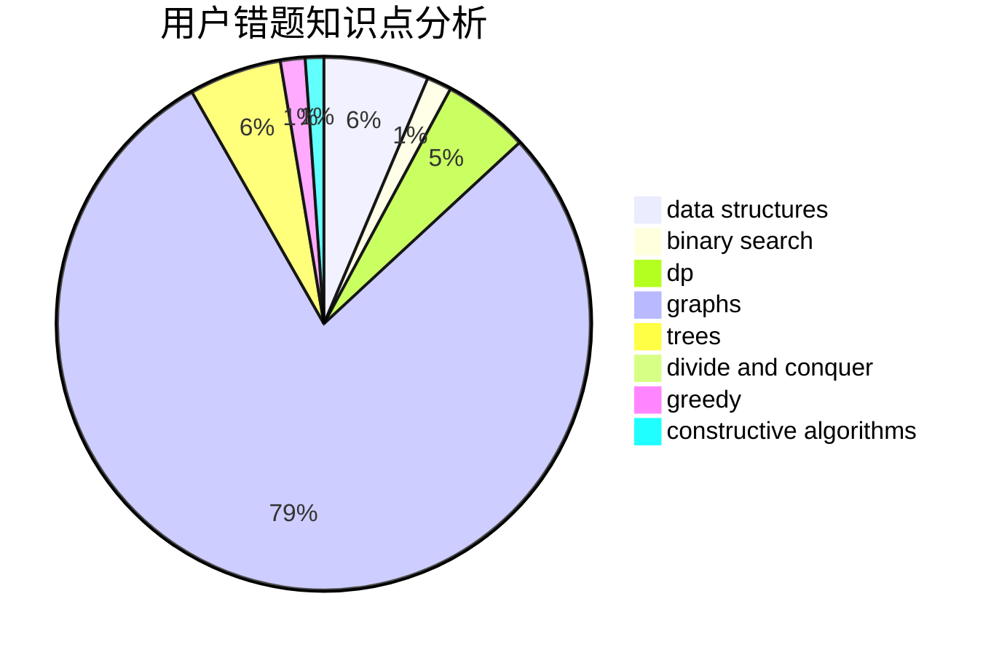

# lagin

<!-- tabs:start -->

#### **用户提交结果分析**

#### **用户做题类型偏好分析**

#### **用户错题知识点分析**

<!-- tabs:end -->
# 推荐题目
[1394E](https://codeforces.com/contest/1394/problem/E)		strings		  
[847B](https://codeforces.com/contest/847/problem/B)		binary search,
                        data structures		  
[849B](https://codeforces.com/contest/849/problem/B)		brute force,
                        geometry		  
[1176E](https://codeforces.com/contest/1176/problem/E)		dfs and similar,
                        dsu,
                        graphs,
                        shortest paths,
                        trees		  
[981D](https://codeforces.com/contest/981/problem/D)		bitmasks,
                        dp,
                        greedy		  
[98A](https://codeforces.com/contest/98/problem/A)		brute force,
                        implementation		  
[165D](https://codeforces.com/contest/165/problem/D)		data structures,
                        dsu,
                        trees		  
[13701](https://codeforces.com/contest/1370/problem/1)		dsu,graphs,sortings,trees		  
[1301F](https://codeforces.com/contest/1301/problem/F)		dfs and similar,
                        graphs,
                        implementation,
                        shortest paths		  
[1091F](https://codeforces.com/contest/1091/problem/F)		constructive algorithms,
                        greedy		  
