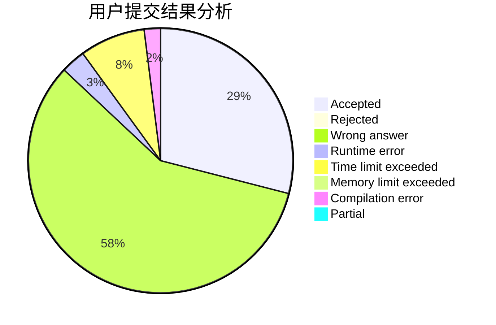
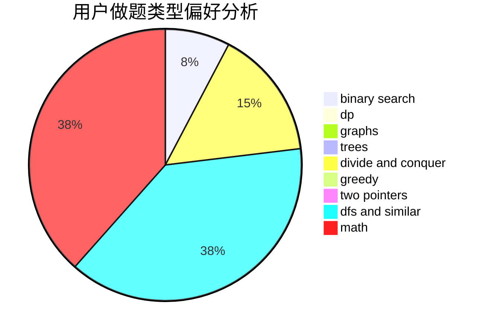

# BeyondLyc

<!-- tabs:start -->

#### **用户提交结果分析**

#### **用户做题类型偏好分析**

<!-- tabs:end -->
# 推荐题目
[152B](https://codeforces.com/contest/152/problem/B)
[1085F](https://codeforces.com/contest/1085/problem/F)
[235C](https://codeforces.com/contest/235/problem/C)
[1005B](https://codeforces.com/contest/1005/problem/B)
[549F](https://codeforces.com/contest/549/problem/F)
[546A](https://codeforces.com/contest/546/problem/A)
[1490C](https://codeforces.com/contest/1490/problem/C)
[1497B](https://codeforces.com/contest/1497/problem/B)
[1491C](https://codeforces.com/contest/1491/problem/C)
[1484C](https://codeforces.com/contest/1484/problem/C)
