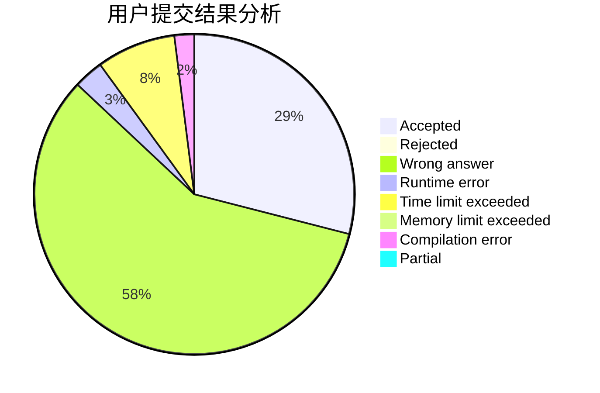
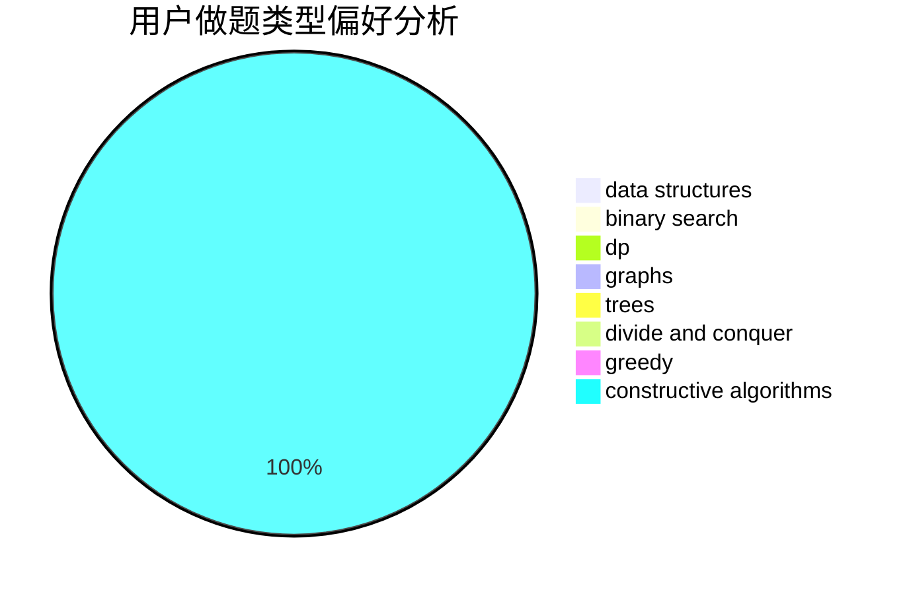
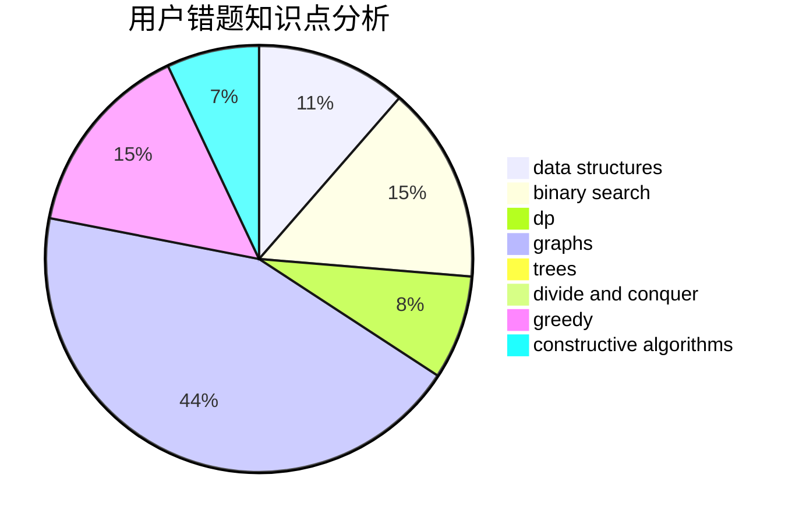

# BeyondLyc

<!-- tabs:start -->

#### **用户提交结果分析**

#### **用户做题类型偏好分析**

#### **用户错题知识点分析**

<!-- tabs:end -->
# 推荐题目
[152B](https://codeforces.com/contest/152/problem/B)		binary search,
                        implementation		  
[1085F](https://codeforces.com/contest/1085/problem/F)		nan		  
[235C](https://codeforces.com/contest/235/problem/C)		data structures,
                        string suffix structures,
                        strings		  
[1005B](https://codeforces.com/contest/1005/problem/B)		brute force,
                        implementation,
                        strings		  
[549F](https://codeforces.com/contest/549/problem/F)		data structures,
                        divide and conquer		  
[546A](https://codeforces.com/contest/546/problem/A)		brute force,
                        implementation,
                        math		  
[1490C](https://codeforces.com/contest/1490/problem/C)		binary search,
                        brute force,
                        brute force,
                        math		  
[1497B](https://codeforces.com/contest/1497/problem/B)		constructive algorithms,
                        greedy,
                        math		  
[1491C](https://codeforces.com/contest/1491/problem/C)		brute force,
                        data structures,
                        dp,
                        greedy,
                        implementation		  
[1484C](https://codeforces.com/contest/1484/problem/C)		dsu,graphs,sortings,trees		  
