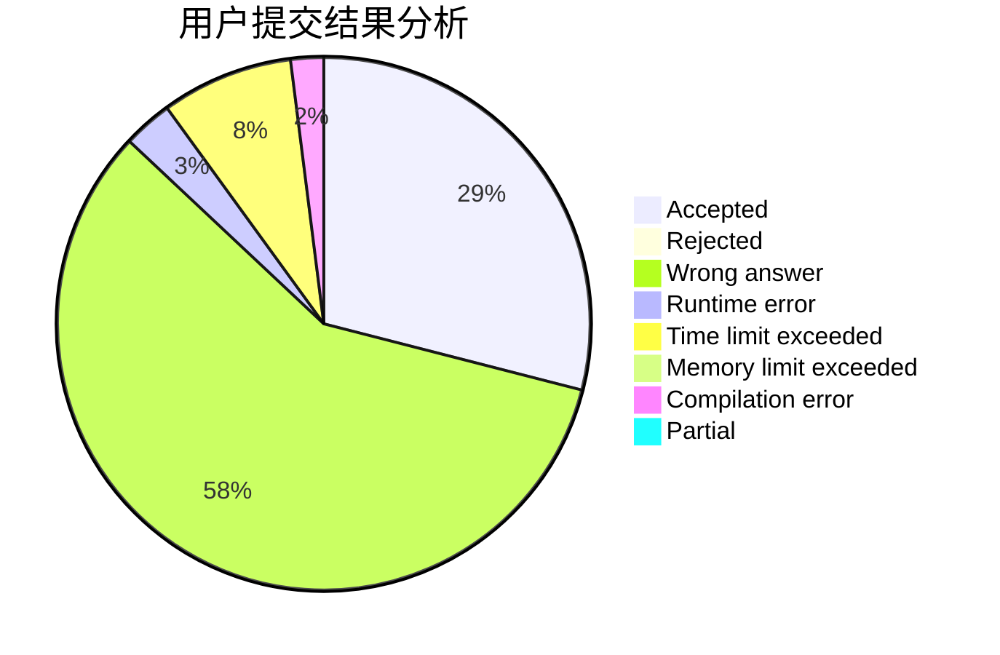
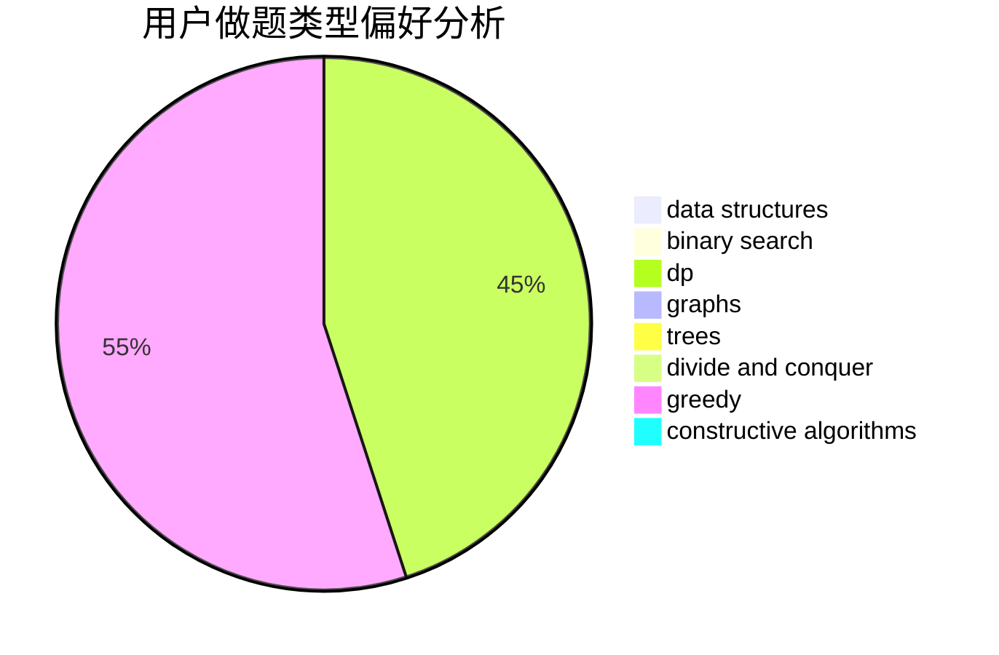
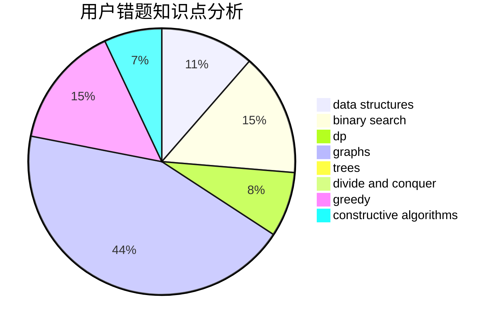

# BeyondLyc

<!-- tabs:start -->

#### **用户提交结果分析**

#### **用户做题类型偏好分析**

#### **用户错题知识点分析**

<!-- tabs:end -->
# 推荐题目
[1505B](https://codeforces.com/contest/1505/problem/B)		implementation,
                        number theory		  
[1085A](https://codeforces.com/contest/1085/problem/A)		implementation,
                        strings		  
[216A](https://codeforces.com/contest/216/problem/A)		implementation,
                        math		  
[1005A](https://codeforces.com/contest/1005/problem/A)		implementation		  
[525C](https://codeforces.com/contest/525/problem/C)		greedy,
                        math,
                        sortings		  
[520B](https://codeforces.com/contest/520/problem/B)		dfs and similar,
                        graphs,
                        greedy,
                        implementation,
                        math,
                        shortest paths		  
[1482E](https://codeforces.com/contest/1482/problem/E)		data structures,
                        divide and conquer,
                        dp		  
[1489D](https://codeforces.com/contest/1489/problem/D)		dsu,graphs,sortings,trees		  
[1483E](https://codeforces.com/contest/1483/problem/E)		dsu,graphs,sortings,trees		  
[1475F](https://codeforces.com/contest/1475/problem/F)		2-sat,
                        brute force,
                        constructive algorithms		  
