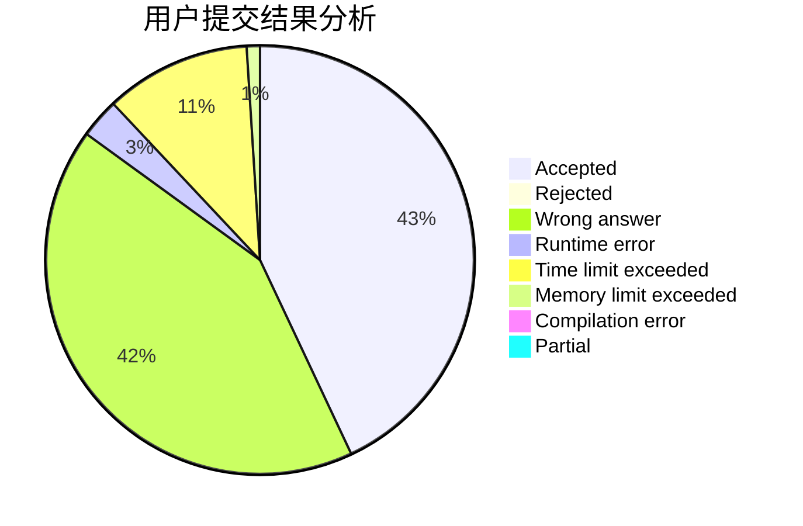
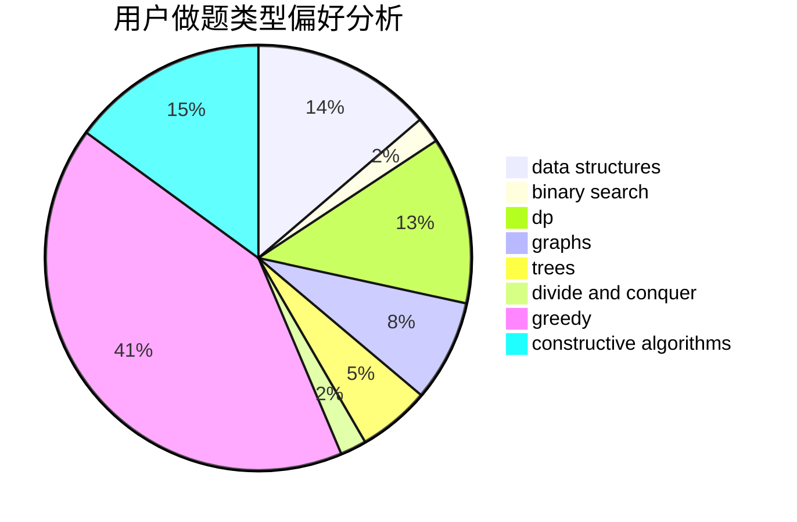
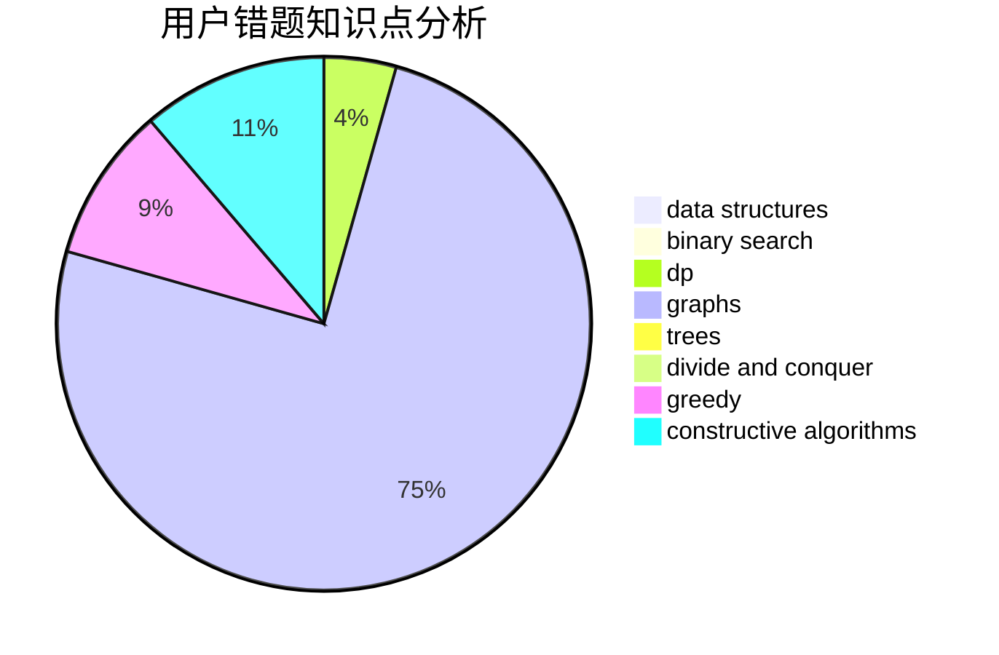

# lahlah

<!-- tabs:start -->

#### **用户提交结果分析**

#### **用户做题类型偏好分析**

#### **用户错题知识点分析**

<!-- tabs:end -->
# 推荐题目
[699A](https://codeforces.com/contest/699/problem/A)		implementation		  
[803D](https://codeforces.com/contest/803/problem/D)		binary search,
                        greedy		  
[827A](https://codeforces.com/contest/827/problem/A)		data structures,
                        greedy,
                        sortings,
                        strings		  
[1163D](https://codeforces.com/contest/1163/problem/D)		dp,
                        strings		  
[1054G](https://codeforces.com/contest/1054/problem/G)		constructive algorithms,
                        greedy,
                        math		  
[171H](https://codeforces.com/contest/171/problem/H)		*special problem,
                        implementation		  
[631A](https://codeforces.com/contest/631/problem/A)		brute force,
                        implementation		  
[830D](https://codeforces.com/contest/830/problem/D)		combinatorics,
                        dp,
                        graphs,
                        trees		  
[735B](https://codeforces.com/contest/735/problem/B)		greedy,
                        number theory,
                        sortings		  
[41E](https://codeforces.com/contest/41/problem/E)		constructive algorithms,
                        graphs,
                        greedy		  
