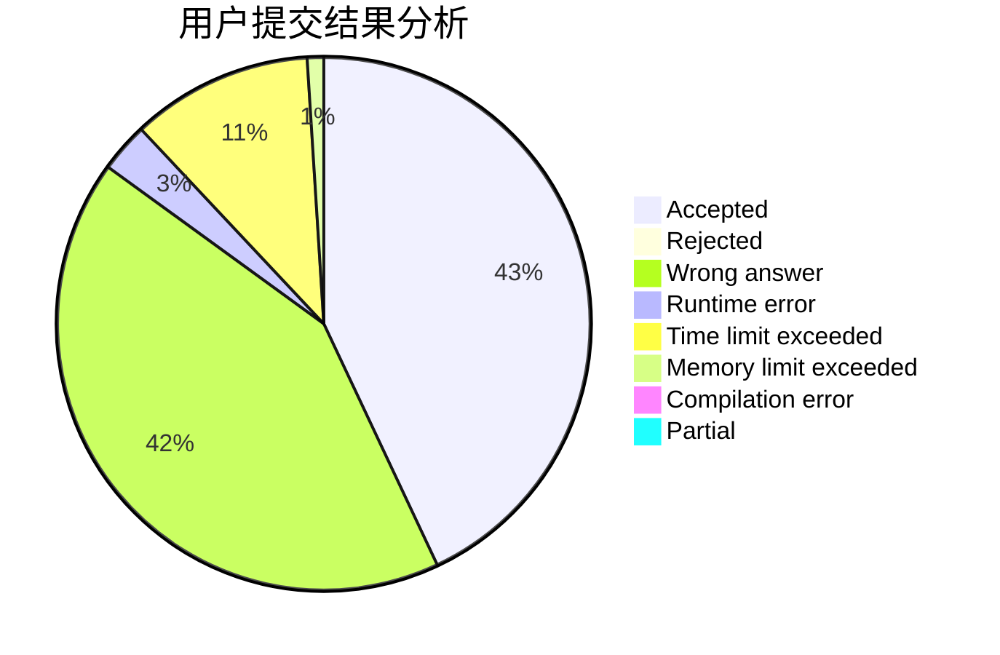
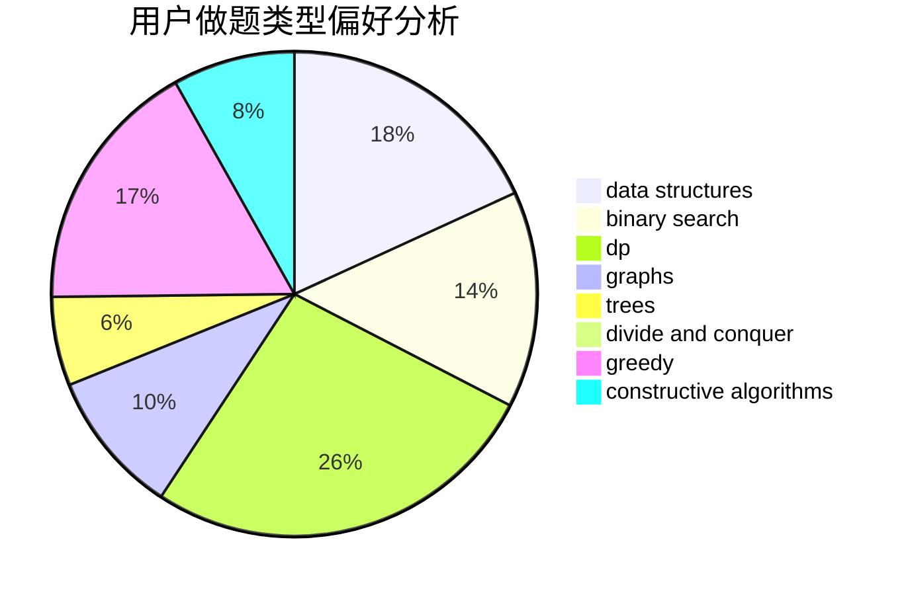
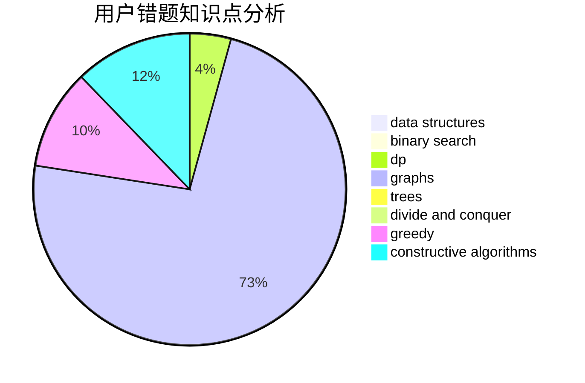

# lahlah

<!-- tabs:start -->

#### **用户提交结果分析**

#### **用户做题类型偏好分析**

#### **用户错题知识点分析**

<!-- tabs:end -->
# 推荐题目
[673B](https://codeforces.com/contest/673/problem/B)		greedy,
                        implementation		  
[787D](https://codeforces.com/contest/787/problem/D)		dsu,graphs,sortings,trees		  
[809B](https://codeforces.com/contest/809/problem/B)		binary search,
                        interactive		  
[1161A](https://codeforces.com/contest/1161/problem/A)		dsu,graphs,sortings,trees		  
[1054C](https://codeforces.com/contest/1054/problem/C)		constructive algorithms,
                        implementation		  
[1513A](https://codeforces.com/contest/1513/problem/A)		constructive algorithms,
                        implementation		  
[611H](https://codeforces.com/contest/611/problem/H)		constructive algorithms,
                        flows,
                        graphs		  
[812A](https://codeforces.com/contest/812/problem/A)		implementation		  
[717H](https://codeforces.com/contest/717/problem/H)		math,
                        probabilities		  
[38G](https://codeforces.com/contest/38/problem/G)		data structures		  
