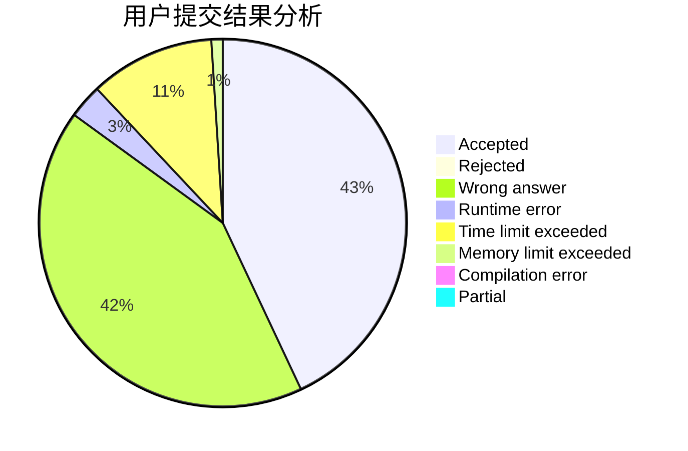
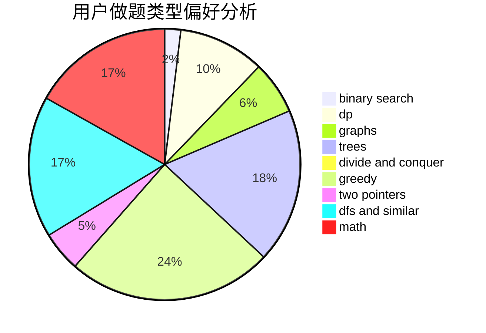

# lahlah

<!-- tabs:start -->

#### **用户提交结果分析**

#### **用户做题类型偏好分析**

<!-- tabs:end -->
# 推荐题目
[699A](https://codeforces.com/contest/699/problem/A)
[803D](https://codeforces.com/contest/803/problem/D)
[827A](https://codeforces.com/contest/827/problem/A)
[1163D](https://codeforces.com/contest/1163/problem/D)
[1054G](https://codeforces.com/contest/1054/problem/G)
[171H](https://codeforces.com/contest/171/problem/H)
[631A](https://codeforces.com/contest/631/problem/A)
[830D](https://codeforces.com/contest/830/problem/D)
[735B](https://codeforces.com/contest/735/problem/B)
[41E](https://codeforces.com/contest/41/problem/E)
