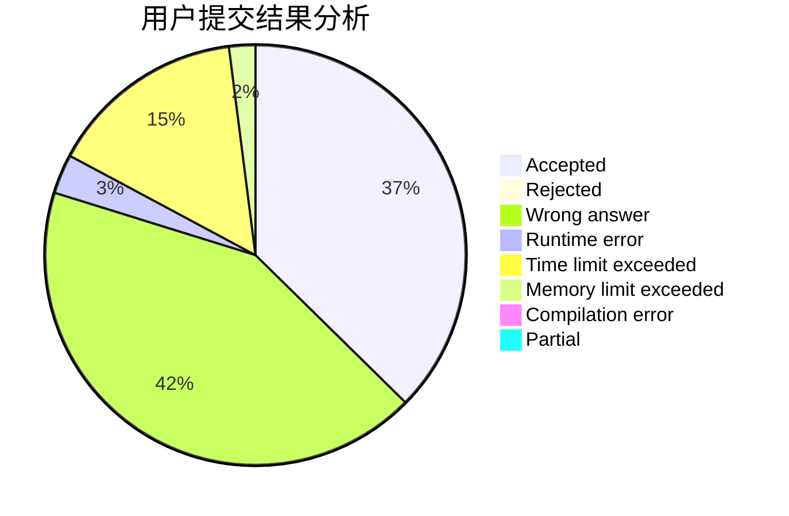
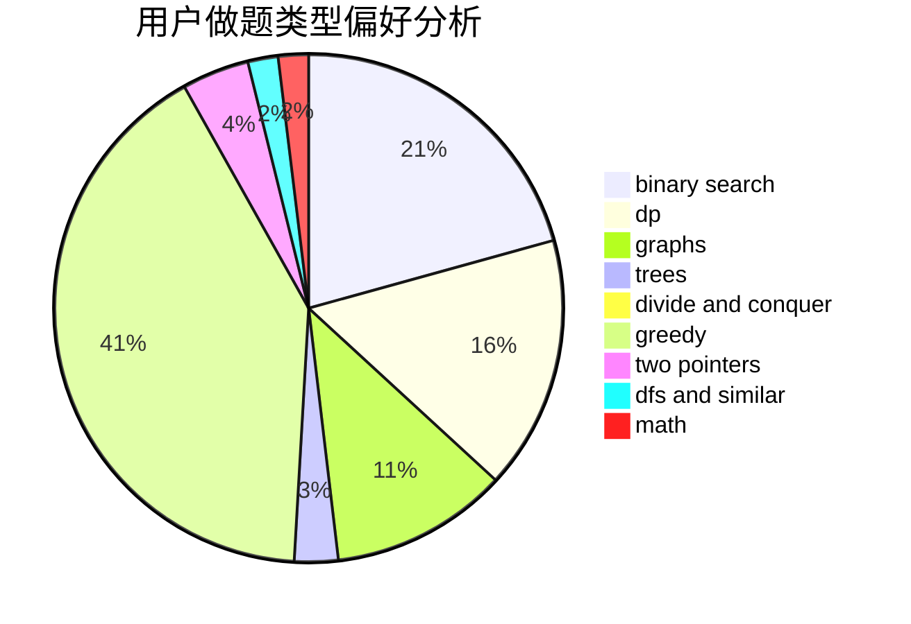

# lanChe

<!-- tabs:start -->

#### **用户提交结果分析**

#### **用户做题类型偏好分析**

<!-- tabs:end -->
# 推荐题目
[846A](https://codeforces.com/contest/846/problem/A)
[1092E](https://codeforces.com/contest/1092/problem/E)
[936D](https://codeforces.com/contest/936/problem/D)
[1360H](https://codeforces.com/contest/1360/problem/H)
[1119F](https://codeforces.com/contest/1119/problem/F)
[575H](https://codeforces.com/contest/575/problem/H)
[1147C](https://codeforces.com/contest/1147/problem/C)
[990A](https://codeforces.com/contest/990/problem/A)
[616C](https://codeforces.com/contest/616/problem/C)
[1099D](https://codeforces.com/contest/1099/problem/D)
