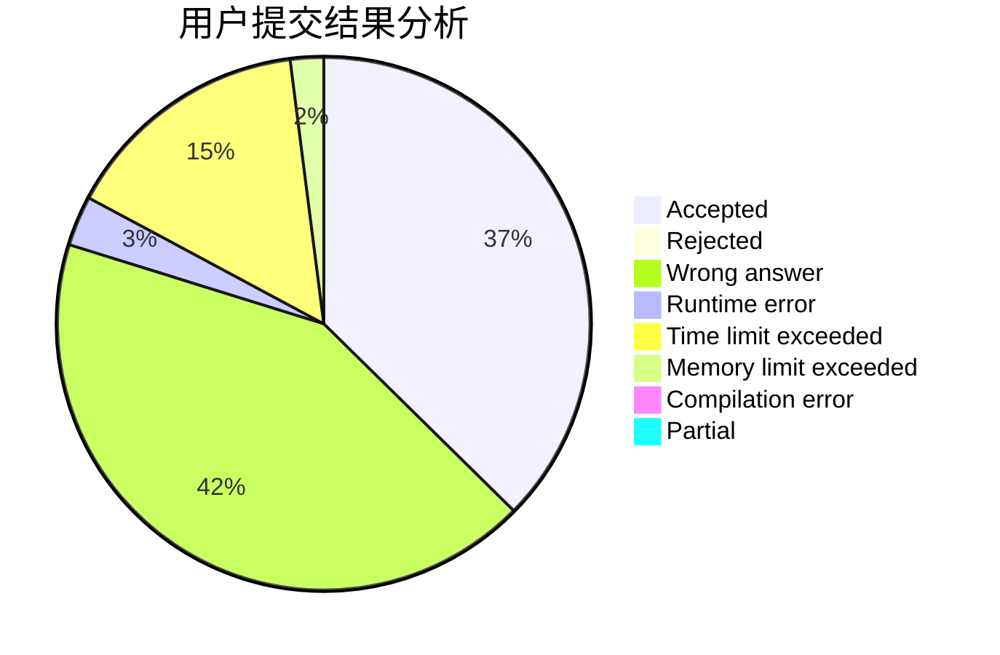
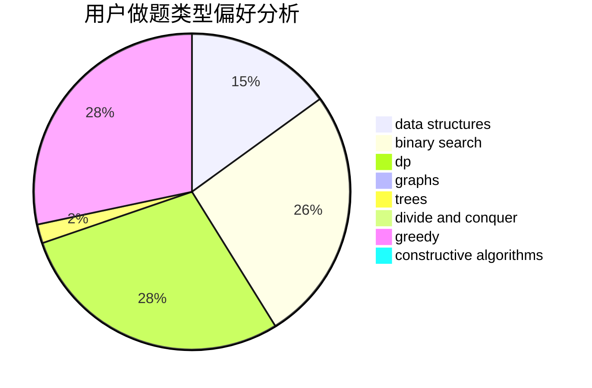

# lanChe

<!-- tabs:start -->

#### **用户提交结果分析**

#### **用户做题类型偏好分析**

#### **用户错题知识点分析**

<!-- tabs:end -->
# 推荐题目
[846A](https://codeforces.com/contest/846/problem/A)		brute force,
                        implementation		  
[1092E](https://codeforces.com/contest/1092/problem/E)		constructive algorithms,
                        dfs and similar,
                        greedy,
                        trees		  
[936D](https://codeforces.com/contest/936/problem/D)		dp,
                        greedy		  
[1360H](https://codeforces.com/contest/1360/problem/H)		binary search,
                        bitmasks,
                        brute force,
                        constructive algorithms		  
[1119F](https://codeforces.com/contest/1119/problem/F)		data structures,
                        dp,
                        trees		  
[575H](https://codeforces.com/contest/575/problem/H)		combinatorics,
                        number theory		  
[1147C](https://codeforces.com/contest/1147/problem/C)		games		  
[990A](https://codeforces.com/contest/990/problem/A)		implementation,
                        math		  
[616C](https://codeforces.com/contest/616/problem/C)		dfs and similar		  
[1099D](https://codeforces.com/contest/1099/problem/D)		dsu,graphs,sortings,trees		  
