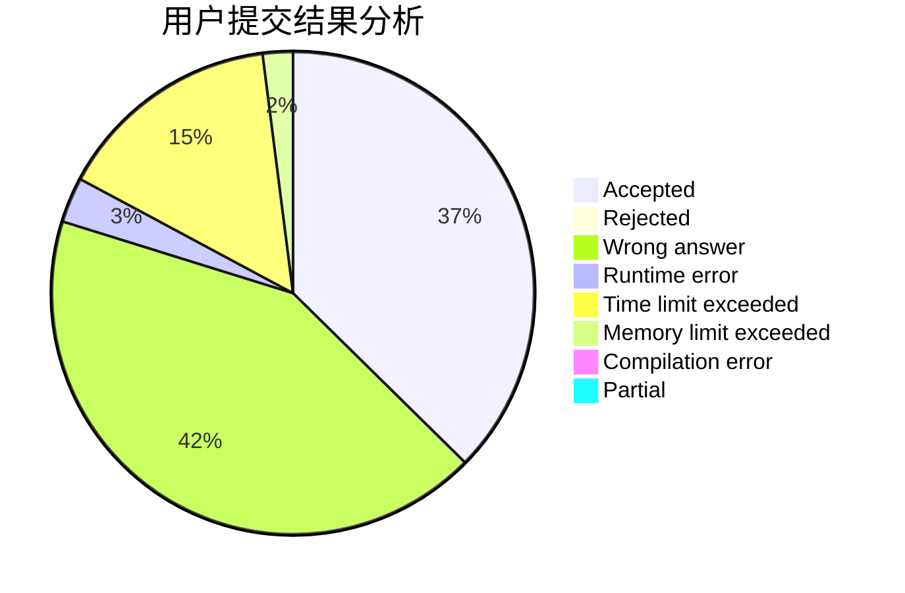
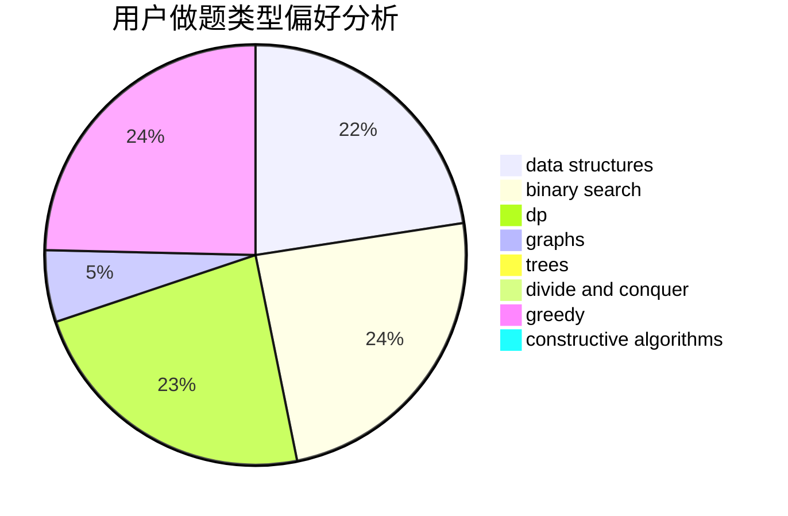

# lanChe

<!-- tabs:start -->

#### **用户提交结果分析**

#### **用户做题类型偏好分析**

#### **用户错题知识点分析**

<!-- tabs:end -->
# 推荐题目
[827E](https://codeforces.com/contest/827/problem/E)		fft,
                        math,
                        strings		  
[1092B](https://codeforces.com/contest/1092/problem/B)		sortings		  
[916C](https://codeforces.com/contest/916/problem/C)		constructive algorithms,
                        graphs,
                        shortest paths		  
[1354C2](https://codeforces.com/contest/1354C/problem/2)		binary search,
                        brute force,
                        geometry,
                        math		  
[1118A](https://codeforces.com/contest/1118/problem/A)		math		  
[550D](https://codeforces.com/contest/550/problem/D)		constructive algorithms,
                        graphs,
                        implementation		  
[1145B](https://codeforces.com/contest/1145/problem/B)		brute force		  
[976B](https://codeforces.com/contest/976/problem/B)		implementation,
                        math		  
[598D](https://codeforces.com/contest/598/problem/D)		dfs and similar,
                        graphs,
                        shortest paths		  
[1099A](https://codeforces.com/contest/1099/problem/A)		implementation		  
