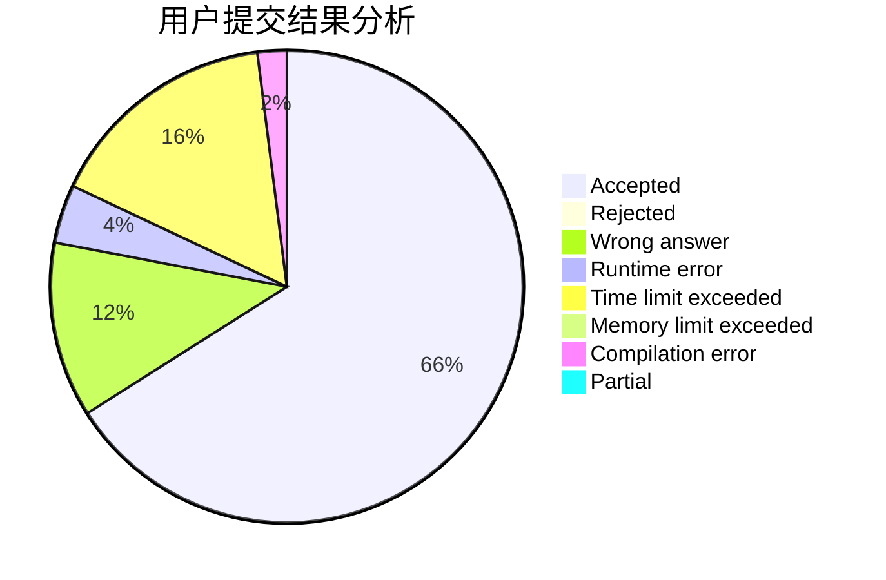
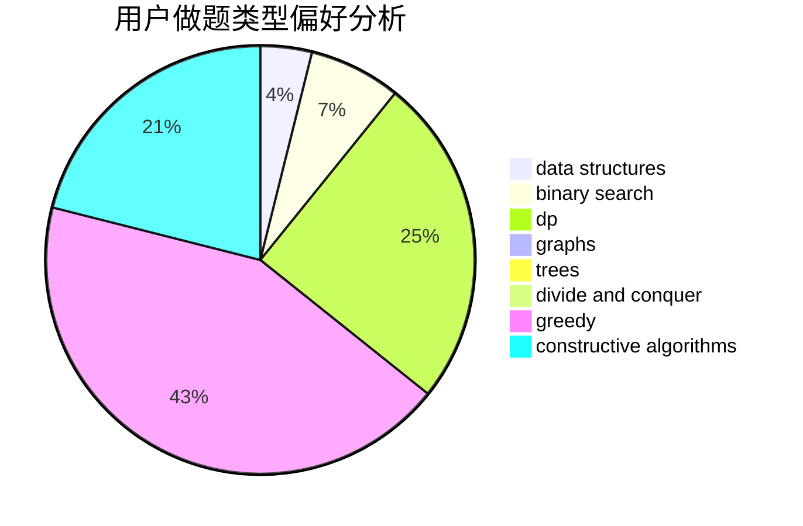
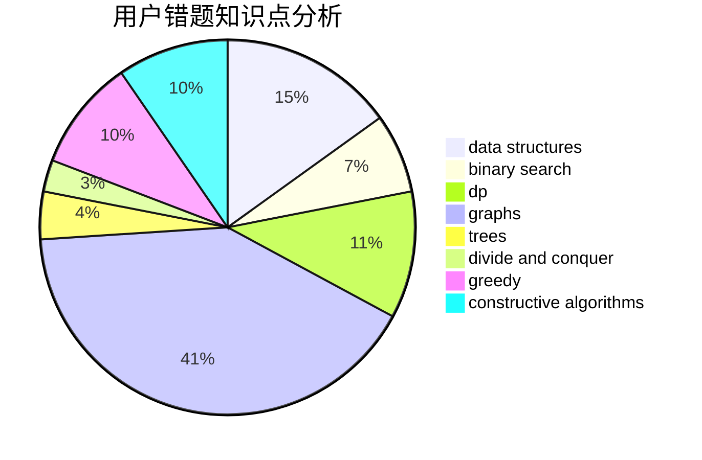

# lanadeus

<!-- tabs:start -->

#### **用户提交结果分析**

#### **用户做题类型偏好分析**

#### **用户错题知识点分析**

<!-- tabs:end -->
# 推荐题目
[1270A](https://codeforces.com/contest/1270/problem/A)		games,
                        greedy,
                        math		  
[913E](https://codeforces.com/contest/913/problem/E)		bitmasks,
                        dp,
                        shortest paths		  
[319A](https://codeforces.com/contest/319/problem/A)		combinatorics,
                        math		  
[1282B1](https://codeforces.com/contest/1282B/problem/1)		dp,
                        greedy,
                        sortings		  
[1145D](https://codeforces.com/contest/1145/problem/D)		implementation		  
[856F](https://codeforces.com/contest/856/problem/F)		greedy		  
[489F](https://codeforces.com/contest/489/problem/F)		combinatorics,
                        dp		  
[1091H](https://codeforces.com/contest/1091/problem/H)		games		  
[735D](https://codeforces.com/contest/735/problem/D)		math,
                        number theory		  
[1165D](https://codeforces.com/contest/1165/problem/D)		math,
                        number theory		  
