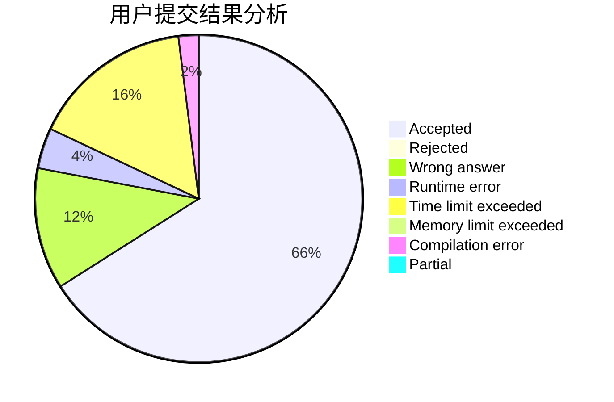
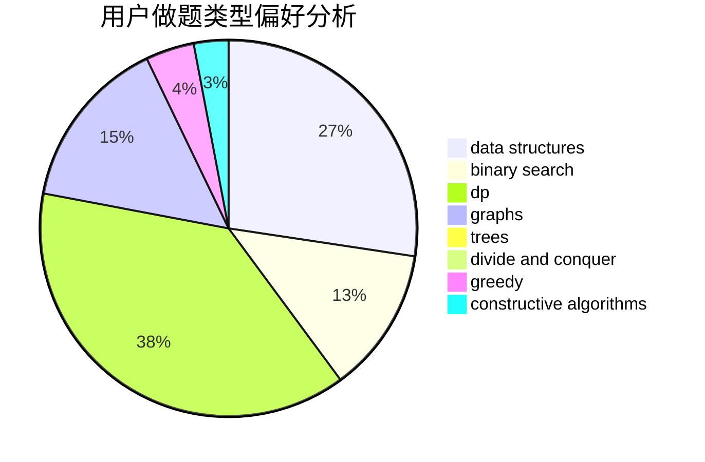
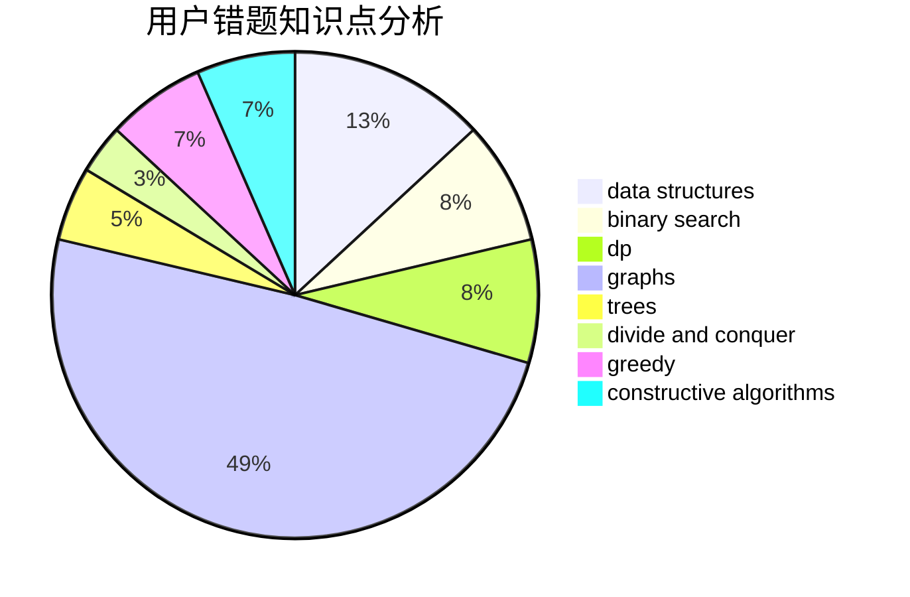

# lanadeus

<!-- tabs:start -->

#### **用户提交结果分析**

#### **用户做题类型偏好分析**

#### **用户错题知识点分析**

<!-- tabs:end -->
# 推荐题目
[1279A](https://codeforces.com/contest/1279/problem/A)		math		  
[932C](https://codeforces.com/contest/932/problem/C)		brute force,
                        constructive algorithms		  
[349B](https://codeforces.com/contest/349/problem/B)		data structures,
                        dp,
                        greedy,
                        implementation		  
[1288D](https://codeforces.com/contest/1288/problem/D)		binary search,
                        bitmasks,
                        dp		  
[1147E](https://codeforces.com/contest/1147/problem/E)		interactive		  
[875F](https://codeforces.com/contest/875/problem/F)		dsu,
                        graphs,
                        greedy		  
[50D](https://codeforces.com/contest/50/problem/D)		binary search,
                        dp,
                        probabilities		  
[1092A](https://codeforces.com/contest/1092/problem/A)		implementation		  
[757B](https://codeforces.com/contest/757/problem/B)		greedy,
                        math,
                        number theory		  
[1167F](https://codeforces.com/contest/1167/problem/F)		combinatorics,
                        data structures,
                        math,
                        sortings		  
