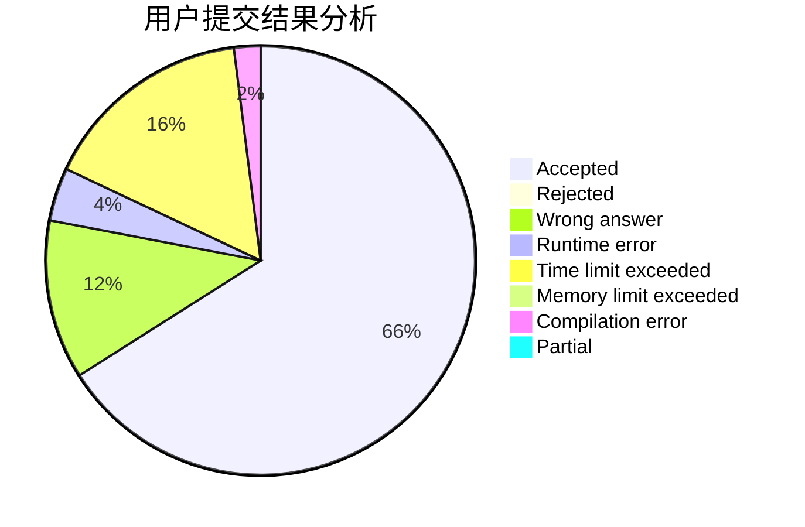
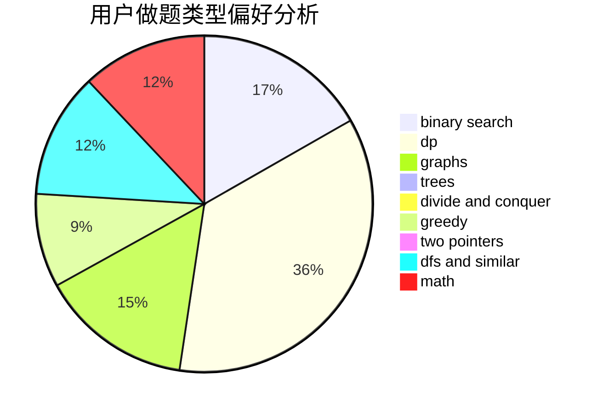

# lanadeus

<!-- tabs:start -->

#### **用户提交结果分析**

#### **用户做题类型偏好分析**

<!-- tabs:end -->
# 推荐题目
[1279A](https://codeforces.com/contest/1279/problem/A)
[932C](https://codeforces.com/contest/932/problem/C)
[349B](https://codeforces.com/contest/349/problem/B)
[1288D](https://codeforces.com/contest/1288/problem/D)
[1147E](https://codeforces.com/contest/1147/problem/E)
[875F](https://codeforces.com/contest/875/problem/F)
[50D](https://codeforces.com/contest/50/problem/D)
[1092A](https://codeforces.com/contest/1092/problem/A)
[757B](https://codeforces.com/contest/757/problem/B)
[1167F](https://codeforces.com/contest/1167/problem/F)
