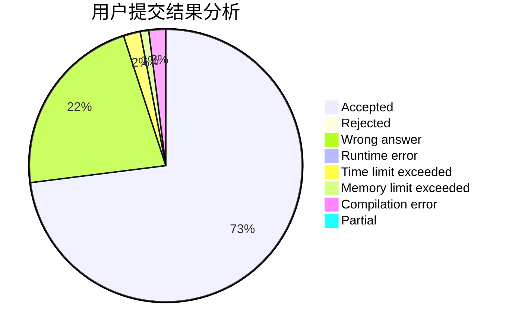
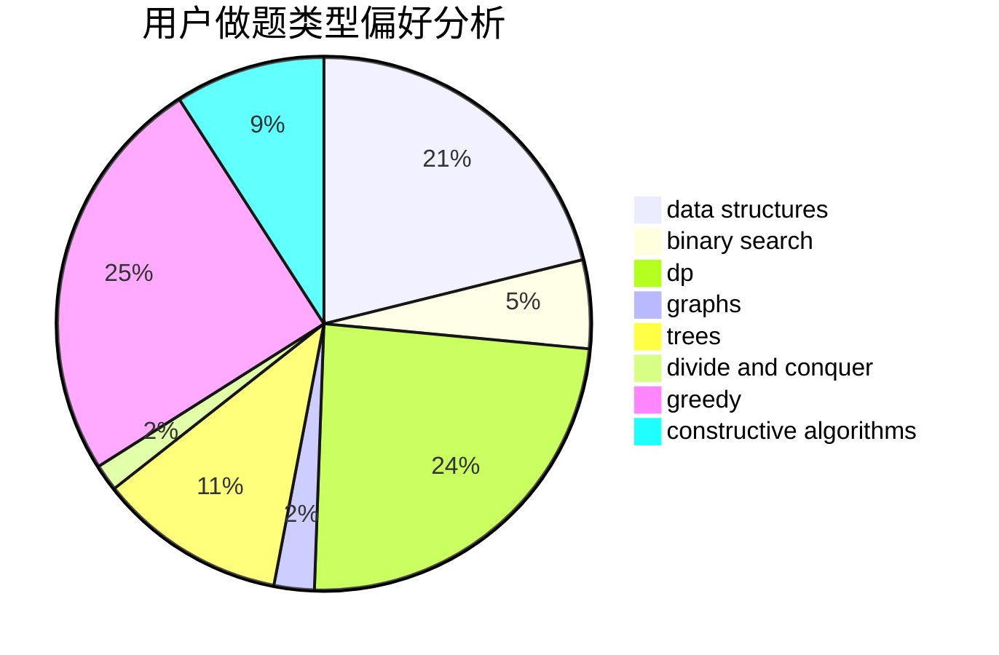
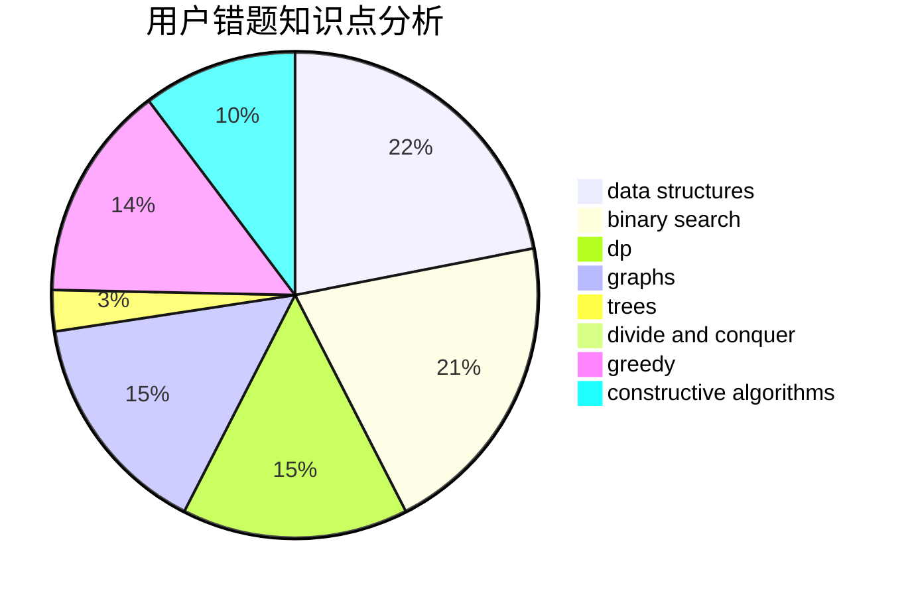

# laowuniubi

<!-- tabs:start -->

#### **用户提交结果分析**

#### **用户做题类型偏好分析**

#### **用户错题知识点分析**

<!-- tabs:end -->
# 推荐题目
[557C](https://codeforces.com/contest/557/problem/C)		brute force,
                        data structures,
                        dp,
                        greedy,
                        math,
                        sortings		  
[77E](https://codeforces.com/contest/77/problem/E)		geometry		  
[620F](https://codeforces.com/contest/620/problem/F)		data structures,
                        strings,
                        trees		  
[1090B](https://codeforces.com/contest/1090/problem/B)		nan		  
[1230C](https://codeforces.com/contest/1230/problem/C)		dsu,graphs,sortings,trees		  
[1105A](https://codeforces.com/contest/1105/problem/A)		brute force,
                        implementation		  
[625E](https://codeforces.com/contest/625/problem/E)		data structures,
                        greedy		  
[663E](https://codeforces.com/contest/663/problem/E)		dsu,graphs,sortings,trees		  
[840D](https://codeforces.com/contest/840/problem/D)		data structures,
                        probabilities		  
[286B](https://codeforces.com/contest/286/problem/B)		implementation		  
