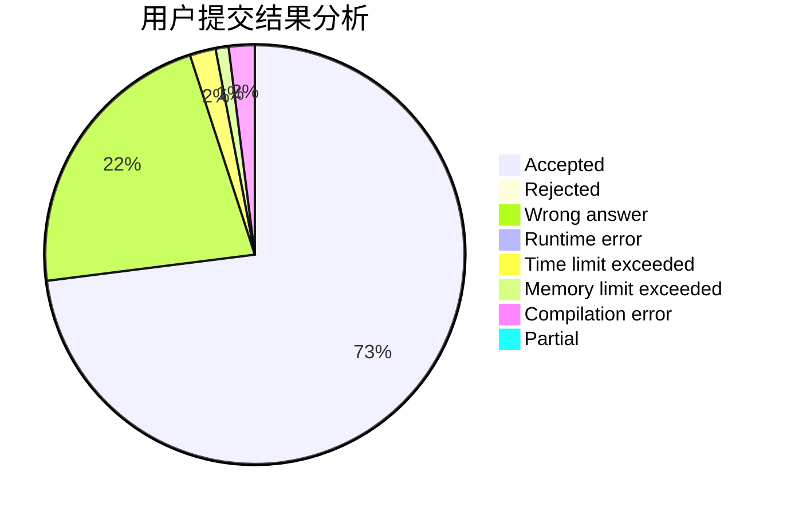
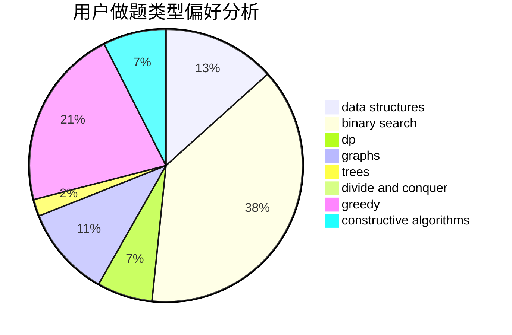
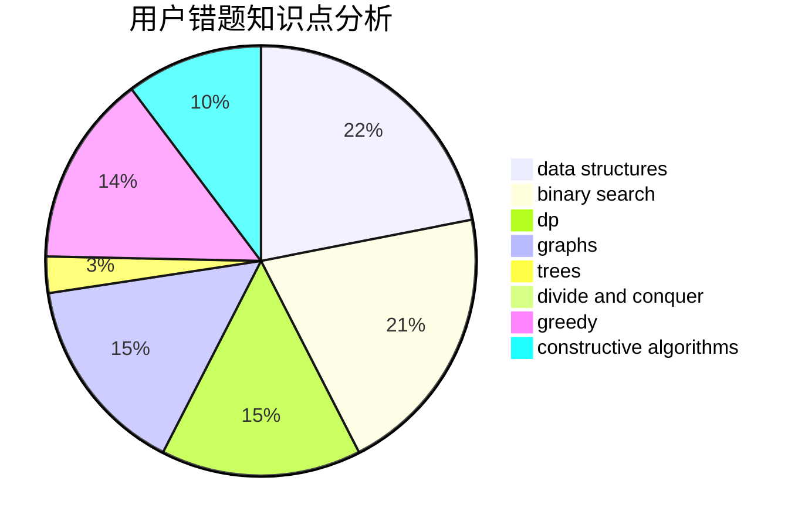

# laowuniubi

<!-- tabs:start -->

#### **用户提交结果分析**

#### **用户做题类型偏好分析**

#### **用户错题知识点分析**

<!-- tabs:end -->
# 推荐题目
[580D](https://codeforces.com/contest/580/problem/D)		bitmasks,
                        dp		  
[798C](https://codeforces.com/contest/798/problem/C)		dp,
                        greedy,
                        number theory		  
[644B](https://codeforces.com/contest/644/problem/B)		*special problem,
                        constructive algorithms,
                        data structures,
                        two pointers		  
[1090M](https://codeforces.com/contest/1090/problem/M)		implementation		  
[1238G](https://codeforces.com/contest/1238/problem/G)		data structures,
                        greedy,
                        sortings		  
[1105D](https://codeforces.com/contest/1105/problem/D)		dfs and similar,
                        graphs,
                        implementation,
                        shortest paths		  
[652D](https://codeforces.com/contest/652/problem/D)		data structures,
                        sortings		  
[683A](https://codeforces.com/contest/683/problem/A)		*special problem,
                        geometry		  
[85D](https://codeforces.com/contest/85/problem/D)		binary search,
                        brute force,
                        data structures,
                        implementation		  
[300C](https://codeforces.com/contest/300/problem/C)		brute force,
                        combinatorics		  
