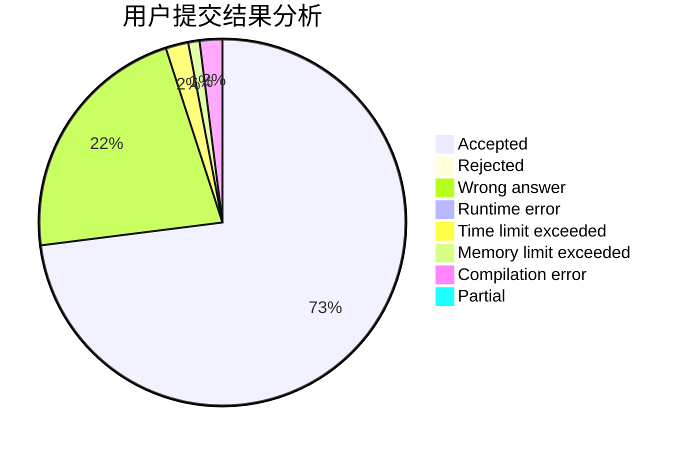
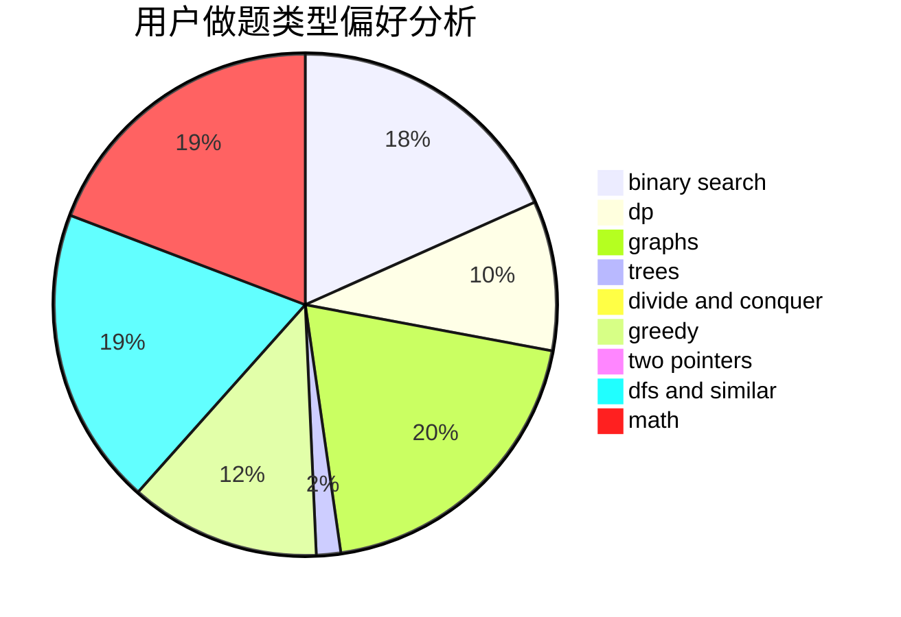

# laowuniubi

<!-- tabs:start -->

#### **用户提交结果分析**

#### **用户做题类型偏好分析**

<!-- tabs:end -->
# 推荐题目
[580D](https://codeforces.com/contest/580/problem/D)
[798C](https://codeforces.com/contest/798/problem/C)
[644B](https://codeforces.com/contest/644/problem/B)
[1090M](https://codeforces.com/contest/1090/problem/M)
[1238G](https://codeforces.com/contest/1238/problem/G)
[1105D](https://codeforces.com/contest/1105/problem/D)
[652D](https://codeforces.com/contest/652/problem/D)
[683A](https://codeforces.com/contest/683/problem/A)
[85D](https://codeforces.com/contest/85/problem/D)
[300C](https://codeforces.com/contest/300/problem/C)
