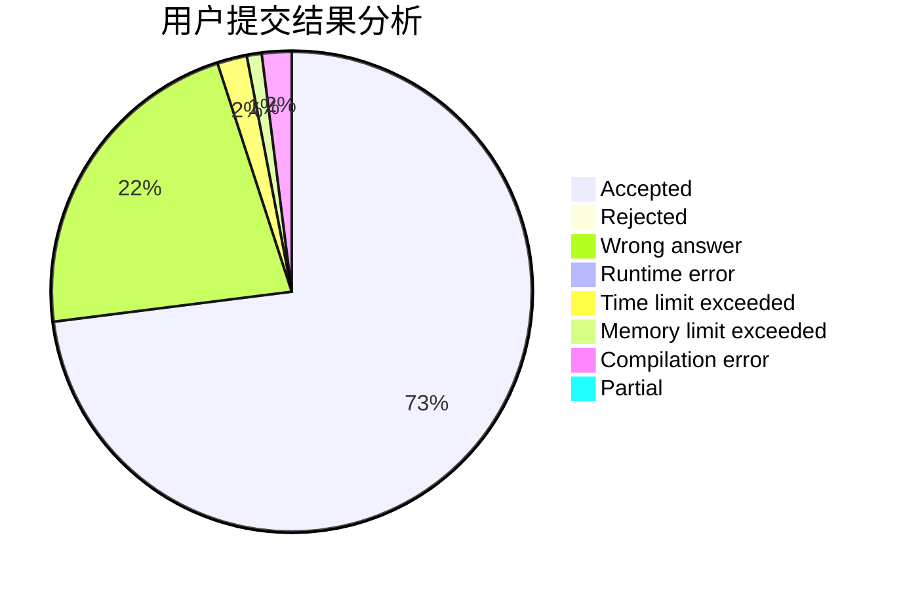
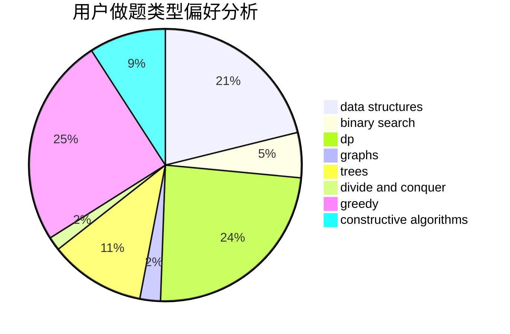
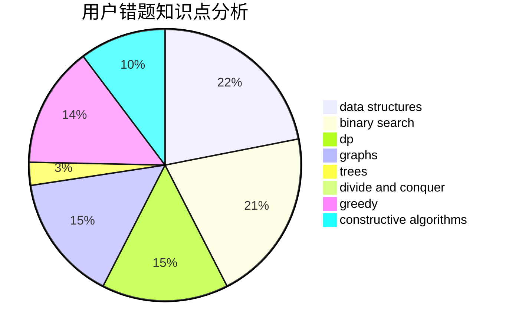

# laowuniubi
<!-- tabs:start -->
#### **用户提交结果分析**

#### **用户做题类型偏好分析**

#### **用户错题知识点分析**

<!-- tabs:end -->
# 推荐题目
[Anadi and Domino](https://codeforces.com/contest/1230/problem/C)		brute force,
                        graphs		  
[Lazy Security Guard](http://codeforces.com/problemset/problem/859/B)		brute force,
                        geometry,
                        math		  
[Circular Dungeon](http://codeforces.com/problemset/problem/1380/G)		greedy,
                        math,
                        probabilities		  
[Salem and Sticks](http://codeforces.com/problemset/problem/1105/A)		brute force,
                        implementation		  
[LaTeX Expert](http://codeforces.com/problemset/problem/1090/B)		nan		  
[Cowslip Collections](http://codeforces.com/problemset/problem/645/F)		combinatorics,
                        math,
                        number theory		  
[Arthur and Table](http://codeforces.com/problemset/problem/557/C)		brute force,
                        data structures,
                        dp,
                        greedy,
                        math,
                        sortings		  
[Martian Food](http://codeforces.com/problemset/problem/77/E)		geometry		  
[Oleg and shares](http://codeforces.com/problemset/problem/793/A)		implementation,
                        math		  
[Inversion Counting](http://codeforces.com/problemset/problem/911/D)		brute force,
                        math		  
<!-- tabs:start -->
#### **data structures**
[Anadi and Domino](http://codeforces.com/problemset/problem/557/C)		brute force,
                        data structures,
                        dp,
                        greedy,
                        math,
                        sortings		  
[Lazy Security Guard](http://codeforces.com/problemset/problem/625/E)		data structures,
                        greedy		  
[Circular Dungeon](http://codeforces.com/problemset/problem/69/E)		data structures,
                        implementation		  
[Salem and Sticks](http://codeforces.com/problemset/problem/1208/D)		binary search,
                        data structures,
                        greedy,
                        implementation		  
[LaTeX Expert](http://codeforces.com/problemset/problem/877/F)		data structures,
                        flows,
                        hashing		  
[Cowslip Collections](http://codeforces.com/problemset/problem/1320/D)		data structures,
                        hashing,
                        strings		  
[Arthur and Table](http://codeforces.com/problemset/problem/620/F)		data structures,
                        strings,
                        trees		  
[Martian Food](http://codeforces.com/problemset/problem/840/D)		data structures,
                        probabilities		  
[Oleg and shares](http://codeforces.com/problemset/problem/538/F)		brute force,
                        data structures,
                        math,
                        sortings		  
[Inversion Counting](http://codeforces.com/problemset/problem/896/C)		data structures,
                        probabilities		  
#### **binary search**
[Anadi and Domino](http://codeforces.com/problemset/problem/1310/C)		binary search,
                        dp,
                        strings		  
[Lazy Security Guard](http://codeforces.com/problemset/problem/126/B)		binary search,
                        dp,
                        hashing,
                        string suffix structures,
                        strings		  
[Circular Dungeon](http://codeforces.com/problemset/problem/837/F)		binary search,
                        brute force,
                        combinatorics,
                        math,
                        matrices		  
[Salem and Sticks](http://codeforces.com/problemset/problem/1208/D)		binary search,
                        data structures,
                        greedy,
                        implementation		  
[LaTeX Expert](http://codeforces.com/problemset/problem/1492/C)		binary search,
                        data structures,
                        dp,
                        greedy,
                        two pointers		  
[Cowslip Collections](http://codeforces.com/problemset/problem/1463/D)		binary search,
                        constructive algorithms,
                        greedy,
                        two pointers		  
[Arthur and Table](http://codeforces.com/problemset/problem/1490/G)		binary search,
                        data structures,
                        math		  
[Martian Food](http://codeforces.com/problemset/problem/1479/D)		binary search,
                        bitmasks,
                        brute force,
                        data structures,
                        probabilities,
                        trees		  
[Oleg and shares](http://codeforces.com/problemset/problem/1436/E)		binary search,
                        data structures,
                        two pointers		  
[Inversion Counting](http://codeforces.com/problemset/problem/1461/D)		binary search,
                        brute force,
                        data structures,
                        divide and conquer,
                        implementation,
                        sortings		  
#### **dp**
[Anadi and Domino](http://codeforces.com/problemset/problem/557/C)		brute force,
                        data structures,
                        dp,
                        greedy,
                        math,
                        sortings		  
[Lazy Security Guard](http://codeforces.com/problemset/problem/1310/C)		binary search,
                        dp,
                        strings		  
[Circular Dungeon](http://codeforces.com/problemset/problem/126/B)		binary search,
                        dp,
                        hashing,
                        string suffix structures,
                        strings		  
[Salem and Sticks](http://codeforces.com/problemset/problem/1107/D)		dp,
                        implementation,
                        math,
                        number theory		  
[LaTeX Expert](https://codeforces.com/contest/663/problem/E)		bitmasks,
                        brute force,
                        divide and conquer,
                        dp,
                        fft,
                        math		  
[Cowslip Collections](http://codeforces.com/problemset/problem/578/D)		dp,
                        greedy		  
[Arthur and Table](http://codeforces.com/problemset/problem/593/E)		dp,
                        matrices		  
[Martian Food](http://codeforces.com/problemset/problem/840/C)		combinatorics,
                        dp		  
[Oleg and shares](http://codeforces.com/problemset/problem/455/A)		dp		  
[Inversion Counting](https://codeforces.com/contest/1013/problem/E)		dp		  
#### **graph**
[Anadi and Domino](https://codeforces.com/contest/1230/problem/C)		brute force,
                        graphs		  
[Lazy Security Guard](https://codeforces.com/contest/218/problem/C)		brute force,
                        dfs and similar,
                        dsu,
                        graphs		  
[Circular Dungeon](http://codeforces.com/problemset/problem/1487/C)		brute force,
                        constructive algorithms,
                        dfs and similar,
                        graphs,
                        greedy,
                        implementation,
                        math		  
[Salem and Sticks](http://codeforces.com/problemset/problem/1437/C)		dp,
                        flows,
                        graph matchings,
                        greedy,
                        math,
                        sortings		  
[LaTeX Expert](http://codeforces.com/problemset/problem/1470/D)		constructive algorithms,
                        dfs and similar,
                        graph matchings,
                        graphs,
                        greedy		  
[Cowslip Collections](http://codeforces.com/problemset/problem/1476/C)		dp,
                        graphs,
                        greedy		  
[Arthur and Table](http://codeforces.com/problemset/problem/1304/D)		constructive algorithms,
                        graphs,
                        greedy,
                        two pointers		  
[Martian Food](http://codeforces.com/problemset/problem/1475/C)		combinatorics,
                        graphs,
                        math		  
[Oleg and shares](http://codeforces.com/problemset/problem/553/E)		dp,
                        fft,
                        graphs,
                        math,
                        probabilities		  
[Inversion Counting](http://codeforces.com/problemset/problem/1495/C)		constructive algorithms,
                        graphs		  
#### **trees**
[Anadi and Domino](http://codeforces.com/problemset/problem/274/B)		dfs and similar,
                        dp,
                        greedy,
                        trees		  
[Lazy Security Guard](http://codeforces.com/problemset/problem/620/F)		data structures,
                        strings,
                        trees		  
[Circular Dungeon](http://codeforces.com/problemset/problem/1276/D)		dp,
                        trees		  
[Salem and Sticks](http://codeforces.com/problemset/problem/1479/D)		binary search,
                        bitmasks,
                        brute force,
                        data structures,
                        probabilities,
                        trees		  
[LaTeX Expert](http://codeforces.com/problemset/problem/1511/C)		brute force,
                        data structures,
                        implementation,
                        trees		  
[Cowslip Collections](http://codeforces.com/problemset/problem/1499/F)		combinatorics,
                        dfs and similar,
                        dp,
                        trees		  
[Arthur and Table](http://codeforces.com/problemset/problem/1491/E)		brute force,
                        dfs and similar,
                        divide and conquer,
                        number theory,
                        trees		  
[Martian Food](http://codeforces.com/problemset/problem/1466/D)		data structures,
                        greedy,
                        sortings,
                        trees		  
[Oleg and shares](http://codeforces.com/problemset/problem/1495/D)		combinatorics,
                        dfs and similar,
                        graphs,
                        math,
                        shortest paths,
                        trees		  
[Inversion Counting](http://codeforces.com/problemset/problem/1303/G)		data structures,
                        divide and conquer,
                        geometry,
                        trees		  
#### **divide and conquer**
[Anadi and Domino](https://codeforces.com/contest/663/problem/E)		bitmasks,
                        brute force,
                        divide and conquer,
                        dp,
                        fft,
                        math		  
[Lazy Security Guard](http://codeforces.com/problemset/problem/1461/D)		binary search,
                        brute force,
                        data structures,
                        divide and conquer,
                        implementation,
                        sortings		  
[Circular Dungeon](http://codeforces.com/problemset/problem/1466/G)		combinatorics,
                        divide and conquer,
                        hashing,
                        math,
                        string suffix structures,
                        strings		  
[Salem and Sticks](http://codeforces.com/problemset/problem/1490/D)		dfs and similar,
                        divide and conquer,
                        implementation		  
[LaTeX Expert](https://codeforces.com/contest/1483/problem/C)		data structures,
                        divide and conquer,
                        dp		  
[Cowslip Collections](http://codeforces.com/problemset/problem/1491/E)		brute force,
                        dfs and similar,
                        divide and conquer,
                        number theory,
                        trees		  
[Arthur and Table](http://codeforces.com/problemset/problem/1303/G)		data structures,
                        divide and conquer,
                        geometry,
                        trees		  
[Martian Food](http://codeforces.com/problemset/problem/1494/D)		constructive algorithms,
                        data structures,
                        dfs and similar,
                        divide and conquer,
                        dsu,
                        greedy,
                        sortings,
                        trees		  
[Oleg and shares](http://codeforces.com/problemset/problem/1482/E)		data structures,
                        divide and conquer,
                        dp		  
[Inversion Counting](http://codeforces.com/problemset/problem/566/C)		dfs and similar,
                        divide and conquer,
                        trees		  
#### **greedy**
[Anadi and Domino](http://codeforces.com/problemset/problem/1380/G)		greedy,
                        math,
                        probabilities		  
[Lazy Security Guard](http://codeforces.com/problemset/problem/557/C)		brute force,
                        data structures,
                        dp,
                        greedy,
                        math,
                        sortings		  
[Circular Dungeon](http://codeforces.com/problemset/problem/625/E)		data structures,
                        greedy		  
[Salem and Sticks](http://codeforces.com/problemset/problem/578/D)		dp,
                        greedy		  
[LaTeX Expert](http://codeforces.com/problemset/problem/1208/D)		binary search,
                        data structures,
                        greedy,
                        implementation		  
[Cowslip Collections](http://codeforces.com/problemset/problem/1474/E)		constructive algorithms,
                        greedy		  
[Arthur and Table](http://codeforces.com/problemset/problem/274/B)		dfs and similar,
                        dp,
                        greedy,
                        trees		  
[Martian Food](http://codeforces.com/problemset/problem/1447/B)		greedy,
                        math		  
[Oleg and shares](http://codeforces.com/problemset/problem/1392/C)		greedy,
                        implementation		  
[Inversion Counting](https://codeforces.com/contest/418/problem/B)		bitmasks,
                        dp,
                        greedy,
                        sortings		  
#### **constructive algorithms**
[Anadi and Domino](https://codeforces.com/contest/1173/problem/F)		constructive algorithms		  
[Lazy Security Guard](http://codeforces.com/problemset/problem/1276/E)		constructive algorithms		  
[Circular Dungeon](http://codeforces.com/problemset/problem/1474/E)		constructive algorithms,
                        greedy		  
[Salem and Sticks](https://codeforces.com/contest/967/problem/E)		constructive algorithms,
                        math		  
[LaTeX Expert](http://codeforces.com/problemset/problem/1316/B)		brute force,
                        constructive algorithms,
                        implementation,
                        sortings,
                        strings		  
[Cowslip Collections](http://codeforces.com/problemset/problem/1438/D)		bitmasks,
                        constructive algorithms,
                        math		  
[Arthur and Table](http://codeforces.com/problemset/problem/1493/A)		constructive algorithms,
                        greedy		  
[Martian Food](http://codeforces.com/problemset/problem/1463/D)		binary search,
                        constructive algorithms,
                        greedy,
                        two pointers		  
[Oleg and shares](https://codeforces.com/contest/1456/problem/B)		bitmasks,
                        brute force,
                        constructive algorithms		  
[Inversion Counting](http://codeforces.com/problemset/problem/1492/D)		bitmasks,
                        constructive algorithms,
                        greedy,
                        math		  
#### **sortings**
[Anadi and Domino](http://codeforces.com/problemset/problem/557/C)		brute force,
                        data structures,
                        dp,
                        greedy,
                        math,
                        sortings		  
[Lazy Security Guard](http://codeforces.com/problemset/problem/141/A)		implementation,
                        sortings,
                        strings		  
[Circular Dungeon](http://codeforces.com/problemset/problem/864/E)		dp,
                        sortings		  
[Salem and Sticks](https://codeforces.com/contest/418/problem/B)		bitmasks,
                        dp,
                        greedy,
                        sortings		  
[LaTeX Expert](http://codeforces.com/problemset/problem/1316/B)		brute force,
                        constructive algorithms,
                        implementation,
                        sortings,
                        strings		  
[Cowslip Collections](http://codeforces.com/problemset/problem/538/F)		brute force,
                        data structures,
                        math,
                        sortings		  
[Arthur and Table](http://codeforces.com/problemset/problem/1213/D2)		brute force,
                        math,
                        sortings		  
[Martian Food](https://codeforces.com/contest/1496/problem/C)		geometry,
                        greedy,
                        math,
                        sortings		  
[Oleg and shares](http://codeforces.com/problemset/problem/1495/A)		geometry,
                        greedy,
                        math,
                        sortings		  
[Inversion Counting](http://codeforces.com/problemset/problem/1497/A)		brute force,
                        data structures,
                        greedy,
                        sortings		  
<!-- tabs:end -->
