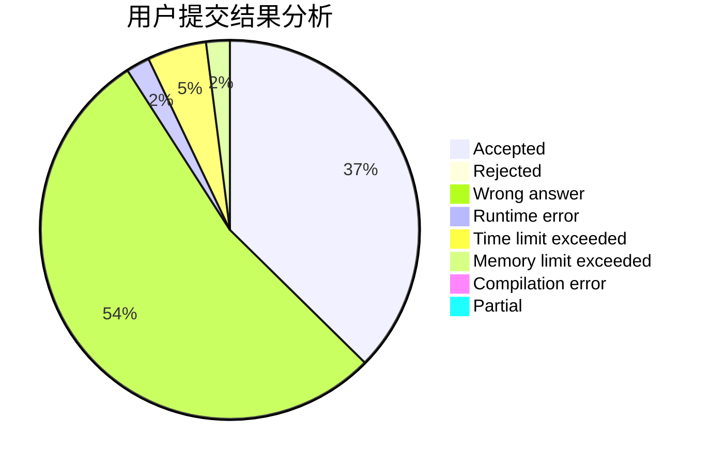
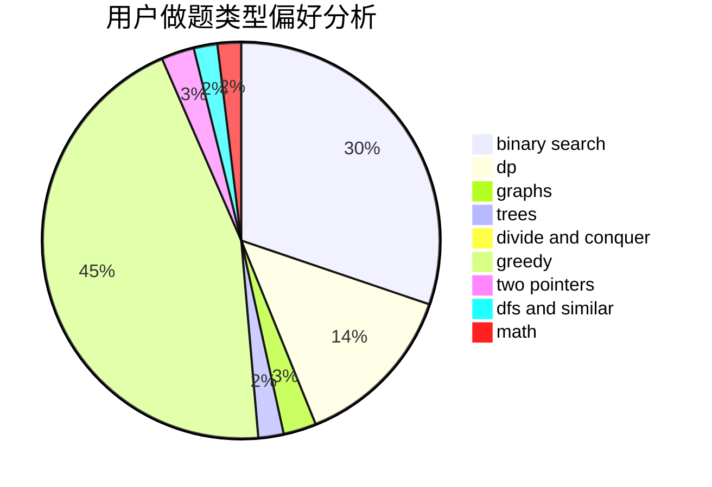

# lbylby

<!-- tabs:start -->

#### **用户提交结果分析**

#### **用户做题类型偏好分析**

<!-- tabs:end -->
# 推荐题目
[140C](https://codeforces.com/contest/140/problem/C)
[51A](https://codeforces.com/contest/51/problem/A)
[1346A](https://codeforces.com/contest/1346/problem/A)
[430C](https://codeforces.com/contest/430/problem/C)
[913H](https://codeforces.com/contest/913/problem/H)
[165A](https://codeforces.com/contest/165/problem/A)
[345A](https://codeforces.com/contest/345/problem/A)
[931A](https://codeforces.com/contest/931/problem/A)
[630G](https://codeforces.com/contest/630/problem/G)
[888D](https://codeforces.com/contest/888/problem/D)
