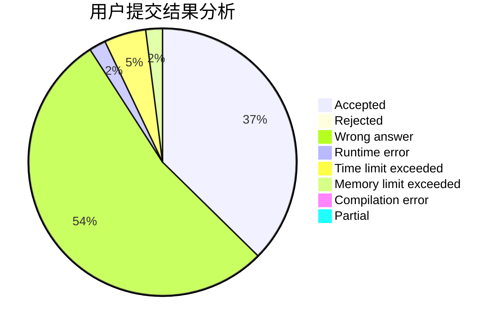
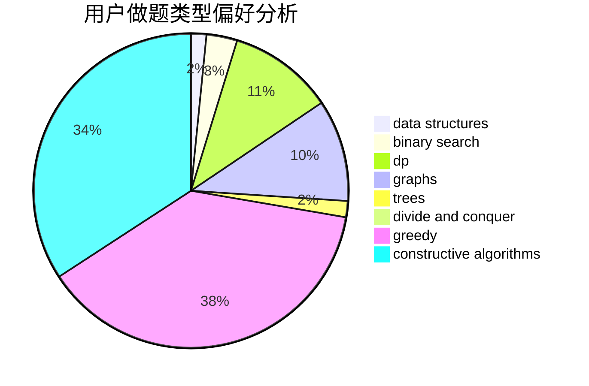
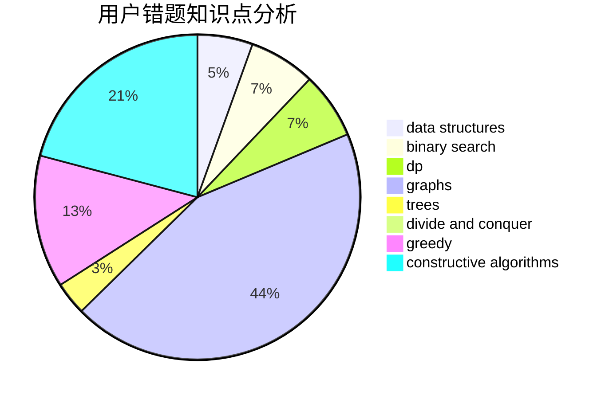

# lbylby

<!-- tabs:start -->

#### **用户提交结果分析**

#### **用户做题类型偏好分析**

#### **用户错题知识点分析**

<!-- tabs:end -->
# 推荐题目
[1400D](https://codeforces.com/contest/1400/problem/D)		brute force,
                        combinatorics,
                        data structures,
                        math,
                        two pointers		  
[499C](https://codeforces.com/contest/499/problem/C)		dsu,graphs,sortings,trees		  
[1339A](https://codeforces.com/contest/1339/problem/A)		brute force,
                        dp,
                        implementation,
                        math		  
[402C](https://codeforces.com/contest/402/problem/C)		brute force,
                        constructive algorithms,
                        graphs		  
[896E](https://codeforces.com/contest/896/problem/E)		data structures,
                        dsu		  
[1510E](https://codeforces.com/contest/1510/problem/E)		nan		  
[316G2](https://codeforces.com/contest/316G/problem/2)		string suffix structures		  
[912C](https://codeforces.com/contest/912/problem/C)		brute force,
                        greedy,
                        sortings		  
[611D](https://codeforces.com/contest/611/problem/D)		dp,
                        hashing,
                        strings		  
[869A](https://codeforces.com/contest/869/problem/A)		brute force,
                        implementation		  
