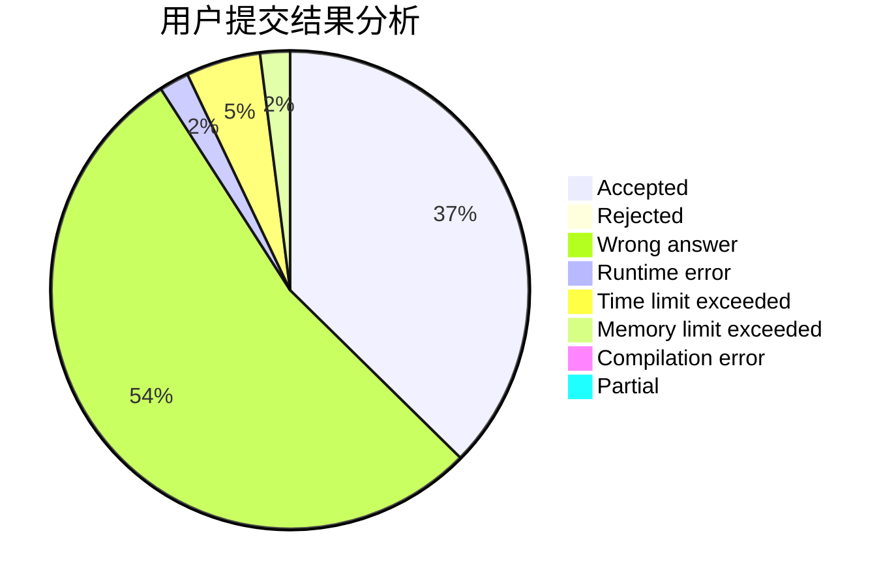
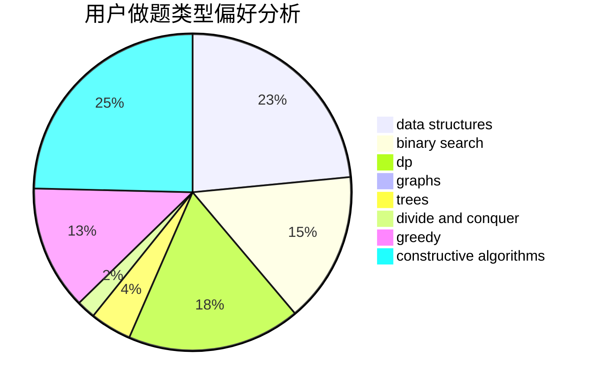
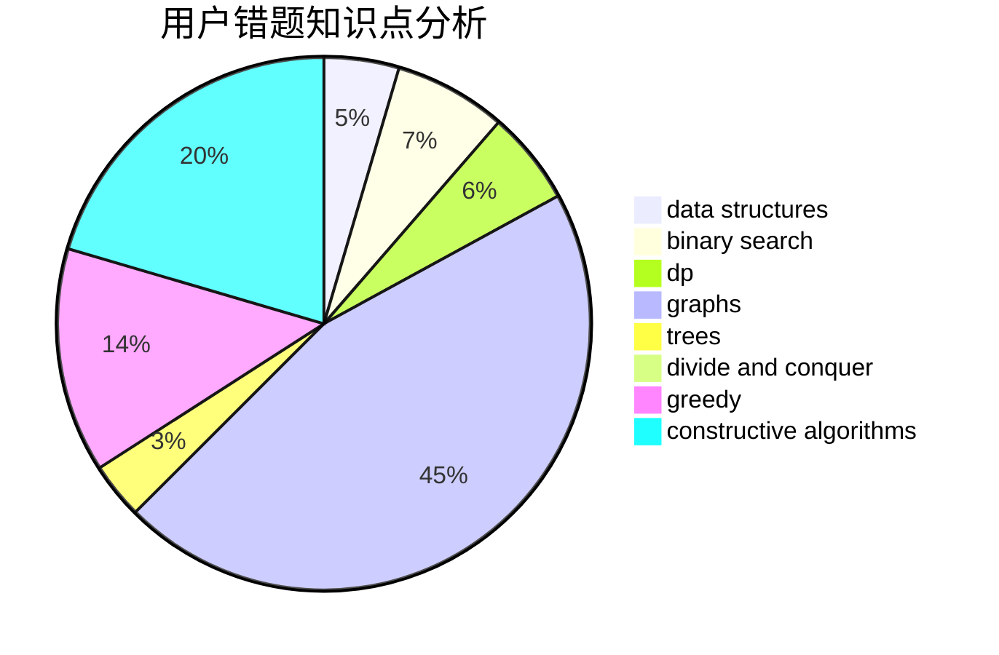

# lbylby

<!-- tabs:start -->

#### **用户提交结果分析**

#### **用户做题类型偏好分析**

#### **用户错题知识点分析**

<!-- tabs:end -->
# 推荐题目
[140C](https://codeforces.com/contest/140/problem/C)		binary search,
                        data structures,
                        greedy		  
[51A](https://codeforces.com/contest/51/problem/A)		implementation		  
[1346A](https://codeforces.com/contest/1346/problem/A)		*special problem,
                        math		  
[430C](https://codeforces.com/contest/430/problem/C)		dsu,graphs,sortings,trees		  
[913H](https://codeforces.com/contest/913/problem/H)		math,
                        probabilities		  
[165A](https://codeforces.com/contest/165/problem/A)		implementation		  
[345A](https://codeforces.com/contest/345/problem/A)		*special problem,
                        probabilities		  
[931A](https://codeforces.com/contest/931/problem/A)		brute force,
                        greedy,
                        implementation,
                        math		  
[630G](https://codeforces.com/contest/630/problem/G)		combinatorics,
                        math		  
[888D](https://codeforces.com/contest/888/problem/D)		combinatorics,
                        dp,
                        math		  
