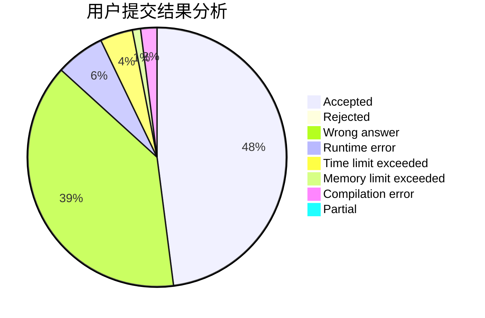
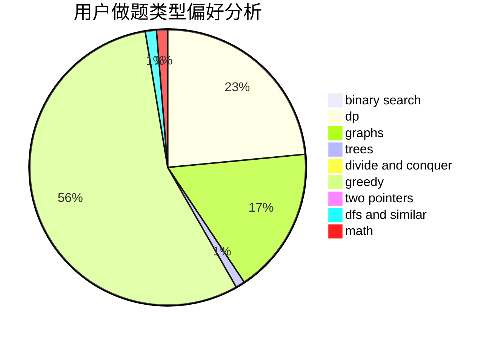

# lcch

<!-- tabs:start -->

#### **用户提交结果分析**

#### **用户做题类型偏好分析**

<!-- tabs:end -->
# 推荐题目
[1181B](https://codeforces.com/contest/1181/problem/B)
[546D](https://codeforces.com/contest/546/problem/D)
[822D](https://codeforces.com/contest/822/problem/D)
[295D](https://codeforces.com/contest/295/problem/D)
[959F](https://codeforces.com/contest/959/problem/F)
[1359A](https://codeforces.com/contest/1359/problem/A)
[6A](https://codeforces.com/contest/6/problem/A)
[1265E](https://codeforces.com/contest/1265/problem/E)
[838D](https://codeforces.com/contest/838/problem/D)
[1427G](https://codeforces.com/contest/1427/problem/G)
