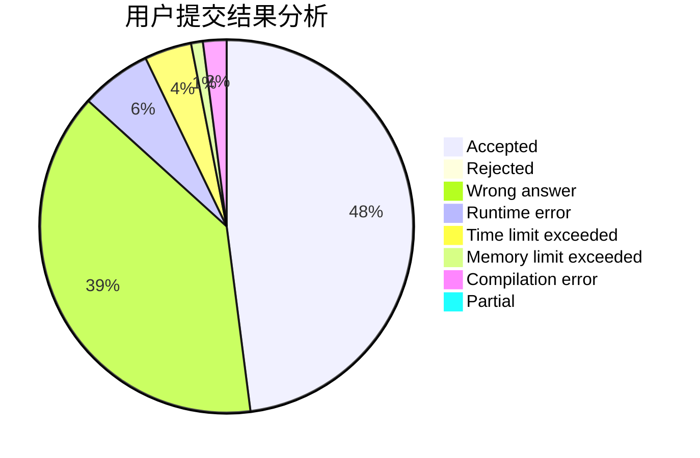
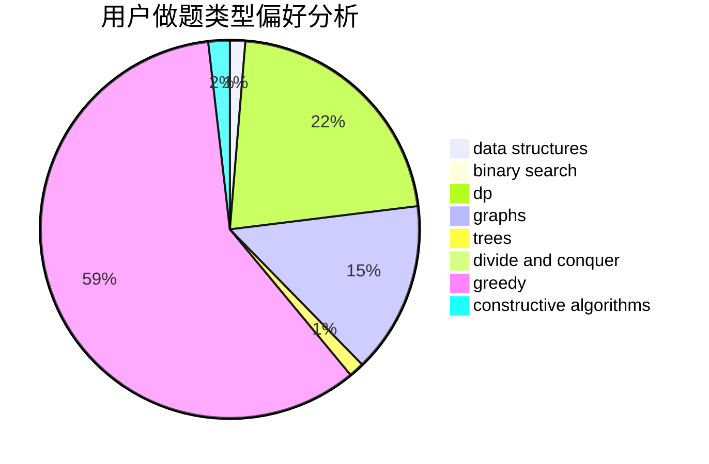
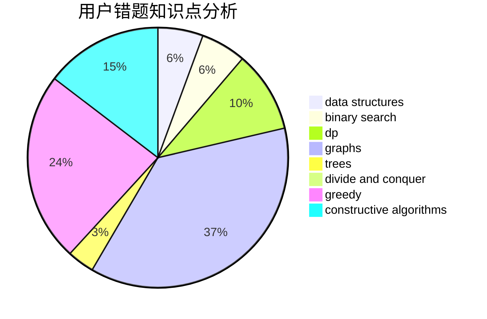

# lcch

<!-- tabs:start -->

#### **用户提交结果分析**

#### **用户做题类型偏好分析**

#### **用户错题知识点分析**

<!-- tabs:end -->
# 推荐题目
[1181B](https://codeforces.com/contest/1181/problem/B)		greedy,
                        implementation,
                        strings		  
[546D](https://codeforces.com/contest/546/problem/D)		constructive algorithms,
                        dp,
                        math,
                        number theory		  
[822D](https://codeforces.com/contest/822/problem/D)		brute force,
                        dp,
                        greedy,
                        math,
                        number theory		  
[295D](https://codeforces.com/contest/295/problem/D)		combinatorics,
                        dp		  
[959F](https://codeforces.com/contest/959/problem/F)		bitmasks,
                        dp,
                        math,
                        matrices		  
[1359A](https://codeforces.com/contest/1359/problem/A)		brute force,
                        greedy,
                        math		  
[6A](https://codeforces.com/contest/6/problem/A)		brute force,
                        geometry		  
[1265E](https://codeforces.com/contest/1265/problem/E)		data structures,
                        dp,
                        math,
                        probabilities		  
[838D](https://codeforces.com/contest/838/problem/D)		math,
                        number theory		  
[1427G](https://codeforces.com/contest/1427/problem/G)		flows,
                        graphs		  
