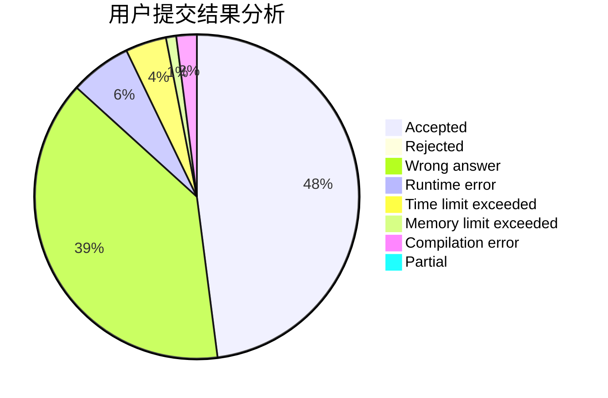
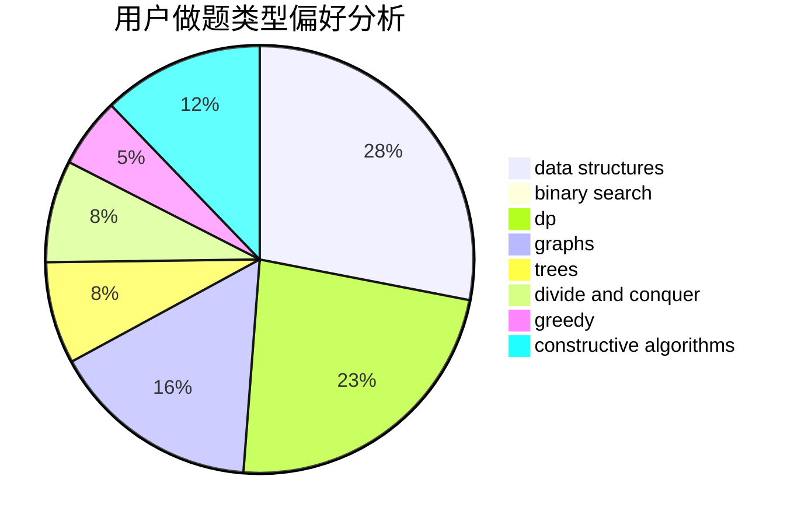
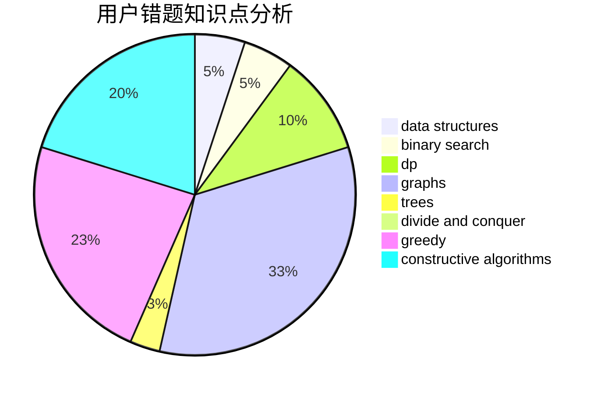

# lcch

<!-- tabs:start -->

#### **用户提交结果分析**

#### **用户做题类型偏好分析**

#### **用户错题知识点分析**

<!-- tabs:end -->
# 推荐题目
[1178F2](https://codeforces.com/contest/1178F/problem/2)		dp		  
[520E](https://codeforces.com/contest/520/problem/E)		combinatorics,
                        dp,
                        math,
                        number theory		  
[807C](https://codeforces.com/contest/807/problem/C)		dsu,graphs,sortings,trees		  
[27E](https://codeforces.com/contest/27/problem/E)		brute force,
                        dp,
                        number theory		  
[938A](https://codeforces.com/contest/938/problem/A)		implementation		  
[1352C](https://codeforces.com/contest/1352/problem/C)		binary search,
                        math		  
[675C](https://codeforces.com/contest/675/problem/C)		constructive algorithms,
                        data structures,
                        greedy,
                        sortings		  
[125E](https://codeforces.com/contest/125/problem/E)		binary search,
                        graphs		  
[818E](https://codeforces.com/contest/818/problem/E)		binary search,
                        data structures,
                        number theory,
                        two pointers		  
[141B](https://codeforces.com/contest/141/problem/B)		geometry,
                        math		  
