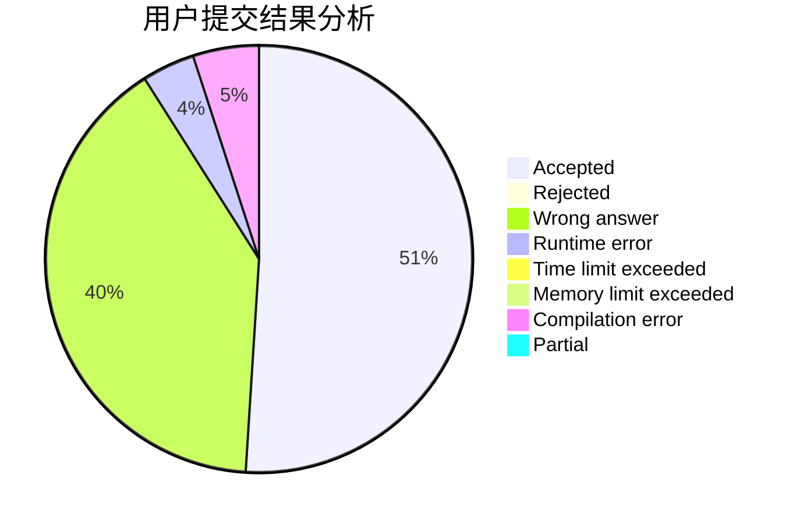
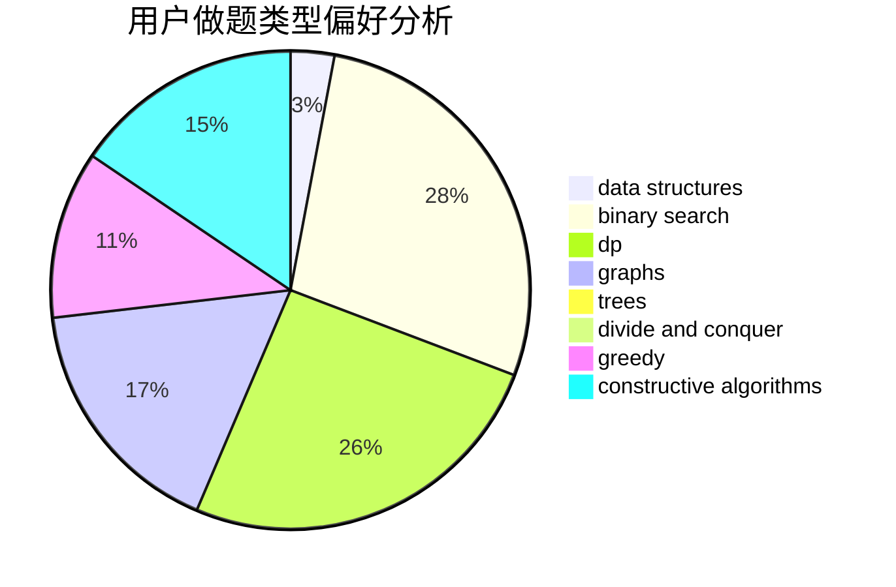
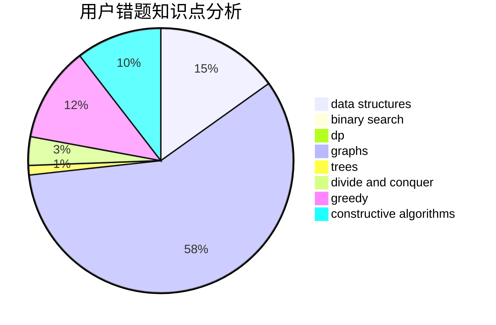

# lcj_rating1600

<!-- tabs:start -->

#### **用户提交结果分析**

#### **用户做题类型偏好分析**

#### **用户错题知识点分析**

<!-- tabs:end -->
# 推荐题目
[1023G](https://codeforces.com/contest/1023/problem/G)		data structures,
                        flows,
                        trees		  
[300A](https://codeforces.com/contest/300/problem/A)		brute force,
                        constructive algorithms,
                        implementation		  
[1228A](https://codeforces.com/contest/1228/problem/A)		brute force,
                        implementation		  
[1099C](https://codeforces.com/contest/1099/problem/C)		constructive algorithms,
                        implementation		  
[305D](https://codeforces.com/contest/305/problem/D)		combinatorics,
                        math		  
[1339C](https://codeforces.com/contest/1339/problem/C)		dsu,graphs,sortings,trees		  
[1042D](https://codeforces.com/contest/1042/problem/D)		data structures,
                        divide and conquer,
                        two pointers		  
[850E](https://codeforces.com/contest/850/problem/E)		bitmasks,
                        brute force,
                        divide and conquer,
                        fft,
                        math		  
[1099A](https://codeforces.com/contest/1099/problem/A)		implementation		  
[696A](https://codeforces.com/contest/696/problem/A)		brute force,
                        data structures,
                        implementation,
                        trees		  
